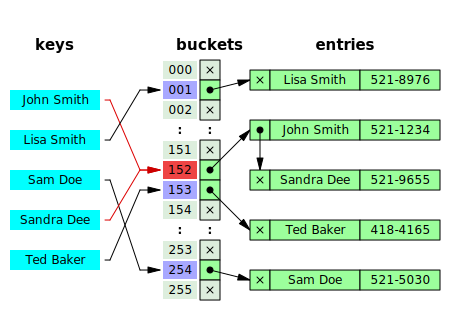
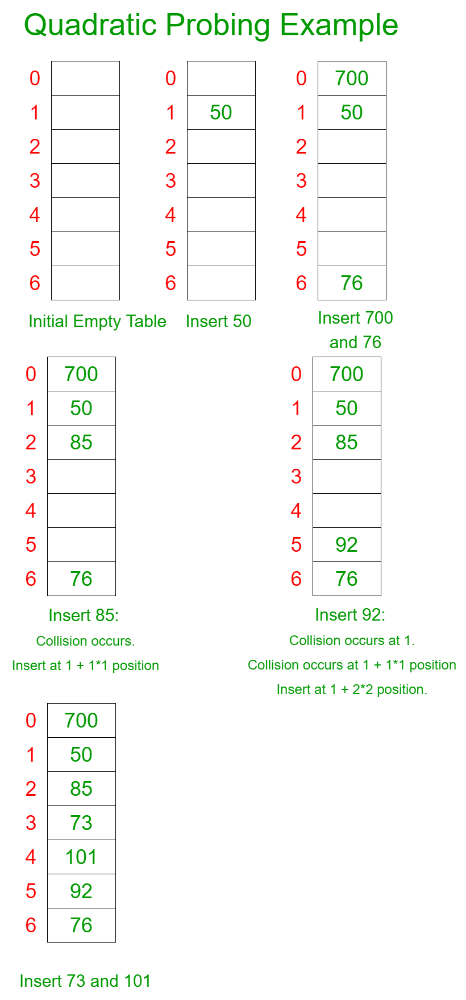
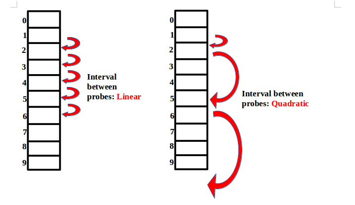

# Hash Table

> 연관 배열 구조를 이용하여 (Key, Value)로 데이터를 저장하는 자료구조


### 특징
- 검색하고자 하는 key 값을 입력 받아서 해시 함수에 넣고 돌려서 받은 해시 코드를 배열의 인덱스로 환산을 해서 데이터의 접근
	- Hash Function(key) -> Hash Code -> Index -> Value
- key값은 문자열, 숫자, 파일 데이터 등이 될 수 있음.
- 입력 데이터가 완벽하게 일치해야 동일한 결과값이 나옴.

### 해시 테이블이 빠른 이유
**색인(index)** 에 <u>해시 값을 사용</u>하기 때문에 모든 데이터를 살피지 않아도 검색, 삽입, 삭제를 빠르게 수행할 수 있음.

### 장점
- 검색 속도가 빠름
    - 해시코드 자체가 배열의 인덱스로 사용되고 바로 접근할 수 있기 때문에 속도가 빠름.
- 해시 충돌이 없는 상태에서 배열, 리스트 같은 선형적인 구조는 물론 트리와 구조보다 빠른 탐색
- 해시를 사용하기에 해시 값을 알아도 key를 예측하기 어려움

### 단점
- 해시 충돌 발생 시 탐색이 시간 복잡도 O(N)에 점점 수렴함.
	- 그럼에도 불구하고 적은 자원으로 많은 데이터를 효율적으로 관리하기 위해 사용
	- 하드 디스크나 클라우드에 존재하는 무한한 데이터들을 유한한 개수의 해시 값으로 매핑함 적은 메모리로도 프로세스의 관리가 가능해짐.
- 정렬이나 순차적인 메모리 저장이 필요한 경우 적합하지 않음.
- 해시 함수의 의존도가 높음
    - 해시 함수의 성능에 따라 해시 테이블 전체 성능이 크게 영향을 받음.
- 공간 효율성이 떨어짐.


### 충돌
 > 서로 다른 두 개의 key가 해시 함수에 의해 동일한 해시 값을 갖는 상황

### 충돌 해결 방법

- **Chaining**, **Open Addressing** 두 가지 방법이 있음.

### 1. Chaining

> 충돌 발생 시 해당 버킷에 연결 리스트를 만들어 값을 할당하고 이어서 연결하는 방식



- 최악의 경우 시간 복잡도는 O(N)

</br>

### 2. Open Addressing

> 충돌 발생 시 해시 함수로 얻은 주소가 아니라 버킷이 비어있는 다른 주소를 찾아서 저장하는 방식

- 3가지 방법이 존재
	- `Linear probing`, `Quadratic probing`, `Double hashing`

**2-1. Linear probing**
> 말 그대로 충돌 발생 시 선형적으로 해결하는 방법

- 장점
	- 구현이 간단하고 효율적으로 충돌을 해결할 수 있음.
- 단점
	- 특정 해시값 주변 버킷이 모두 채워져 있는 경우(primary clustring), 빈 버킷을 찾는 시간이 증가할 수 있음.
	- **`클러스터링`** : 넓은 메모리 영역에서 한쪽으로 모여있는 현상


**동작 과정**

1. 충돌 발생 시 바로 다음 인덱스를 확인
1. 비어있으면 해당 인덱스에 넣음.
1. 비어있지 않으면 바로 다음 인덱스를 확인
1. 비어있는 자리를 찾을 때까지 1~3번 과정을 반복


</br>

**2-2. Quadratic probing**<sub> 제곱 탐사</sub>
> 고정 폭으로 이동하는 Linear probing과 달리 폭이 제곱수로 늘어나는 방식

- 단점
	- 궁극적으로 클러스터링을 피할 수 없음.
	- 같은 해시값을 가진 데이터는 2차 클러스터링이 발생

**동작 과정**

1. 충돌 발생 시 1<sup>2</sup> 칸을 이동하여 확인
1. 비어있으면 해당 인덱스에 넣음.
1. 비어있지 않으면 2<sup>2</sup> 칸을 이동하여 확인
1. 또 비어있지 않으면 3<sup>2</sup> 칸을 이동하여 확인
1. 비어있는 자리를 찾을 때까지 제곱수를 늘려가며 찾음.



- 시간 복잡도
	- L : hash table 사이즈
	- O(N * L) 

</br>

- Linear probin과 Quadratic probing 비교



</br>

**2-3. Double hashing**<sub> 이중 해싱</sub>
> 2개의 해시 함수를 준비하여 한 해시 함수로 얻은 해시값이 충돌을 일으키면 다른 해시 함수로 해시값을 다시 구하는 방법

- 2차 클러스터링을 피하기 위해 사용
- 단점
	- 이 방법도 클러스터링 문제를 완벽하게 해소하기는 힘듦.
- 시간 복잡도
	- 삽입 : O(N)
	- 검색 : O(N)
	- 삭제 : O(N)


#### Rehashing<sub> 재해싱</sub>
> 남은 공간이 거의 없는 해시 테이블에서 연쇄 충돌이 자주 일어나는 문제를 해결할 수 있는 방법 중 하나

- 테이블의 크기를 늘리고 늘어난 해시 테이블의 크기에 맞춰 테이블 내 모든 데이터를 다시 해싱해야 함.
- 통계적으로 해시 테이블의 공간 사용률이 70~80%에 이르면 성능 저하가 나타남.
- 공간 사용률이 이보다 적으면 미리 재해싱을 해둬야 성능 저하를 막을 수 있음.
- 재해싱이 너무 빈번하게 일어나면 안되기 때문에 75%로 설정하는 것이 일반적임.

</br>

### Hash Table 구현

<details>
<summary>java 코드</summary>
<div markdown="1">

```java
import java.util.LinkedList;

public class Test {

	static class HashTable {
		
		// 데이터를 저장할 linkedlist
		LinkedList<Node>[] data;

		class Node {
			String key;
			String value;

			public Node(String key, String value) {
				this.key = key;
				this.value = value;
			}

			String value() {
				return value;
			}

			void value(String value) {
				this.value = value;
			}
		}

		HashTable(int size) {
			this.data = new LinkedList[size];
		}

		// hash function
		int getHashCode(String key) {
			
			int hashcode = 0;
			
			// 각 문자의 아스키 값을 가져와서 해시 코드에 더해줌.
			for (char c : key.toCharArray()) {
				hashcode += c;
			}
			return hashcode;
		}

		// find index of hash table
		int convertToIndex(int hashcode) {
			return hashcode % data.length;
		}
		
		// 해시 테이블의 인덱스에 여러 리스트가 존재하는 경우 key로 해당 노드를 찾아오는 함수
		Node searchKey(LinkedList<Node> list, String key) {
			if(list == null)
				return null;
			// null이 아니면 key와 같은 노드를 찾음.
			for(Node node : list) {
				if(node.key.equals(key))
					return node;
			}
			
			return null;
		}
		
		// 데이터를 받아서 저장하는 함수
		void put(String key, String value) {
			
			int hashcode = getHashCode(key);
			int index = convertToIndex(hashcode);
			
			System.out.println(key + ", hashcode(" + hashcode + "), index(" + index + ")");
			LinkedList<Node> list = data[index];
			
			// 저장할 배열의 위치가 null인 경우
			if(list == null) {
				list = new LinkedList<Node>();
				data[index] = list;
			}
			// 이미 같은 key값을 가진 데이터가 있을 수 있으므로 검색을 해봐야 함. 
			Node node = searchKey(list, key);
			if(node == null) {
				list.addLast(new Node(key, value));
			}
			else {
				node.value(value);
			}
		}
		
		// 해시 테이블에 저장된 데이터를 키값으로 찾아오는 함수
		String get(String key) {
			int hashcode = getHashCode(key);
			int index = convertToIndex(hashcode);
			LinkedList<Node> list = data[index];
			Node node = searchKey(list, key);
			return node == null ? "Not found" : node.value();
		}
	}

	public static void main(String[] args) {
		HashTable h = new HashTable(3);
		h.put("sung", "She is pretty");
		h.put("jin", "She is a model");
		h.put("hee", "She is an angel");
		h.put("min", "She is cute");
		h.put("sung", "She is beautiful");
		System.out.println(h.get("sung"));
		System.out.println(h.get("jin"));
		System.out.println(h.get("hee"));
		System.out.println(h.get("min"));
		System.out.println(h.get("jae"));
	}

}
```

</div>
</details>

</br>

### 복잡도<sub>Complexity</sub>
| 연산 | 평균 | 최악 |
| :---: | :---: | :---: |
| 삽입 | O(1) | O(N) |
| 검색 | O(1) | O(N) |
| 삭제 | O(1) | O(N) |


</br>
</br>

- 참고

[Hash table](https://en.wikipedia.org/wiki/Hash_table)

[Open Addressing Collision Handling technique in Hashing](https://www.geeksforgeeks.org/open-addressing-collision-handling-technique-in-hashing/)

[quadratic-probing-in-hashing](https://www.geeksforgeeks.org/quadratic-probing-in-hashing/)

[[자료구조 알고리즘] 해쉬테이블(Hash Table)에 대해 알아보고 구현하기](https://www.youtube.com/watch?v=Vi0hauJemxA)

[[자료구조]해시 테이블](https://hongcoding.tistory.com/179)

[[자료구조] 11-3. 해쉬](https://makemethink.tistory.com/139)

[[자료구조] Hash](https://inblog.ai/dohyeong/hash-1558)