# 퀵 정렬<sub> Quick Sort</sub>

> 기준 값(피벗)을 기준으로 작은 값을 갖는 데이터와 큰 값을 갖는 데이터로 분리해가며 정렬하는 방법

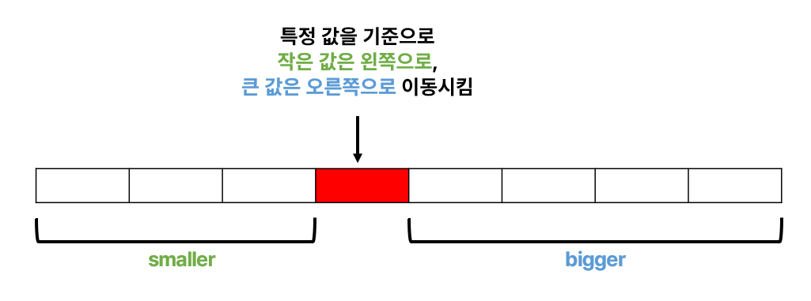

### 특징
- 대표적인 **분할 정복** 알고리즘
    - 하나의 큰 문제를 두 개의 작은 문제로 분할하는 식으로 빠르게 정렬
    - 즉, 특정한 값을 기준으로 큰 숫자와 작은 숫자를 서로 교환한 뒤에 배열을 반으로 나눔.
- 랜덤배열에서 빠른 정렬 속도
- 피벗(pivot)을 선정하는 방법에 따라 속도가 달라짐.
- 순열이나 역순의 경우 매우 느린 속도를 보임.
- 분할 정복 방식을 사용한다는 점에서 merge sort와 개념적으로 유사
- 차이점은 파티셔닝이 수행되는 방식과 하위 리스트가 적절한 상대적 순서로 유지되므로 병합이 필요하지 않다는 것
- 내부 정렬, 제자리 정렬 알고리즘

### 장점
- 속도가 빠름 - 평균 O(NlogN)
- Bubble Sort<sub>거품 정렬</sub>와 마찬가지로 단순한 알고리즘
- 정렬을 위한 비교 횟수는 많지만, Bubble Sort에 비해 실제로 교환하는 횟수는 적기 때문에 많은 교환이 일어나야 하는 자료상태에서 비교적 효율적
- 선택, 버블, 삽입 정렬보다 빠름.
- 불필요한 데이터의 이동을 줄이고 먼 거리의 데이터를 교환할 뿐만 아니라, 한 번 결정된 피벗들이 추후 연산에서 제외되는 특성 때문에, 시간 복잡도가 O(nlog₂n)를 가지는 다른 정렬 알고리즘과 비교했을 때도 가장 빠름.

### 단점
- 최악의 경우 O(N<sup>2</sup>)로 느림.
- pivot을 어떻게 선택하냐에 따라 성능이 달라짐.
- 불안정 정렬(Unstable Sort)
- 정렬된 배열에 대해서는 Quick Sort의 불균형 분할에 의해 오히려 수행시간이 더 많이 걸림.


### 동작원리
1. 기준 값(피벗)을 기준으로 작거나 같은 값을 지닌 데이터는 앞으로, 큰 값을 지닌 데이터는 뒤로 가도록 함.
1. 이렇게 나눠진 데이터들을 또 피벗을 정하여 작은값, 큰값을 이동시킴.
1. 모두 정렬될 때까지 1, 2번을 반복

#### 피벗<sub>pivot</sub>을 기준으로 데이터 이동시키는 과정
```
* 기본 규칙
 start는 항상 end보다 왼쪽에 있어야 함.
 start가 가리키는 값이 pivot보다 작은 경우 그냥 다음으로 넘어 감.
 end가 가리키는 값이 pivot보다 큰 경우 그냥 다음으로 넘어 감.
```
<details>
<summary><b>동작 과정 이미지</b></summary>
<div markdown="1">
<p align="center">  
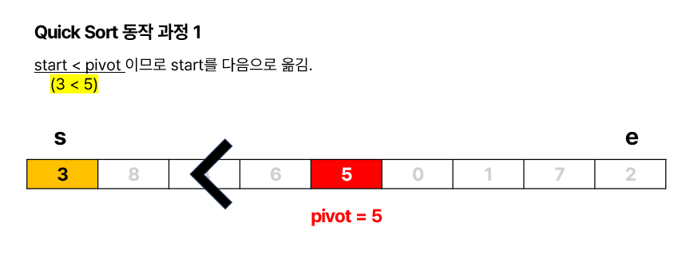  
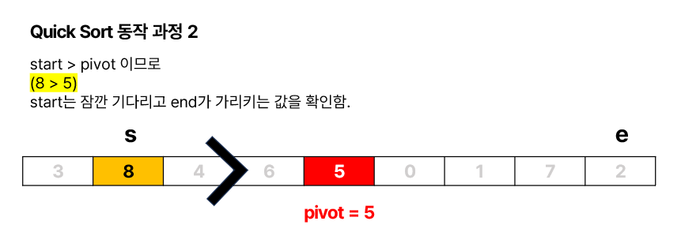
</p>

-------


<p align="center">  
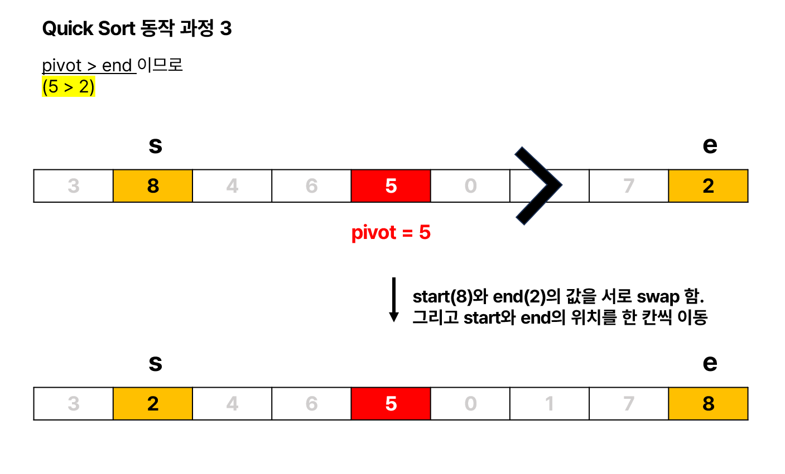  
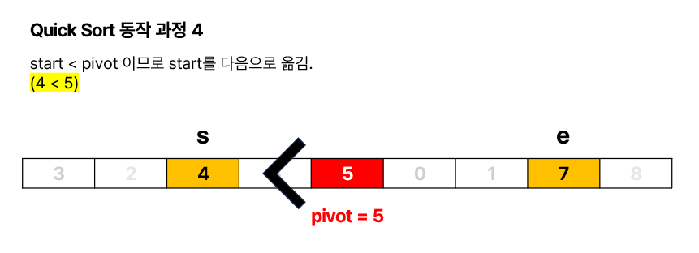
</p>

-------


<p align="center">  
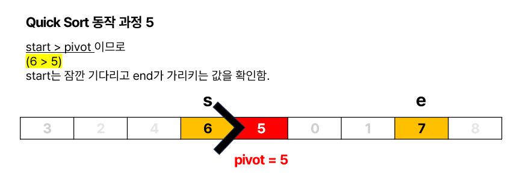  
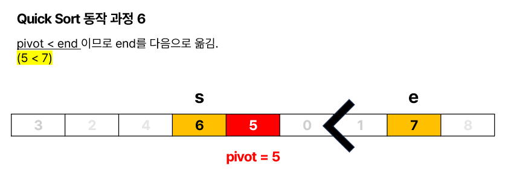
</p>

-------


<p align="center">  
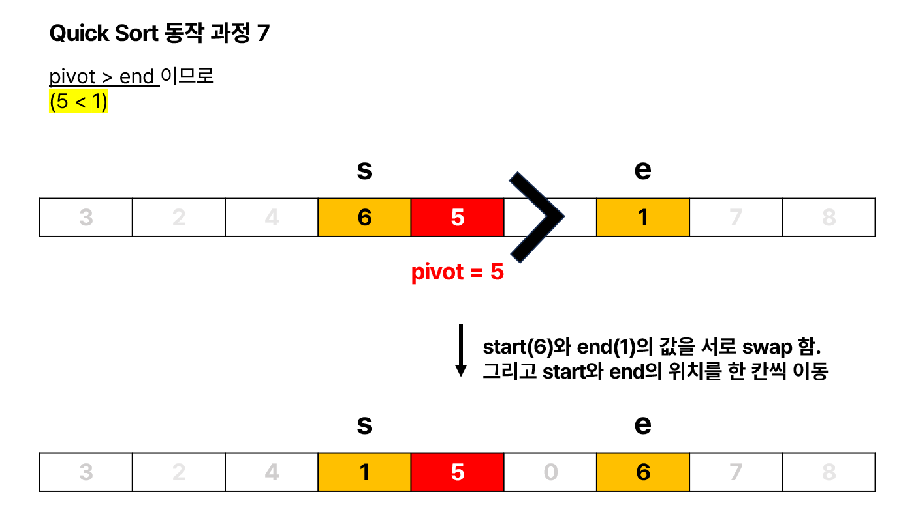  
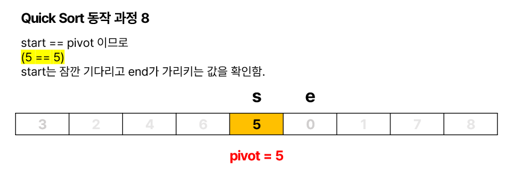
</p>

-------


<p align="center">  
  
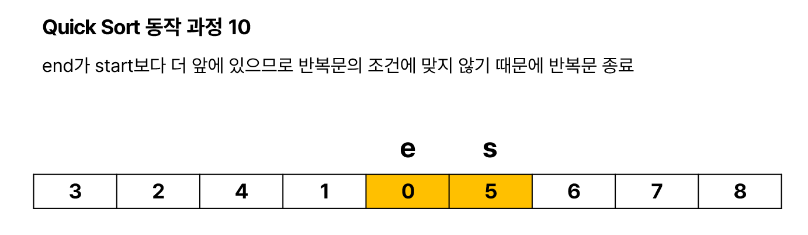
</p>

-------


<p align="center"> 
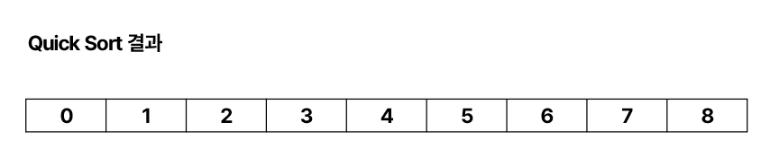
</p>

</div>
</details>

</br>

### Quick Sort 구현

<details>
<summary>java 코드</summary>
<div markdown="1">

```java
import java.util.Arrays;

public class QuickSort {

	public static void main(String[] args) {

		int[] arr = { 3, 8, 4, 6, 5, 0, 1, 7, 2 };
		printArray(arr);
		quickSort(arr);
		printArray(arr);

	}

	private static void quickSort(int[] arr) {
		quickSort(arr, 0, arr.length - 1);
	}

	private static void quickSort(int[] arr, int start, int end) {
		
		// pivot을 기준으로 데이터를 이동시켜줌.
		int part2 = partition(arr, start, end);

		// 왼쪽에 정렬할 게 남으면 분할해서 정렬
		if (start < part2 - 1) {
			quickSort(arr, start, part2 - 1);
		}
		// 오른쪽에 정렬할 게 남으면 분할해서 정렬
		if (part2 < end) {
			quickSort(arr, part2, end);
		}
	}

	private static int partition(int[] arr, int start, int end) {
		int pivot = arr[(start + end) / 2];

		while (start <= end) {
			while (arr[start] < pivot)
				start++;
			while (arr[end] > pivot)
				end--;
			if (start <= end) {
				swap(arr, start, end);
				start++;
				end--;
			}
		}

		return start;
	}

	private static void swap(int[] arr, int start, int end) {

		int tmp = arr[start];
		arr[start] = arr[end];
		arr[end] = tmp;

	}

	private static void printArray(int[] arr) {
		System.out.println(Arrays.toString(arr));
	}

}
```

</div>
</details>

</br>

### 복잡도<sub>Complexity</sub>
<table style="text-align:center">
  <tr>
    <td ></td>
    <td colspan="3">시간 복잡도</td>
    <td colspan="2">공간 복잡도</td>
  </tr>
  <tr>
    <td></td>
    <td >최선</td>
    <td>평균</td>
    <td>최악</td>
    <td>평균</td>
    <td>최악</td>
  </tr>
  <tr>
    <td><b>Quick Sort</b></td>
    <td>O(NlogN)</td>
    <td>O(NlogN)</td>
    <td>O(N<sup>2</sup>) </br>피벗 값에 따라 </br>편향되게 분할하는 경우</td>
    <td>O(logN)</td>
    <td>O(N)</td>
  </tr>
</table>
</br>
</br>

- 참고


[정렬 알고리즘](https://devjourney7.tistory.com/132)

[[자료구조 알고리즘] 퀵정렬(Quicksort)에 대해 알아보고 자바로 구현하기](https://www.youtube.com/watch?v=7BDzle2n47c)