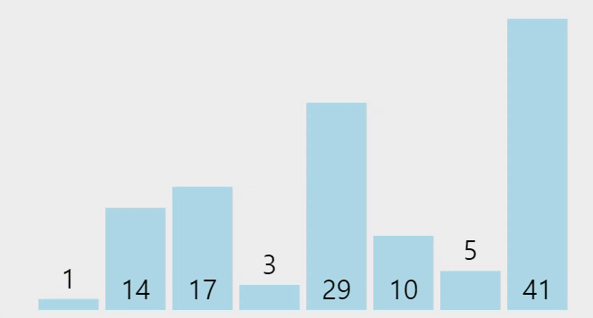

# 선택 정렬<sub> Selection Sort</sub>

> 해당 순서에 원소를 넣을 위치는 이미 정해져 있고, 어떤 원소를 넣을지 선택하는 알고리즘



### 특징
- 내부 정렬 알고리즘
- 제자리 정렬<sub>In-place sort</sub>로 배열 안에서 교환하는 방식이기 때문에 추가 공간을 사용하지 않음
- 불안정 정렬

### 장점
- Bubble Sort<sub>거품 정렬</sub>와 마찬가지로 단순한 알고리즘
- 정렬을 위한 비교 횟수는 많지만, Bubble Sort에 비해 실제로 교환하는 횟수는 적기 때문에 많은 교환이 일어나야 하는 자료상태에서 비교적 효율적

### 단점
- 시간복잡도가 O(n^2)으로, 비효율적
- 불안정 정렬<sub>Unstable Sort</sub>임.
- 전체 모든 원소를 스캔하기 때문에 삽입 정렬<sub>Insertion Sort</sub>보다 느림


### 동작 원리
1. 가장 왼쪽에 있는 원소부터 기준 원소가 됨.
1. 기준 원소보다 오른쪽에 있는 원소 중 가장 작은 값을 찾음.
1. 가장 작은 원소와 기준 원소를 교환.
1. 기준 원소를 인접한 오른쪽 원소로 변경하고 위 과정을 기준 원소가 마지막 원소가 될 때까지 반복

### Selection Sort 구현

<details>
<summary>java 코드</summary>
<div markdown="1">

```java
class SelectionSort{
 
  static void Selection_Sort(int arr[], int n)  
  {
    for(int i = 0; i < n - 1; ++i)  
    {
      int min_index = i;  
      for(int j = i + 1; j < n; ++j)  
      {
        if(arr[j] < arr[min_index])  
          min_index = j;
      }
      int temp = arr[i];
      arr[i] = arr[min_index];
      arr[min_index] = temp;
    }
  }
 
  // Driver code
  public static void main(String[] args)
  {
    int n = 5;
    int arr[] = {2, 0, 1, 4, 3};
    Selection_Sort(arr, n);
    System.out.print("The Sorted Array by using Selection Sort is : ");
    for(int i = 0; i < n; ++i)
      System.out.print(arr[i] + " ");
  }
}
```

</div>
</details>

</br>

### 복잡도<sub>Complexity</sub>
<table style="text-align:center">
  <tr>
    <td ></td>
    <td colspan="3">시간 복잡도</td>
    <td rowspan="2">공간 복잡도</td>
  </tr>
  <tr>
    <td></td>
    <td >최선</td>
    <td>평균</td>
    <td>최악</td>
  </tr>
  <tr>
    <td><b>Selection Sort</b></td>
    <td>O(N<sup>2</sup>)</td>
    <td>O(N<sup>2</sup>)</td>
    <td>O(N<sup>2</sup>)</td>
    <td>O(1)</td>
  </tr>
</table>

</br>
</br>

- 참고


[정렬 알고리즘](https://devjourney7.tistory.com/132)