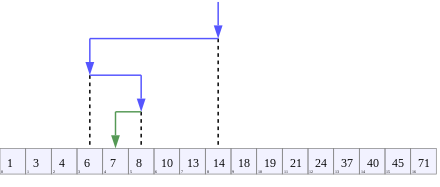
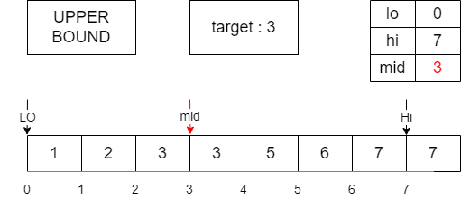

# :books: Binary Search <sub>이분탐색</sub>

## :bookmark_tabs: 목차

[:arrow_up: **Algorithm**](../README.md)

1. ### [Binary Search](#📕-binary-search-이분-탐색) <sub>이분 탐색</sub>

   - 정의
   - 특징
   - 이분 탐색의 동작 원리
   - 알고리즘
   - 복잡도
   - 장단점

2. ### [Lower/Upper Bound Search](#📙-lowerupper-bound-search-하한상한-탐색) <sub>하한/상한 탐색</sub>

   - 정의
   - 특징
   - 하한/상한 탐색의 동작 원리
   - 알고리즘
   - 복잡도
   - 장단점

# :closed_book: Binary Search <sub>이분 탐색</sub>

## 정의

> 정렬된 데이터 집합<sub>Sorted Datas</sub> 내에서 특정 대상의 값을 찾아내는 검색 알고리즘<sub>Search Algorithm</sub>

## 특징



- 미리 오름차순(또는 내림차순)으로 키 값이 정렬된 데이터 집합에서 동작함
- 매번 일정 범위의 값 중 중앙값을 선택해 중앙값을 기준으로 대소를 구분해 목표하는 값을 찾는 알고리즘
- 전체 데이터 집합의 크기가 `N`일때 `O(logN)`안에 원하는 값을 찾을 수 있음

## 이분 탐색의 동작 원리


1. 범위 안의 값 중에서 중간값<sub>Mid Value</sub>을 찾아 목표 값<sub>Target Value</sub>으로 지정
2. 찾고자 하는 값이 선택한 목표값보다 큰지 작은지 체크
   - 찾고자 하는 값이 목표값 보다 **큰 경우**:  
      목표값을 중간값과 우극단 사이의 중간값으로 변경
   - 찾고자 하는 값이 목표값 보다 **작은 경우**:  
      목표값을 중간값과 좌극단 사이의 중간값으로 변경
3. 찾고자 하는 값이 목표값과 일치 할 때 까지 2번을 반복

## 알고리즘

Procedure

```
Binary_Search(Arr, target):
    L = 0
    R = length of Arr - 1

    while L <= R:
        m = floor((L + R) / 2)
        if Arr[m] < target:
            L = m + 1
        else if Arr[m] > target:
            R = m − 1
        else
            return m
    return NIL
```

JAVA

```java
public int binarySearch(int[] arr, int target) {
    int L = 0;
    int R = arr.length - 1;

    while (L <= R) {
        int m = (L + R) / 2;
        if (target == arr[m]) {
            return m;
        } else if (arr[m] < target) {
            L = m + 1;
        } else if (target < arr[m]) {
            R = m - 1;
        }
    }

    throw new NoSuchElementException("can't find target.");
}
```

## 복잡도

| 연산 종류             | 평균<sub>Avg</sub> | 최악<sub>Worst</sub> |
| --------------------- | ------------------ | -------------------- |
| 공간<sub>Space</sub>  | `O(1)`             | `O(1)`               |
| 탐색<sub>Search</sub> | `O(logN)`          | `O(logN)`            |

- `N`은 데이터의 개수
- 이진 탐색의 경우 탐색에 필요한 데이터는 좌극단, 우극단, 중간값 뿐인 상수 메모리만 활용 `O(1)`
- 평균과 최악 모두 시간 복잡도 `O(logN)`안에 원하는 값을 찾을 수 있어 빠름

## 장단점

- ### 장점

  - 구현이 간단함
  - 아주 빠른 시간안에 원하는 데이터를 탐색 할 수 있음

- ### 단점

  - 오직 정렬된 데이터에 대해서만 사용 가능함

# :orange_book: Lower/Upper Bound Search <sub>하한/상한 탐색</sub>

## 정의

> 이분 탐색<sub>Binary Search</sub>의 변형으로 특정 대상 값을 포함한 하한 값<sub>Lower Value</sub>(또는 상한 값<sub>Upper Value</sub>)을 찾아내는 검색 알고리즘<sub>Search Algorithm</sub>

## 특징

- 기존의 이분 탐색과 원리와 과정은 동일
- 특정 값을 하나를 찾는 것이 아니기 때문에 값을 찾지 못하는 경우가 없음
- 특정 값<sub>Target Value</sub> 하나만 찾는 것이 아닌 목표 이하/이상의 값을 찾을 수 있음

## 하한/상한 탐색의 동작 원리

### 하한 탐색


- 동작 과정은 이분 탐색과 동일하지만 최종적으로 반환하는 값은 가장 마지막에 찾은 low 값을 반환

### 상한 탐색



- 동작 과정은 이분 탐색과 동일하지만 최종적으로 반환하는 값은 가장 마지막에 찾은 high 값을 반환

## 알고리즘

### 하한 탐색

Procedure

```
Lower_Bound(Arr, target):
    L = 0
    R = length of Arr - 1

    while L <= R:
        m = floor((L + R) / 2)
        if Arr[m] < target:
            L = m + 1
        else if Arr[m] > target:
            R = m − 1

    return L
```

JAVA

```java
public int lowerBoundSearch(int[] arr, int target) {
    int lo = 0;
    int hi = arr.length - 1;

    while (lo <= hi) {
        int mid = (lo + hi) / 2;
        if (arr[mid] < target) {
            lo = mid + 1;
        } else if (target < arr[mid]) {
            hi = mid - 1;
        }
    }

    return lo;
}
```

### 상한 탐색

Procedure

```
Upper_Bound(Arr, target):
    L = 0
    R = length of Arr - 1

    while L <= R:
        m = floor((L + R) / 2)
        if Arr[m] < target:
            L = m + 1
        else if Arr[m] > target:
            R = m − 1

    return R
```

JAVA

```java
public int upperBoundSearch(int[] arr, int target) {
    int lo = 0;
    int hi = arr.length - 1;

    while (lo <= hi) {
        int mid = (lo + hi) / 2;
        if (arr[mid] < target) {
            lo = mid + 1;
        } else if (target < arr[mid]) {
            hi = mid - 1;
        }
    }

    return hi;
}
```

## 복잡도

| 연산 종류             | 평균<sub>Avg</sub> | 최악<sub>Worst</sub> |
| --------------------- | ------------------ | -------------------- |
| 공간<sub>Space</sub>  | `O(1)`             | `O(1)`               |
| 탐색<sub>Search</sub> | `O(logN)`          | `O(logN)`            |

- `N`은 데이터의 개수
- 이진 탐색의 경우 탐색에 필요한 데이터는 좌극단, 우극단, 중간값 뿐인 상수 메모리만 활용 `O(1)`
- 평균과 최악 모두 시간 복잡도 `O(logN)`안에 원하는 값을 찾을 수 있어 빠름

## 장단점

- ### 장점

  - 구현이 간단함
  - 아주 빠른 시간안에 원하는 데이터를 탐색 할 수 있음
  - 목표 값이 없더라도 원하는 조건에 일치하는 하한값/상한값을 찾을 수 있음

- ### 단점

  - 오직 정렬된 데이터에 대해서만 사용 가능함
