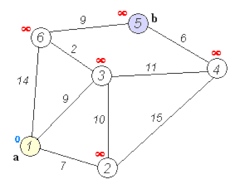

# :books: Dijkstra & A-Star <sub>다익스트라 알고리즘과 A\* 알고리즘</sub>

## :bookmark_tabs: 목차

[:arrow_up: **Algorithm**](../README.md)

1. ### [Dijkstra](#) <sub>다익스트라 알고리즘</sub>

   - 정의
   - 특징
   - Dijkstra의 동작 원리
   - 알고리즘
   - 복잡도

2. ### [A-Star](#) <sub>A\* 알고리즘</sub>

   - 정의
   - 특징
   - A-Star의 동작 원리
   - 알고리즘
   - 복잡도

# :closed_book: Dijkstra <sub>다익스트라 알고리즘</sub>

## 정의

> 간선의 가중치가 양의 값을 가지는 가중치 그래프에서 한 정점에서 다른 모든 정점까지의 최단 경로를 찾는 알고리즘

## 특징

- 한 정점에서 다른 모든 정점까지의 최소 가중치를 가지는 최단 경로를 찾는 알고리즘
- 모든 간선의 가중치는 양의 가중치를 가질때만 동작할 수 있음
- 기본 알고리즘과 우선순위큐를 활용해 개선된 알고리즘이 존재
- 가능한 적은 비용으로 가장 빠르게 해답에 도달하는 경로를 찾을때 활용

## Dijkstra의 동작 원리



1. 시작 정점 S로부터의 최단거리를 저장할 배열을 만들고, 다음과 같이 초기화
   - 시작 정점은 0으로 초기화
   - 시작 정점을 제외한 다른 정점들에는 매우 큰 값(INF)으로 초기화
2. 현재 정점을 가리키는 변수 A에 탐색을 시작할 정점의 번호를 기록
3. 정점 A에서 갈 수 있는 임의의 정점 B에 대해, 경로SA와 경로AB의 합과 현재까지 구해진 경로SB의 값을 비교
   - 경로SA와 경로AB의 합이 더 작다면 경로SB 의 값을 이 값으로 갱신
4. 현재 선택된 정점 A의 모든 이웃 정점 B에 대해 작업 3을 반복
5. 미방문 상태의 남은 정점 중 시작 정점 S로부터의 최단거리가 가장 짧은 정점을 선택해 그 정점를 A에 기록
6. 모든 정점이 방문 완료 상태가 되거나, 더 이상 미방문 상태의 노드로 이동할 수 있는 간선이 없어 새로운 정점을 선택할 수 없을 때까지, 3~5의 과정을 반복

## 알고리즘

Procedure

- 기본 알고리즘

```
procedure Dijkstra(Graph, source) is
    let Queue be a vertex set

    for each vertex v in Graph do
        dist[v] := INFINITY
        prev[v] := UNDEFINED
        Queue.add(v)

    dist[source] := 0

    while Queue is not empty do
        u := vertex in Queue with min dist[u]
        Queue.remove(u)

        for each neighbor v of u do
            alt := dist[u] + length(u, v)
            if alt < dist[v] then
                dist[v] := alt
                prev[v] := u

    return dist, prev
```

- 우선순위 큐 활용

```
procedure Dijkstra_Priority(Graph, source) is
    let Queue be a vertex set

    dist[source] := 0

    for each vertex v in Graph do
        if v is not source then
            dist[v] := INFINITY
            prev[v] := UNDEFINED

        Queue.add_with_priority(v, dist[v])


    while Queue is not empty do
        u := Queue.extract_min()
        for each neighbor v of u do
            alt := dist[u] + length(u, v)
            if alt < dist[v] then
                dist[v] := alt
                prev[v] := u
                Q.decrease_priority(v, alt)

    return dist, prev
```

JAVA

- 기본 알고리즘

```java
// edge[0], edge[1], edge[2] : to, from, cost
public static int[] Dijkstra(int V, int E, int[][] edges, int[] int start) {
  ArrayList<ArrayList<Node>> graph = new ArrayList<>();

  for (int i = 0; i < V + 1; i++) {
    graph.add(new ArrayList<>());
  }

  for (int[] edge : edges) {
    dist[edge[0]][edge[1]] = edge[2];
    graph.get(edge[0]).add(new Node(edge[1], edge[2]));
  }

  int[] dist = new int[V + 1];

  for (int i = 0; i < V + 1; i++) {
    dist[i] = Integer.MAX_VALUE;
  }

  dist[start] = 0;

  boolean[] visited = new boolean[V + 1];

  for (int i = 0; i < V; i++) {
    int value = Integer.MAX_VALUE;
    int idx = 0;

    for (int j = 1; j < V + 1; j++) {
      if (!visited[j] && dist[j] < value) {
        value = dist[j];
        idx = j;
      }
    }

    visited[idx] = true;

    for (int j = 0; j < graph.get(idx).size(); j++) {
      Node adj = graph.get(idx).get(j);
      if (dist[adj.idx] > dist[idx] + adj.cost) {
        dist[adj.idx] = dist[idx] + adj.cost;
      }
    }
  }

  return dist;
}
```

- 우선순위 큐 활용

```java
// edge[0], edge[1], edge[2] : to, from, cost
public static int[] Dijkstra_Priority(int V, int E, int[][] edges, int[] int start) {
  ArrayList<ArrayList<Node>> graph = new ArrayList<>();

  for (int i = 0; i < V + 1; i++) {
    graph.add(new ArrayList<Node>());
  }

  for (int[] edge : edges) {
    dist[edge[0]][edge[1]] = edge[2];
    graph.get(edge[0]).add(new Node(edge[1], edge[2]));
  }

  int[] dist = new int[V + 1];

  for (int i = 0; i < V + 1; i++) {
    dist[i] = Integer.MAX_VALUE;
  }

  dist[start] = 0;

  PriorityQueue<Node> q = new PriorityQueue<Node>((o1, o2) -> Integer.compare(o1.cost, o2.cost));

  q.offer(new Node(start, 0));

  while (!q.isEmpty()) {
    Node cur = q.poll();

    if (dist[cur.idx] < cur.cost) {
      continue;
    }

    for (int i = 0; i < graph.get(cur.idx).size(); i++) {
      Node next = graph.get(cur.idx).get(i);
      if (dist[next.idx] > cur.cost + next.cost) {
        dist[next.idx] = cur.cost + next.cost;
        q.offer(new Node(next.idx, dist[next.idx]));
      }
    }
  }

  return dist;
}
```

## 복잡도

### 기본 알고리즘

| 연산 종류             | 평균<sub>Avg</sub> | 최악<sub>Worst</sub> |
| --------------------- | ------------------ | -------------------- |
| 공간<sub>Space</sub>  | `O(V^2)`           | `O(V^2)`             |
| 탐색<sub>Search</sub> | `O(V^2)`           | `O(V^2)`             |

### 우선순위 큐를 활용한 알고리즘

| 연산 종류             | 평균<sub>Avg</sub> | 최악<sub>Worst</sub> |
| --------------------- | ------------------ | -------------------- |
| 공간<sub>Space</sub>  | `O(V)`             | `O(V)`               |
| 탐색<sub>Search</sub> | `O((V + E)logV)`   | `O((V + E)logV)`     |

- `V`는 그래프를 이루는 정점의 개수
- `E`는 그래프를 이루는 간선의 개수
- 기본 알고리즘의 경우 상한을 단순화 하여 포화 그래프에 가까운 경우를 고려했기 때문에 최대 `O(V^2)`의 탐색을 요구하나, 실제로는 간선 E의 개수에 따라 다름
- 일반적인 희소 그래프 기준으로 우선순위 큐또는 피보나치 힙을 사용하면 decrease-key 연산을 줄일 수 있어 해당 과정을 `O(logV)`로 간소화 할 수 있음

# :orange_book: A-Star <sub>A\* 알고리즘</sub>

## 정의

## 특징

## A-Star의 동작 원리

## 알고리즘

Procedure

```

```

JAVA

```java

```

## 복잡도

| 연산 종류             | 평균<sub>Avg</sub> | 최악<sub>Worst</sub> |
| --------------------- | ------------------ | -------------------- |
| 공간<sub>Space</sub>  | `O()`              | `O()`                |
| 탐색<sub>Search</sub> | `O()`              | `O()`                |
