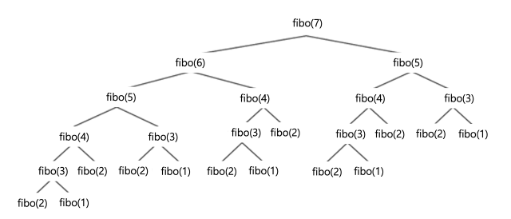
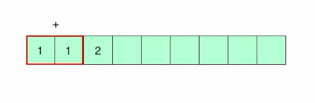

# :books: Dynamic Programming <sub>동적 계획법</sub>

## :bookmark_tabs: 목차

[:arrow_up: **Algorithm**](../README.md)

1. ### [Dynamic Programming](#📕-dynamic-programming-동적-계획법) <sub>동적 계획법</sub>

   - 정의
   - 특징
   - 동적계획법 예시
   - 장단점

# :closed_book: Dynamic Programming <sub>동적 계획법</sub>

## 정의

> 복잡한 문제를 재귀적<sub>Recursive</sub>인 방식으로 더 간단한 하위 문제로 분해하여 단순화 하는 알고리즘 기법

## 특징

- DP를 적용하기 위해선 다음 두가지 조건을 만족시켜야 함
  
  1. 부분 반복 문제 <sub>Overlapping Subproblem</sub>
     - `fibo(7)`을 구하기 위해 `fibo(3)`, `fibo(4)`, `fibo(5)`를 반복적으로 호출
     - 이렇게 부분적으로 반복되는 문제를 부분 반복 문제라 함
  2. 최적 부분 구조 <sub>Optimal Substructure</sub>
     - 위의 피보나치는 `fibo(n) = fibo(n-1) + fibo(n-2)`의 점화식을 가짐
     - 부분 문제의 최적해를 사용해 전체 문제의 최적해를 낼 수 있는 구조를 말함
- 주로 분할 정복 기법<sub>Divide and Conquer</sub>과 메모이제이션 기법<sub>Memoization</sub>을 조합해 구현

  > **분할 정복 <sub>Divide and Conquer</sub>**
  >
  > 그대로 해결할 수 없는 문제를 작은 문제로 분할하여 문제를 해결하는 방법

  > **메모이제이션 <sub>Memoization</sub>**
  >
  > 반복적으로 계산하는 공통 영역을 메모리에 저장하여 중복 연산을 줄이는 방법

## 동적계획법의 구현 방법론

### 탑다운 방식 <sub>Top-Down</sub>

- 가장 큰 문제부터 시작해 부분 하위 문제를 호출하는 구조
- 탑다운 방식은 주로 재귀 호출을 사용하는 방식으로 구현
- 가독성이 좋지만, 재귀 호출 과정에서 함수 스택 메모리가 사용

### 바텀업 방식 <sub>Button-Up</sub>

- 가장 작은 부분 하위문제부터 시작해 상위 문제로 쌓아가는 구조
- 바텀업 방식은 주로 반복문을 사용하는 방식으로 구현
- 별도의 함수 스택 메모리를 부르지 않아 메모리를 더 절약할 수 있음

## 동적계획법 예시

피보나치 수열을 동적계획법을 활용해 푸는 예시

### 재귀적인 피보나치 함수

```java
public static long fibo(long n) {
  if (n <= 1)
    return 1;
  else
    return fibo(n - 2) + fibo(n - 1);
}
```


- 재귀적인 풀이의 경우 `O(2^n)`의 기하급수적 연산량을 요구
- n의 값이 증가할수록 연산 성능이 떨어지고 요구 메모리가 커짐

### 동적계획법 피보나치 함수

```java
static long[] dp = new long[n + 1];

public static long fibo(long n) {
  if (n <= 1) {
    return 1;
  } else if (dp[n] != 0) {
    return dp[n];
  } else {
    return dp[n] = fibo(n - 1) + fibo(n - 2);
  }
}
```



- 동적계획법을 사용하면 fibo(n)의 값을 별도의 메모리 영역에 메모이제이션
- fibo(n+1)의 값을 계산할때 메모리에 저장된 fibo(n)가 있다면 저장된 값을 활용
- 동적계획법의 풀이의 경우 `O(n)`의 성능을 요구

## 장단점

- ### 장점

  - 부분 반복 문제를 줄여 연산의 속도와 전체적인 메모리 소모량을 개선

- ### 단점

  - 스택 호출로 구현했을 때 메모리 초과에 따른 스택 오버플로우 발생 가능성
  - 메모이제이션을 사용으로 별도의 메모리를 할당하고 호출하는 구조를 작성해야 함
