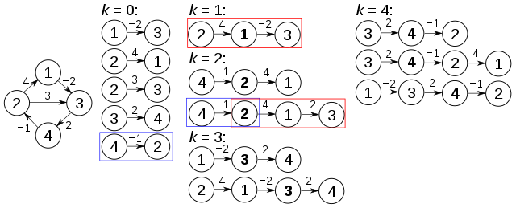
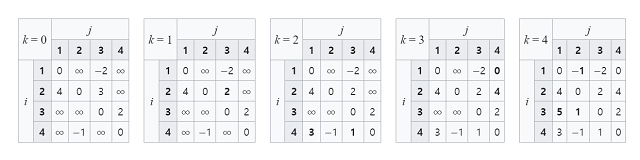

# :books: Floyd-Warshall <sub>플로이드-워셜 알고리즘</sub>

## :bookmark_tabs: 목차

[:arrow_up: **Algorithm**](../README.md)

1. ### [Floyd-Warshall](#📕-floyd-warshall-플로이드-워셜-알고리즘) <sub>플로이드-워셜 알고리즘</sub>

   - 정의
   - 특징
   - Floyd-Warshall의 동작 원리
   - 알고리즘
   - 복잡도

# :closed_book: Floyd-Warshall <sub>플로이드-워셜 알고리즘</sub>

## 정의

> 간선의 가중치가 음이거나 양의 값을 가지며, 음수 사이클을 가지지 않는 가중치 그래프에서 최단 경로를 찾는 알고리즘

## 특징

- 모든 정점 쌍 간의 최소 가중치를 가지는 최단 경로 길이를 구하는 알고리즘
- 기본 알고리즘은 경로 정보를 제공하지 않지만, 코드를 수정해 경로 정보를 반환 가능
- 동적 계획법<sub>Dynamic Programming</sub>을 활용하는 알고리즘

## Floyd-Warshall의 동작 원리




- 플로이드-워셜 알고리즘은 각각의 꼭짓점 쌍을 지나는 그래프의 모든 경로를 비교

1. 두 정점 i, j가 경유지 k를 거쳐가는 최단 경로를 반환
2. 경유지를 거쳐가는 최단 경로를 찾는 과정은 다음과 같음
   - i에서 j까지 직통 경로 ij가 있는 경우
     1. 새 경로 ij와 기존의 경로 중 최단을 선택
   - i에서 j까지의 직통 경로 ij가 없는 경우,
     1. i에서 k까지 이동하는 최단 경로 ik를 선택
     2. k에서 j까지 이동하는 최단 경로 kj를 선택
     3. 경로 ik와 경로 kj의 합과 기존의 경로 중 최단을 선택
3. 모든 정점 집합 V의 세 정점 조합 i,j,k에 대해서 과정 1, 2를 반복

## 알고리즘

Procedure

```
procedure FloydWarshall(V, edge) is
    let dist be a |V| × |V| array of minimum distances initialized to ∞ (infinity)

    for each edge (u, v) do
        dist[u][v] := w(u, v)  // The weight of the edge (u, v)

    for each vertex v do
        dist[v][v] := 0

    for k from 1 to |V| do
        for i from 1 to |V| do
            for j from 1 to |V| do
                if dist[i][j] > dist[i][k] + dist[k][j] then
                    dist[i][j] := dist[i][k] + dist[k][j]
    return dist
```

JAVA

```java
// edge[0], edge[1], edge[2] : to, from, weight
public static int[][] FloydWarshall(int V, int[][] edges) {
  int[][] dist  = new int[V][V];

  for (int[] edge : edges) {
    dist[edge[0]][edge[1]] = edge[2];
  }

  for(int k = 0; k < V; k++) {
    for(int i = 0; i < V; i++) {
      for(int j = 0; j < V; j++) {
        dist[i][j] = Math.min(dist[i][j], dist[i][k] + dist[k][j]);
      }
    }
  }

  return dist;
}
```

## 복잡도

| 연산 종류             | 평균<sub>Avg</sub> | 최악<sub>Worst</sub> |
| --------------------- | ------------------ | -------------------- |
| 공간<sub>Space</sub>  | `O(V^2)`           | `O(V^2)`             |
| 탐색<sub>Search</sub> | `O(V^3)`           | `O(V^3)`             |

- `V`는 그래프를 이루는 정점의 개수
