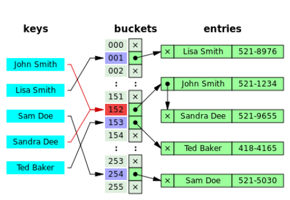
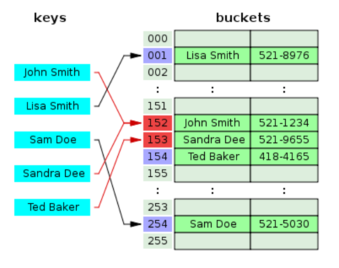

# :books: HashTable 해시테이블

## :bookmark_tabs: 목차

[:arrow_up: **Algorithm**](../README.md)

1. ### [Hash](#📕-hash-해시-함수) 해시 함수

   - 정의
   - 특징
   - 해시 함수의 조건
   - 좋은 해시 함수란?
   - 해시 함수의 종류
   - 활용

2. ### [HashTable](#📙-hashtable-해시테이블) 해시테이블

   - 정의
   - 특징
   - 해시 충돌을 해결 하는 방법
   - 크기 조정
   - 복잡도
   - 장단점
   - 활용

# :closed_book: Hash 해시 함수

## 정의

> 임의의 길이를 가진 데이터를 고정된 길이의 값으로 바꾸어 사용하는 일방향 함수 One-way Function및 알고리즘

## 특징

- 일방향 함수 One-way Function로 계산은 쉽지만 역을 구하는 것이 어려움
- 암호학적 해시 해시함수의 경우 같은 입력에 대해 항상 같은 출력을 보장하며, 이 출력 값을 고른 범위에 균일하게 분포하는 특성을 가짐
- 무한 길이의 데이터를 유한 길이로 줄이므로 이 과정에서 중복되는 Key가 발생할 수 있으며, 이러한 일을 충돌(Collision)이라 부름
  > Collision : 서로 다른 두 개의 키가 같은 인덱스로 해싱되는 현상

## 해시 함수의 조건

- 임의의 길이를 가진 키를 `ADD` 또는 `XOR`과 같은 패리티 보존 연산자를 사용하여 단어 또는 다른 단위로 접어서 고정된 길이의 키로 변환
- 결과 값이 키 공간에 균일하게 분포되도록 키의 비트를 스크램블
  > Scrambles : 무작위 방식으로 데이터의 각 비트를 섞어버리는 것
- 키 값을 테이블 크기보다 작거나 같은 값으로 매핑

## 좋은 해시 함수란?

### 좋은 해시 함수의 조건

1. 계산 속도가 빠르고 구조가 가벼울 것
   - 해시가 필요한 모든 연산에 전처리로 포함 될 것이므로 무거우면 불리함
2. 출력된 해시의 충돌이 최소화 되어야 할 것
   - 해시의 충돌이 많아질 수록 인덱싱과 체이닝에 로스가 발생, 시간 복잡도가 `O(1)` -> `O(N)`으로 점차 증가함

### 엄밀한 암호학적 해시 함수의 조건

1. **Preimage Resistance** 역상 저항성
   - 주어진 결과값에 대해 입력값을 계산하기 어려워야 함
2. **Second Preimage Resistance** 제 2 역상 저항성
   - 주어진 입력값에 대해 충돌쌍을 갖는 다른 입력값을 계산하기 어려워야 함
3. **Collision Resistance** 충돌 저항성
   - 충돌쌍(같은 결과값)을 갖는 두 개의 입력값을 계산하는 것이 어려워야 함

## 해시함수의 종류

- MD5
- SHA
  - SHA-1
  - SHA-256, SHA-512
  - SHA-3
- CRC
  - CRC32

## 활용

- 자료구조 구현
  - 해시테이블HashTable (또는 해시맵HashMap)
  - 해시셋HashSet
  - 블룸 필터 Bloom Filter
- 캐시 Cache
- 중복/유사 레코드 검색
- 중복/유사 부분 문자열 검색
- 기하학적 해시
- 변조 탐지/에러 검출

# :orange_book: HashTable 해시테이블

## 정의

> 해시 함수Hash Function를 사용해 데이터를 키쌍Key-Value으로 관리하는 자료구조

## 특징

- 해시 함수Hash Function의 해시를 통해 Key-Value의 쌍의 구조로 구현
- 테이블Table 또는 버킷Bucket이라 부르는 고정 크기 배열에 인덱싱Indexing해 데이터를 저장 하며, 이 과정을 해싱Hashing이라 함
- 해시 테이블HashTable의 모식도  
  
- 무한 길이의 데이터를 유한 길이로 줄이므로 이 과정에서 중복되는 Key가 발생할 수 있으며, 이러한 일을 충돌(Collision)이라 부름
  > Collision : 서로 다른 두 개의 키가 같은 인덱스로 해싱되는 현상

## 해시 충돌 Hash Collision을 해결 하는 방법

### Separate Chaining 분리 연결법

- 동일한 버킷의 데이터에 대해 리스트와 같은 자료구조를 사용해 같은 인덱스에 메모리를 추가 할당하는 해결법  
  
- 동일한 버킷으로 접근하는 데이터들을 연결Chaining해 관리함
- 해시 버킷의 물리적인 확장 없이 손쉽게 구현 가능
- 중복 인덱스를 가지는 데이터가 많아지면 동일 버킷에 연결된 데이터가 많아져 캐싱 성능이 하락함

### Open Addressing 개방 주소법

- 메모리 공간을 추가하지 않고 정해진 순서에 따라 인덱스를 옮겨 버킷의 비어있는 공간에 값을 채워넣는 해결법  
  
- 대표적인 주소 탐색 방법  
  
  1. **Linear Probing** 선형 탐사
     - 정해진 고정 폭으로 옮겨 해시 값의 중복을 피함
  2. **Quadratic Probing** 제곱 탐사
     - 정해진 고정 폭의 제곱수 만큼 인덱스를 옮겨 해시 값의 중복을 피함
  3. **Double Hashing Probing** 이중 해시 탐사
     - 해시 값을 다시 해싱하여 해싱 인덱싱의 규칙성을 더 복잡하게 함

### 캐싱 성능 차이 비교

- 분리 연결법과 개방 주소법(선형)의 캐싱 누락 횟수를 비교한 그래프  
  

## 크기 조정 Resizing

- 부하율Load Factor 계산식  
  $load factor(a) = \frac{n}{m}$
  - $n$ : 헤시 테이블을 차지하는 요소의 수
  - $m$ : 버킷의 총 용량
- 해시테이블 버킷 안의 데이터가 차지하는 영역의 비율
  > 일반적으로 적절한 성능의 부하율 범위는 `0.6 ~ 0.8` 정도
  - 부하율이 낮으면 비효율 적인 공간 활용을 의미
  - 부하율이 높으면 잦은 충돌 발생 및 충돌 해결 알고리즘을 호출을 의미하며, 캐싱 성능을 저하시킴
- 부하율을 계산하여 해시테이블의 크기를 동적으로 관리 할 수 있음

## 복잡도

| 연산 종류             | 평균Avg | 최악Worst |
| --------------------- | ------------------ | -------------------- |
| 공간Space  | `O(N)`             | `O(N)`               |
| 탐색Search | `O(1)`             | `O(N)`               |
| 삽입Insert | `O(1)`             | `O(N)`               |
| 삭제Delete | `O(1)`             | `O(N)`               |

- 탐색/삽입/삭제에 필요한 평균 시간 복잡도는 `O{1}`이지만, 충돌이나 캐시 누락 등의 상황이 자주 발생하는 최악의 경우 시간 복잡도는 `O(N)`

## 장단점

- ### 장점

  - 데이터 탐색, 삽입, 삭제 속도가 빠름
  - 키쌍으로 관리되어 키에 대한 데이터가 있는지 데이터 중복 확인이 쉬움

- ### 단점

  - 해시를 위한 저장공간이 좀 더 필요
  - 데이터 순회시 별도의 반복자Itorator가 필요
  - 버킷이 고정된 크기를 가져 사이즈를 동적으로 바꾸는 것이 어려움
  - 해시 충돌이 발생하면 성능 저하가 생김

## 활용

- 데이터 캐시 구현
- 연관 배열Associative arrays의 구현
- 데이터베이스 인덱싱Database indexing 구현  
  -> 해시테이블 기반 DBMS는 드물고 대부분 B-Tree를 사용
- 맵Map과 셋Set의 구현
- 데이터 탐색, 삽입, 삭제가 빈번히 일어날 때
