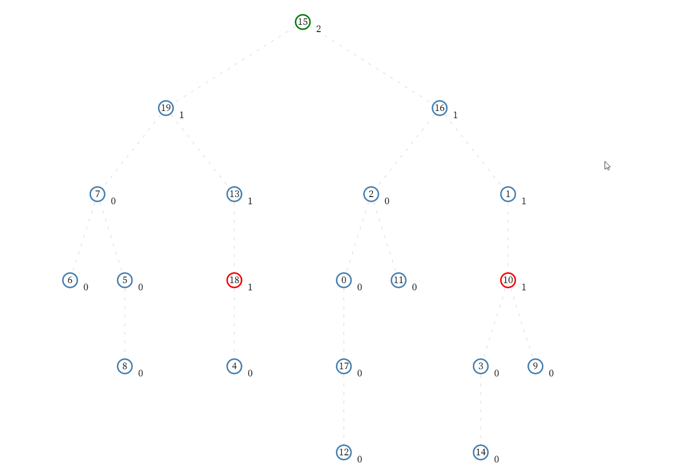

# :books: LCA <sub>최소 공통 조상</sub>

## :bookmark_tabs: 목차

[:arrow_up: **Algorithm**](../README.md)

1. ### [LCA](#📕-lca-lowest-common-ancestor-최소-공통-조상) <sub>Lowest Common Ancestor, 최소 공통 조상</sub>

   - 정의
   - 특징
   - LCA의 동작 원리
   - 알고리즘
   - 복잡도

# :closed_book: LCA <sub>Lowest Common Ancestor, 최소 공통 조상</sub>

## 정의

> 트리 자료구조에서 두 노드 사이의 최소 공통 조상을 구하는 알고리즘

## 특징

- 방향성 비순환 그래프<sub>DAG</sub>의 두 노드 A, B 사이의 가장 가까운 공통 조상을 찾는 알고리즘

## LCA의 동작 원리



### 기본 LCA 동작

1. 그래프 탐색 알고리즘을 통해 모든 노드의 깊이 정보를 파악
2. 두 노드 A, B 중 더 깊은 노드와 탐색하는 깊이가 같도록 탐색 깊이를 일치
3. 두 노드 A, B의 조상 노드를 거슬러 올라가면서 공통 조상이 나올때 까지 올리기

### 동적 계획법<sub>DP</sub>으로 개선된 LCA의 동작

위 알고리즘은 노드 N개가 쿼리 Q개를 가질 때 O(NQ)의 시간복잡도를 가지게 된다.
최악의 경우, 노드 N개의 최대 깊이는 N이므로 O(N^2)의 시간복잡도를 요구한다.

- 공통 조상 노드를 순차적으로 찾아 올라가는게 아니라, 지수적으로 점프 해서 찾아 올라가는 방식(2^n번째 조상을 탐색)을 활용해 더 빠른 시간 내에 공통 조상을 탐색
- 이를 위한 노드 A의 2^n번째 조상을 기록하기 위해 동적 계획법<sub>DP</sub>을 사용
- 노드 N의 조상 노드를 기록하는 점화식은 다음과 같다.  
  $parent[n][i] = parent[parent[n][i-1]][i-1]$

<!-- ### 세그먼트 트리<sub>Segment Tree</sub>로 개선된 LCA의 동작 -->

## 알고리즘

Procedure

```

```

JAVA

```java
public class LCA {
	private int nodeCnt;
	private List<Integer>[] adjList;
	private int treeHigh;
	private int[] depth;
	private boolean[] dp;
	private int[][] parent;

	public LCA(int nodeCnt, List<Integer>[] adjList) {
		this.nodeCnt = nodeCnt;
		this.adjList = adjList;
		this.treeHigh = (int) Math.ceil(Math.log(nodeCnt) / Math.log(2)) + 1;
		this.depth = new int[nodeCnt + 1];
		this.dp = new boolean[nodeCnt + 1];
		this.parent = new int[nodeCnt + 1][this.treeHigh];
	}

	private void init(int current, int treeHigh) {
		dp[current] = true;
		depth[current] = treeHigh;
		for (int next : adjList[current]) {
			if (dp[next])
				continue;
			init(next, treeHigh + 1);
			parent[next][0] = current;
		}
	}

	private void makeParentArray() {
		for (int i = 1; i < treeHigh; i++) {
			for (int j = 1; j < nodeCnt + 1; j++) {
				parent[j][i] = parent[parent[j][i - 1]][i - 1];
			}
		}
	}

	public int run(int a, int b) {
		init(1, 1);
		makeParentArray();

		if (depth[a] > depth[b]) {
			int temp = a;
			a = b;
			b = temp;
		}

		for (int i = treeHigh - 1; i >= 0; i--) {
			if ((1 << i) <= depth[b] - depth[a]) {
				b = parent[b][i];
			}
		}

		if (a == b) {
			return a;
		}

		for (int i = treeHigh - 1; i >= 0; i--) {
			if (parent[a][i] != parent[b][i]) {
				a = parent[a][i];
				b = parent[b][i];
			}
		}

		return parent[a][0];
	}
}
```

## 복잡도

### 기본 알고리즘

| 연산 종류             | 평균<sub>Avg</sub> | 최악<sub>Worst</sub> |
| --------------------- | ------------------ | -------------------- |
| 공간<sub>Space</sub>  | `O(N)`             | `O(N)`               |
| 탐색<sub>Search</sub> | `O(N^2)`           | `O(N^2)`             |

### 동적 계획법을 활용한 알고리즘

| 연산 종류             | 평균<sub>Avg</sub> | 최악<sub>Worst</sub> |
| --------------------- | ------------------ | -------------------- |
| 공간<sub>Space</sub>  | `O(N)`             | `O(N)`               |
| 탐색<sub>Search</sub> | `O(NlogN + MlogN)` | `O(NlogN + MlogN)`   |

<!-- ### 세그먼트 트리를 활용한 알고리즘

| 연산 종류             | 평균<sub>Avg</sub> | 최악<sub>Worst</sub> |
| --------------------- | ------------------ | -------------------- |
| 공간<sub>Space</sub>  | `O(N)`             | `O(N)`               |
| 탐색<sub>Search</sub> | `O(N + MlogN)`     | `O(N + MlogN)`       | -->

- `N`은 노드 A를 기준으로 공통 조상을 찾는 과정의 수
- `M`은 노드 B를 기준으로 공통 조상을 찾는 과정의 수
