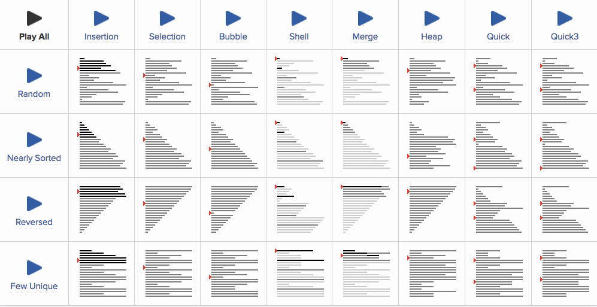

# :books: Sorting <sub>정렬</sub>

## :bookmark_tabs: 목차

[:arrow_up: **Algorithm**](../README.md)

1. ### [Sorting](#) <sub>정렬</sub>

   - 정의
   - [**삽입 정렬**](#삽입-정렬-insertion-sort) <sub>Insertion Sort</sub>
   - [**거품 정렬**](#거품-정렬-bubble-sort) <sub>Bubble Sort</sub>
   - [**선택 정렬**](#선택-정렬-selection-sort) <sub>Selection Sort</sub>
   - [**셸 정렬**](#셸-정렬-shell-sort) <sub>Shell Sort</sub>
   - [**병합 정렬**](#병합-정렬-merge-sort) <sub>Merge Sort</sub>
   - [**힙 정렬**](#힙-정렬-heap-sort) <sub>Heap Sort</sub>
   - [**퀵 정렬**](#퀵-정렬-quick-sort) <sub>Quick Sort</sub>
   - [**기수 정렬**](#기수-정렬-radix-sort) <sub>Radix Sort</sub>
   - [**계수 정렬**](#계수-정렬-count-sort) <sub>Count Sort</sub>

# :closed_book: Sorting <sub>정렬</sub>

## 정의

> 데이터를 정해진 조건에 맞도록 정렬된 순서로 배열하는 것을 알고리즘<sub>Algorithm</sub>

## 정렬 알고리즘 동작 한눈에 보기



## 삽입 정렬 <sub>Insertion Sort</sub>

### 특징

- 손으로 카드를 정렬하는 방식과 유사하게 작동하는 정렬 알고리즘
- 정렬된 영역과 정렬되지 않은 영역으로 구분함
- 정렬되지 않은 영역의 값을 선택해 정렬된 영역의 알맞은 위치에 배치

### 동작 원리

1. 왼쪽에서부터 시작해 인접한 요소를 비교해 현재 선택된 요소가 더 작으면 요소를 왼쪽에 배치
2. 선택한 요소가 더 이상 왼쪽으로 이동할 수 없으면 다음 요소를 선택
3. 이 과정은 모든 데이터가 더 이상 위치가 바뀌지 않을 때 까지 반복

### 알고리즘

<details>
<summary>java 코드</summary>
<div markdown="1">

```java
public class InsertionSort {
	void sort(int arr[]) {
		int n = arr.length;
		for (int i = 1; i < n; ++i) {
			int key = arr[i];
			int j = i - 1;

			while (j >= 0 && arr[j] > key) {
				arr[j + 1] = arr[j];
				j = j - 1;
			}
			arr[j + 1] = key;
		}
	}

	static void printArray(int arr[]) {
		for (int i = 0; i < arr.length; i++) {
			System.out.print(arr[i] + " ");
		}
		System.out.println();
	}

	public static void main(String args[]) {
		int arr[] = { 12, 11, 13, 5, 6 };

		InsertionSort ob = new InsertionSort();
		ob.sort(arr);

		printArray(arr);
	}
}
```

</div>
</details>

## 선택 정렬 <sub>Selection Sort</sub>

### 특징

- 정렬되지 않은 부분에서 가장 작은 요소를 반복적으로 선택하고 목록의 정렬된 부분으로 이동시키는 정렬 알고리즘

### 동작 원리

1. 왼쪽에서부터 시작해 선택한 요소와 오른쪽의 모든 요소를 비교해 가장 작은 값을 찾아 서로 교환
2. 오른쪽으로 한 칸 이동하고 1번 반복, 선택된 요소의 왼쪽은 이미 정렬됐으므로 선택하지 않음
3. 이 과정은 모든 데이터가 더 이상 위치가 바뀌지 않을 때 까지 반복

### 알고리즘

<details>
<summary>java 코드</summary>
<div markdown="1">

```java
public class SelectionSort {
	void sort(int arr[]) {
		int n = arr.length;

		for (int i = 0; i < n - 1; i++) {
			int min_idx = i;
			for (int j = i + 1; j < n; j++)
				if (arr[j] < arr[min_idx])
					min_idx = j;

			int temp = arr[min_idx];
			arr[min_idx] = arr[i];
			arr[i] = temp;
		}
	}

	static void printArray(int arr[]) {
		for (int i = 0; i < arr.length; i++) {
			System.out.print(arr[i] + " ");
		}
		System.out.println();
	}

	public static void main(String args[]) {
		int arr[] = { 64, 25, 12, 22, 11 };

		SelectionSort ob = new SelectionSort();
		ob.sort(arr);

		printArray(arr);
	}
}
```

</div>
</details>

## 거품 정렬 <sub>Bubble Sort</sub>

### 특징

- 정렬되지 않은 인접한 요소를 반복적으로 교환하여 작동하는 정렬 알고리즘

### 동작 원리

1. 왼쪽에서부터 시작해 인접한 요소를 비교하면 더 높은 요소가 오른쪽에 배치
2. 1번을 모든 요소에 대해 반복하면 가장 큰 요소는 가장 오른쪽 끝으로 이동
3. 이 과정은 모든 데이터가 더 이상 위치가 바뀌지 않을 때 까지 반복

### 알고리즘

<details>
<summary>java 코드</summary>
<div markdown="1">

```java
public class BubbleSort {
	void sort(int arr[]) {
		int n = arr.length;
		boolean swapped;

		for (int i = 0; i < n - 1; i++) {
			swapped = false;
			for (int j = 0; j < n - i - 1; j++) {
				if (arr[j] > arr[j + 1]) {

					int temp = arr[j];
					arr[j] = arr[j + 1];
					arr[j + 1] = temp;
					swapped = true;
				}
			}

			if (swapped == false)
				break;
		}
	}

	static void printArray(int arr[]) {
		for (int i = 0; i < arr.length; i++) {
			System.out.print(arr[i] + " ");
		}
		System.out.println();
	}

	public static void main(String args[]) {
		int arr[] = { 64, 34, 25, 12, 22, 11, 90 };

		BubbleSort ob = new BubbleSort();
		ob.sort(arr);

		printArray(arr);
	}
}
```

</div>
</details>

## 셸 정렬 <sub>Shell Sort</sub>

### 특징

- 삽입 정렬의 변형으로 어느정도 정리 되었을때 빠른 것을 고려해 일정 범위의 소팅 구간<sub>gap</sub>을 설정해 삽입 정렬을 진행하는 정렬 알고리즘

### 동작 원리

1. 정렬해야 할 리스트의 각 k번째 요소를 추출해서 부분 리스트인 간격<sub>gap</sub>을 생성
   - 간격의 초깃값: (정렬할 값의 수)/2 + 1의 홀수로 이루어진 값
   - 각 회전마다 간격 k를 절반으로 줄이며 1이 될때 까지 반복
2. 왼쪽에서부터 시작해 간격 안의 인접한 요소를 비교해 현재 더 작은 요소를 왼쪽에 배치
3. 선택한 요소가 더 이상 왼쪽으로 이동할 수 없으면 다음 요소를 선택
4. 이 과정은 간격이 1이 되거나 모든 데이터가 더 이상 위치가 바뀌지 않을 때 까지 반복

### 알고리즘

<details>
<summary>java 코드</summary>
<div markdown="1">

```java
public class ShellSort {
	void sort(int arr[]) {
		int n = arr.length;

		for (int gap = n / 2; gap > 0; gap /= 2) {
			for (int i = gap; i < n; i++) {
				int temp = arr[i];

				int j = i;

				for (j = i; j >= gap && arr[j - gap] <= temp; j -= gap) {
					arr[j] = arr[j - gap];
				}

				arr[j] = temp;
			}
		}
	}

	static void printArray(int arr[]) {
		for (int i = 0; i < arr.length; i++) {
			System.out.print(arr[i] + " ");
		}
		System.out.println();
	}

	public static void main(String args[]) {
		int arr[] = { 12, 34, 54, 2, 3, 15 };

		ShellSort ob = new ShellSort();
		ob.sort(arr);

		printArray(arr);
	}
}
```

</div>
</details>

## 병합 정렬 <sub>Merge Sort</sub>

### 특징

- 분할정복<sub>Divide and Conquer</sub>을 사용한 정렬 알고리즘
- 정렬해야 할 리스트를 균등한 크기를 가진 부분 리스트로 재귀적 분할
- 분할한 리스트를 정렬한 뒤 재귀적으로 합병하여, 하나의 정렬된 리스트로 만듬

> **분할 정복 <sub>Divide and Conquer</sub>**
>
> 그대로 해결할 수 없는 문제를 작은 문제로 분할하여 문제를 해결하는 방법

### 동작 원리

1. 정렬해야 할 리스트를 균등한 크기를 가진 2개의 부분 리스트로 분할
   - 이 과정을 재귀적으로 진행 해 더이상 분할 할 수 없을 때 까지 반복
2. 분할된 2개의 부분 리스트를 하나로 합침
   - 분할된 두 리스트 A, B의 가장 작은 요소부터 순차적으로 삽입하여 정렬
   - 분할된 부분리스트의 하나의 리스트로 합칠때 까지 반복

### 알고리즘

<details>
<summary>java 코드</summary>
<div markdown="1">

원본 리스트의 메모리 공간을 유지한채 정렬하는 병합 정렬 코드

```java
public class MergeSort {
	void merge(int arr[], int left, int mid, int right) {
		int n1 = mid - left + 1;
		int n2 = right - mid;

		int L[] = new int[n1];
		int R[] = new int[n2];

		for (int i = 0; i < n1; ++i) {
			L[i] = arr[left + i];
		}

		for (int j = 0; j < n2; ++j) {
			R[j] = arr[mid + 1 + j];
		}

		int i = 0, j = 0;
		int k = left;

		while (i < n1 && j < n2) {
			if (L[i] <= R[j]) {
				arr[k] = L[i];
				i++;
			} else {
				arr[k] = R[j];
				j++;
			}
			k++;
		}

		while (i < n1) {
			arr[k] = L[i];
			i++;
			k++;
		}

		while (j < n2) {
			arr[k] = R[j];
			j++;
			k++;
		}
	}

	void sort(int arr[], int left, int right) {
		if (left < right) {

			int mid = left + (right - left) / 2;

			sort(arr, left, mid);
			sort(arr, mid + 1, right);

			merge(arr, left, mid, right);
		}
	}

	static void printArray(int arr[]) {
		for (int i = 0; i < arr.length; i++) {
			System.out.print(arr[i] + " ");
		}
		System.out.println();
	}

	public static void main(String args[]) {
		int arr[] = { 12, 11, 13, 5, 6, 7, 1, 9 };

		MergeSort ob = new MergeSort();
		ob.sort(arr, 0, arr.length - 1);

		printArray(arr);
	}
}
```

</div>
</details>

## 힙 정렬 <sub>Heap Sort</sub>

### 특징

- 이진 힙<sub>Binary Heap</sub> 구조를 사용한 정렬 알고리즘
- 정렬해야 할 리스트의 최소 요소를 찾아 힙의 시작 부분에 배치하는 방법으로 정렬

### 동작 원리

1. heapify를 사용하여 리스트를 힙 구조로 변환
   - 최대 힙<sub>Max Heap</sub>의 경우 루트 노드를 삭제하고 이를 힙의 마지막 노드로 바꾼 다음 힙의 루트를 heapify
   - 힙 크기가 1보다 커질 때까지 heapify 과정을 반복
2. 힙의 요소가 다음 중 하나만 포함될 때까지 아래 단계를 반복
   - 힙의 루트 요소(가장 큰 요소)를 힙의 마지막 요소와 교체
   - 힙의 마지막 요소(현재 올바른 위치에 있음)를 제거
   - 힙의 나머지 요소에 대해 heapify
3. 입력 리스트의 요소 순서를 반대로 하여 정렬된 결과를 출력

### 알고리즘

<details>
<summary>java 코드</summary>
<div markdown="1">

```java
public class HeapSort {
	void heapify(int arr[], int N, int i) {
		int largest = i;
		int left = 2 * i + 1;
		int right = 2 * i + 2;

		if (left < N && arr[left] > arr[largest])
			largest = left;

		if (right < N && arr[right] > arr[largest])
			largest = right;

		if (largest != i) {
			int swap = arr[i];
			arr[i] = arr[largest];
			arr[largest] = swap;

			heapify(arr, N, largest);
		}
	}

	public void sort(int arr[]) {
		int N = arr.length;

		for (int i = N / 2 - 1; i >= 0; i--)
			heapify(arr, N, i);

		for (int i = N - 1; i > 0; i--) {
			int temp = arr[0];
			arr[0] = arr[i];
			arr[i] = temp;

			heapify(arr, i, 0);
		}
	}

	static void printArray(int arr[]) {
		for (int i = 0; i < arr.length; i++) {
			System.out.print(arr[i] + " ");
		}
		System.out.println();
	}

	public static void main(String args[]) {
		int arr[] = { 22, 31, 16, 5, 6, 7, 11, 19 };

		HeapSort ob = new HeapSort();
		ob.sort(arr);

		printArray(arr);
	}
}
```

</div>
</details>

## 퀵 정렬 <sub>Quick Sort</sub>

### 특징

- 특정 요소를 피벗<sub>Pivot</sub>으로 선택해 피벗을 기준으로 올바른 위치에 배치하여 선택한 피벗 주위의 리스트로 나누어 분할정복하는 정렬 알고리즘
- 피벗을 선택하는 방법은 다음과 같은 방법이 있음
  - 첫 요소를 피벗으로 선택
  - 마지막 요소를 피벗으로 선택
  - 가운데 요소를 피벗으로 선택
  - 무작위의 요소를 피벗으로 선택

### 동작 원리

**partition 알고리즘**

- 정렬된 리스트가 선택된 요소를 중심으로 다음 기준에 따라 요소를 배치
  - 피벗보다 작은 요소는 피벗의 왼쪽에 배치
  - 피벗보다 큰 요소는 피벗의 오른쪽에 배치

1. 정렬해야 할 리스트에 partition 알고리즘을 수행해 요소 배치후 피봇을 반환
2. 반환된 피봇을 기준으로 기존의 리스트를 부분 리스트 2개로 나눔
3. 이 과정은 모든 데이터가 피봇으로 선택될 때 까지 반복

### 알고리즘

<details>
<summary>java 코드</summary>
<div markdown="1">

```java
public class QuickSort {
	public int partition(int[] arr, int left, int right) {
		int pivot = arr[right];
		int temp = 0;

		int i = left;

		for (int j = left; j < right; j++) {
			if (arr[j] < pivot) {
				temp = arr[i];
				arr[i] = arr[j];
				arr[j] = temp;

				i++;
			}
		}

		temp = arr[i];
		arr[i] = arr[right];
		arr[right] = temp;

		return i;
	}

	public void sort(int[] arr, int left, int right) {
		if (left < right) {
			int pi = partition(arr, left, right);

			sort(arr, left, pi - 1);
			sort(arr, pi + 1, right);
		}
	}

	static void printArray(int arr[]) {
		for (int i = 0; i < arr.length; i++) {
			System.out.print(arr[i] + " ");
		}
		System.out.println();
	}

	public static void main(String[] args) {
		int[] arr = { 22, 31, 16, 5, 6, 7, 11, 19 };
		int N = arr.length;

		QuickSort ob = new QuickSort();
		ob.sort(arr, 0, N - 1);

		printArray(arr);
	}
}
```

</div>
</details>

## 기수 정렬 <sub>Radix Sort</sub>

### 특징

- 요소를 숫자 단위로 처리하여 정렬하는 선형 정렬 알고리즘
- 고정 크기 키를 사용하는 정수 또는 문자열에 대한 효율적
- 각 숫자의 자리값을 기준으로 요소를 버킷에 담아 부분 정렬

### 동작 원리

1. 정렬해야 할 리스트에서 가장 큰 요소를 선택
2. 단위 자리 숫자(X=1)를 기준으로 요소를 정렬. 이때 계수 정렬<sub>Count Sort</sub>등을 활용
3. 단위 위치 (X=1, 10, 100, ...)에 따라 2번의 정렬을 반복
4. 오름차순으로 정렬된 배열을 반환

### 알고리즘

<details>
<summary>java 코드</summary>
<div markdown="1">

```java
	public int getMax(int arr[], int n) {
		int mx = arr[0];

		for (int i = 1; i < n; i++) {
			if (arr[i] > mx) {
				mx = arr[i];
			}
		}

		return mx;
	}

	public void countSort(int arr[], int n, int exp) {
		int[] output = new int[n];
		int[] count = new int[10];
		int i = 0;

		for (i = 0; i < n; i++) {
			count[(arr[i] / exp) % 10]++;
		}

		for (i = 1; i < 10; i++) {
			count[i] += count[i - 1];
		}

		for (i = n - 1; i >= 0; i--) {
			output[count[(arr[i] / exp) % 10] - 1] = arr[i];
			count[(arr[i] / exp) % 10]--;
		}

		for (i = 0; i < n; i++) {
			arr[i] = output[i];
		}
	}

	public void sort(int arr[]) {
		int N = arr.length;
		int M = getMax(arr, N);

		for (int exp = 1; M / exp > 0; exp *= 10)
			countSort(arr, N, exp);
	}

	static void printArray(int arr[]) {
		for (int i = 0; i < arr.length; i++) {
			System.out.print(arr[i] + " ");
		}
		System.out.println();
	}

	public static void main(String[] args) {
		int arr[] = { 170, 45, 75, 90, 802, 24, 2, 66 };

		RadixSort ob = new RadixSort();
		ob.sort(arr);

		printArray(arr);
	}
}
```

</div>
</details>

## 계수 정렬 <sub>Count Sort</sub>

### 특징

- 입력값의 범위가 제한적일 때 빠르고 효율적으로 동작하는 비비교 기반 정렬 알고리즘
- 정렬할 요소의 개수에 비해 입력값의 범위가 작은 경우 특히 효율적
- 입력 리스트의 각 요소의 빈도를 계산한 정보를 사용해 요소를 올바른 정렬 위치에 배치

### 동작 원리

1. 정렬해야 할 리스트의 최대 요소를 선택
2. 계수를 저장할 배열 countArr를 선언(최대 요소 + 1)하고 모든 값을 0으로 초기화
3. 모든 요소를 순차적으로 순회하며 등장 빈도를 countArr의 요소 인덱스에 카운팅
4. countArr를 순회하며 카운팅한 횟수만큼 해당 요소를 반환

### 알고리즘

<details>
<summary>java 코드</summary>
<div markdown="1">

```java
public class CountSort {
	public void sort(int arr[]) {
		int N = arr.length;
		int M = 0;

		for (int i = 0; i < N; i++) {
			M = Math.max(M, arr[i]);
		}

		int[] output = new int[N];
		int[] count = new int[M + 1];

		for (int i = 0; i < N; i++) {
			count[arr[i]]++;
		}

		for (int i = 1; i <= M; i++) {
			count[i] += count[i - 1];
		}

		for (int i = N - 1; i >= 0; i--) {
			output[count[arr[i]] - 1] = arr[i];
			count[arr[i]]--;
		}

		for (int i = 0; i < N; i++) {
			arr[i] = output[i];
		}
	}

	static void printArray(int arr[]) {
		for (int i = 0; i < arr.length; i++) {
			System.out.print(arr[i] + " ");
		}
		System.out.println();
	}

	public static void main(String[] args) {
		int[] arr = { 4, 3, 12, 1, 5, 5, 3, 9 };

		CountSort ob = new CountSort();
		ob.sort(arr);

		printArray(arr);
	}
}
```

</div>
</details>

## 복잡도

| 정렬 알고리즘 종류       | 최선<sub>Best</sub> | 평균<sub>Avg</sub> | 최악<sub>Worst</sub> | 공간<sub>Space</sub> |
| ------------------------ | ------------------- | ------------------ | -------------------- | -------------------- |
| 삽입<sub>Insertion</sub> | `O(N)`              | `O(N^2)`           | `O(N^2)`             | `O(1)`               |
| 거품<sub>Bubble</sub>    | `O(N)`              | `O(N^2)`           | `O(N^2)`             | `O(1)`               |
| 선택<sub>Selection</sub> | `O(N^2)`            | `O(N^2)`           | `O(N^2)`             | `O(1)`               |
| 셸<sub>Shell</sub>       | `O(NlogN)`          | `O((NlogN)^2)`     | `O((NlogN)^2)`       | `O(1)`               |
| 병합<sub>Merge</sub>     | `O(NlogN)`          | `O(NlogN)`         | `O(NlogN)`           | `O(N)`               |
| 힙<sub>Heap</sub>        | `O(NlogN)`          | `O(NlogN)`         | `O(NlogN)`           | `O(1)`               |
| 퀵<sub>Quick</sub>       | `O(NlogN)`          | `O(NlogN)`         | `O(N^2)`             | `O(logN)`            |
| 기수<sub>Radix</sub>     | `O(NK)`             | `O(NK)`            | `O(NK)`              | `O(N+K)`             |
| 계수<sub>Count</sub>     | `O(N+K)`            | `O(N+K)`           | `O(N+K)`             | `O(K)`               |
