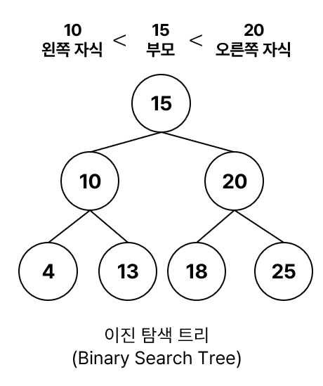
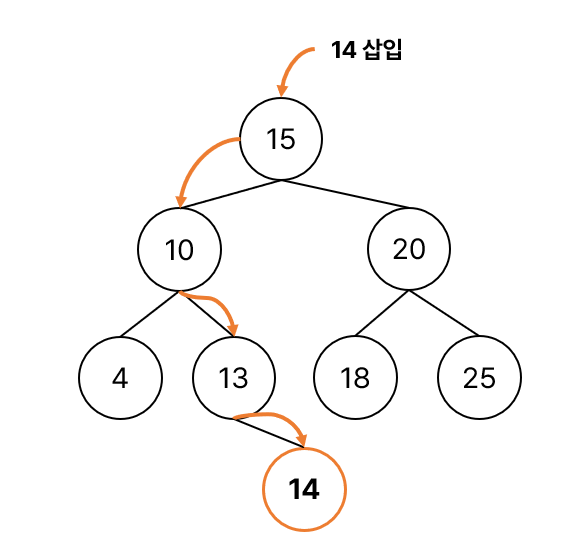
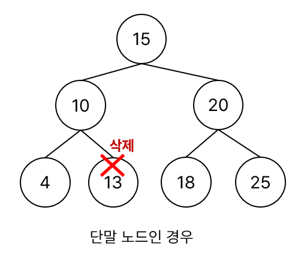
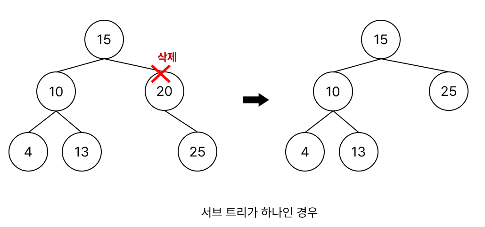
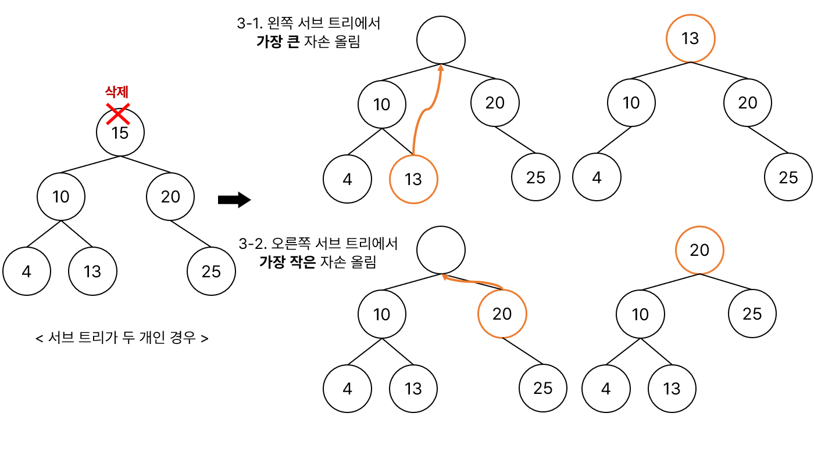

# Binary Search Tree(BST, 이진 탐색 트리)
### ❓이진 트리 기반의 탐색을 위한 자료구조, 이진 탐색과 연결 리스트를 결합한 자료 구조

<p align="center"></p>

- 항상 왼쪽 자식 노드의 키값은 부모노드보다 작고, 오른쪽 자식 노드의 키값은 부모노드보다 큼.
- 각 노드에 중복되지 않는 키가 존재.
- 트리의 높이에 영향을 받기 때문에 높이가 h일 때 시간 복잡도 : O(h)
- 트리의 균형이 한쪽으로 치우쳐진 경우(최악의 경우) 시간 복잡도 : O(N)
    - 이 경우를 막기 위해 나온 기법이 자가 균형 이진 탐색 트리(Red-Black Tree(RBT), AVL Tree)
- 데이터가 완전히 정렬된 상태로 저장되어 있진 않지만 순회를 하면 정렬된 값을 얻을 수 있음.


### BST 탐색

- 찾고자 하는 값을 num이라고 하자.

```text
1. 루트 노드의 키와 num을 비교하고, 찾는 값이면 탐색 종료
 1-1. if( num < 루트 노드의 키 )
        왼쪽 서브 트리 탐색
 1-2. if( num > 루트 노드의 키 ) 
        오른쪽 서브 트리 탐색
```
위 과정을 num을 찾을 때까지 반복.

### BST 삽입 ➡️ [구현 코드](./algorithm/BinarySearchTree_Add.java)



```text
1. 루트 노드와 비교하여 같으면 오류 발생(중복 값 허용 X)
2. if(삽입할 노드 < 루트 노드의 키)
        왼쪽 서브 트리를 탐색하여 비어있으면 추가 후 삽입 과정 종료, 비어있지 않으면 값 비교
3. if(삽입할 노드 > 루트 노드의 키)
        오른쪽 서브 트리를 탐색하여 비어있으면 추가 후 삽입 과정 종료, 비어있지 않으면 값 비교
```

위 과정을 빈 공간이 나올 때까지 반복한다.

</br>

### BST 삭제 ➡️ [구현 코드](./algorithm/BinarySearchTree_Delete.java)

- 3가지 경우가 존재

1. 삭제하려는 노드가 단말 노드<sub>leaf node</sub>인 경우
2. 삭제하려는 노드의 서브 트리가 하나인 경우
3. 삭제하려는 노드의 서브 트리가 두 개인 경우


#### 1. 단말 노드인 경우
- 삭제할 노드의 부모 노드가 있다면 부모 노드의 자식 노드를 NULL로 만들고 삭제하면 됨.

<p align="center"></p>

#### 2. 서브 트리가 하나인 경우

- 삭제할 노드의 자식 노드를 부모 노드가 가리키게 하고 삭제하면 됨.

<p align="center"></p>

#### 3. 서브 트리가 두 개인 경우

- 3-1 삭제할 노드의 <u>왼쪽 서브 트리의 가장 큰 자손</u>을 삭제할 노드의 자리로 올림.
- 3-2 삭제할 노드의 <u>오른쪽 서브 트리의 가장 작은 자손</u>을 삭제할 노드의 자리로 올림.

<p align="center"></p>

### Tree의 순회<sub>traversal</sub> 방법 ➡️ [구현 코드](./algorithm/BinarySearchTree_Traversal.java)
1. 중위순회(Inorder) : **왼쪽자식 -> 부모 -> 오른쪽 자식** 순서로 방문
2. 전위순회(Preorder) : **부모 -> 왼쪽자식, 오른쪽 자식** 순서로 방문
3. 후위순회(Postorder) : **왼쪽자식 -> 오른쪽 자식 -> 부모** 순서로 방문

### 특징
|  | Binary Search Tree | 
| --- | --- | 
| 데이터들의 input 순서 보장 여부 | no |
| 중복된 데이터 허용 여부 | no |
| 데이터 정렬 여부 | 저장된 데이터가 완전히 정렬되어 있다기 보다 순회를 할 때 정렬된 상태로 뽑히게 됨. |

### ⏰ 시간 복잡도
| 연산 | 평균 | 최악의 경우  <sub>편향되어 있을 경우 |
| --- | --- | --- |
| 삽입 | O(logN) | O(N) |
| 검색 | O(logN) | O(N) |
| 삭제 | O(logN) | O(N) |

### 장점
- 이진 탐색의 효율적인 탐색 가능

### 단점
- 트리의 균형이 보장되지 않음.
- 트리의 균형을 유지하지 않으면 성능이 안 좋아져 시간 복잡도가 O(N)까지 떨어짐.
- 데이터 삽입, 삭제할 때마다 트리의 균형을 재조정해야 할 수 있고, 이는 추가 비용을 발생시킴.

### 활용
- DB 인덱싱에 사용
- 검색 알고리즘 구현에 사용
- 데이터 캐싱에 사용
- 우선순위 대기열에 사용
- 자주 발생하는 값을 더 작은 공간에 저장하고 덜 발생하는 값을 더 큰 공간에 저장하여 데이터를 압축하는 데 사용할 수 있음.
       ➡️ 이미지 및 오디오 압축, 데이터 전송, 파일 압축 등에 사용됨.
- 보안 통신 프로토콜에 사용되는 공개 키 암호화 알고리즘인 RSA와 같은 암호화 알고리즘에 사용될 수 있음. RSA는 BST를 사용하여 공개 키와 개인 키를 생성

</br>

- 참고

[Complexity of different operations in Binary tree, Binary Search Tree and AVL tree](https://www.geeksforgeeks.org/complexity-different-operations-binary-tree-binary-search-tree-avl-tree/)

[Applications, Advantages and Disadvantages of Binary Search Tree](https://www.geeksforgeeks.org/applications-advantages-and-disadvantages-of-binary-search-tree/)