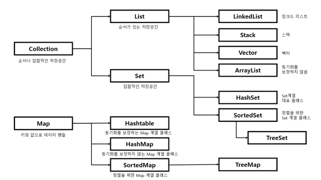

# :books: Graph & Tree & Heap 그래프와 트리 그리고 힙

## :bookmark_tabs: 목차

[:arrow_up: **DataStructure**](./README.md)

1. ### [Graph](#📕-graph-그래프) 그래프

   - 정의
   - 특징
   - 그래프의 기본 종류
   - 그래프의 구현 방법
   - 복잡도
   - 활용

2. ### [Tree](#📙-tree-트리) 트리

   - 정의
   - 특징
   - 크기 조정
   - 복잡도
   - 장단점
   - 활용

3. ### [Heap](#📗-heap-힙) 힙

   - 정의
   - 특징
   - 크기 조정
   - 복잡도
   - 장단점
   - 활용

# :closed_book: Graph 그래프

## 정의

> 유한한 정점 집합Vertex Set과 간선 집합Edge Set의 연결 관계를 기록한 순서 쌍Pair으로 구성된 자료구조

## 특징

- 유한개의 정점Vertex과 간선Edge으로 구성되어 있음
  - 데이터의 위치를 나타내는 정점Vertex(또는 노드Node , 포인트Point)
  - 데이터의 연결 관계를 나타내는 간선Edge(또는 선Line , 링크Link)
- 간선은 방향성Direct과 가중치Weight를 가질 수 있음
- 두 점이 간선으로 연결되어 있으면 이를 인접Adjacent했다고 표현
- 서로 떨어진 두 정점을 여러 간선을 거쳐 연결된 것을 경로Path라 부름
- 경로의 시작 지점과 끝 지점이 동일할 경우도 있으며 이를 사이클Cycle 이라고 함

## 그래프의 기본 종류

- 기본적으로 무방향, 방향, 가중치 여부로 그래프를 분류하며, 방향과 가중치 모두 있는 경우나 사이클이 있는 경우에 따라 추가적으로 분류하기도 함

### Undirected graph 무방향 그래프

- 간선에 방향성과 가중치가 모두 없는 그래프

### Directed graph 방향 그래프

- 간선에 방향성 있는 그래프

### Weighted graph 가중치 그래프

- 간선에 가중치가 있는 그래프

## 그래프의 구현 방법

### Adjacency list 인접 리스트

- 그래프의 각 정점을 root로 가지는 리스트 배열을 생성한 뒤, 간선에 따라 인접한 두 정점 i, j를 `V[i].add(pair(j, weight))` 형태로 기록해서 구현
- 각 정점 리스트에 삽입된 노드는 비순차적으로 기록됨
- 리스트의 요소의 수는 간선의 개수와 일치
- **장점**
  - 간선의 개수가 적을 때 비교적 적은 공간을 활용해 그래프를 표현 가능
  - 정점의 연결 관계를 파악하기 위해서 `O(E)`의 시간 복잡도를 요구
- **단점**
  - 리스트의 링크를 표시하기 위해 추가적인 메모리 소모가 발생
  - 특정 정점 또는 간선 정보를 찾기 위해서 `O(V+E)`의 시간 복잡도 요구

### Adjacency matrix 인접 행렬

- 그래프의 두 정점의 쌍(i, j)을 가지는 행렬을 생성한 뒤, 간선에 따라 인접한 두 정점을 i, j를 `adj[i][j] = weight` 형태로 기록해서 구현
- 행렬의 크기는 `O(V^2)`
- **장점**
  - 구현이 쉬움
  - 두 정점 간의 연결 정보를 찾기 위해서 `O(1)`의 시간 복잡도를 요구
- **단점**
  - 정점의 연결 관계를 파악하기 위해서 최대 `O(V^2)`의 시간 복잡도를 요구

### Incidence matrix 결합 행렬

- 그래프의 각 정점과 간선의 쌍(i, e)을 가지는 행렬을 생성한 뒤, 간선에 따라 인접한 두 정점을 `inc[i][e] = weight` 형태로 기록해서 구현
- 행렬의 크기는 `O(VE)`
- 방향 그래프에서 연결된 정점의 시작 지점과 끝 지점을 구분하기 위해서 시작 정점의 가중치 값을 음수, 끝 정점의 가중치 값을 정수로 표현하기도 함
- **장점**
  - 구현이 쉬움
  - 인접 행렬에 비해서 메모리를 절약
  - 부분 그래프Sub-graph와 사이클을 파악하기 쉬움
  - 정점과 간선의 연결 정보를 찾기 위해서 `O(1)`의 시간 복잡도를 요구
- **단점**
  - 정점의 연결 관계를 파악하기 위해서 최대 `O(VE)`의 시간 복잡도를 요구

## 복잡도

| 연산 종류             | 평균Avg | 최악Worst |
| --------------------- | ------------------ | -------------------- |
| 공간Space  | `O(V+E)`           | `O(V+E)`             |
| 탐색Search | `O(V+E)`           | `O(V+E)`             |
| 삽입Insert | `O(1)`             | `O(1)`               |
| 삭제Delete | `O(V+E)`           | `O(V+E)`             |

- `V`는 정점의 수, `E`는 간선의 수
- 탐색에는 깊이 우선 탐색Depth First Search, DFS과 너비 우선 탐색Breadth First Search, BFS를 사용
- 삽입 시 필요한 시간 복잡도는 `O(1)`이지만, 삭제 시 원하는 데이터를 지우기 위해 모든 정점과 간선을 순회해 찾아야 하므로 시간복잡도는 `O(V+E)`
- 단, 인접 행렬이나 결합 행렬로 구현되었을 경우 삽입/삭제에 걸리는 시간 복잡도는 `O(1)`

## 활용

- 경로 탐색Path Searching 구현
- 상태 머신State Machine 구현
- 연결 관계 기반으로 데이터를 관리해야 할 때

# :orange_book: Tree 트리

## 정의

## 특징

## 크기 조정

## 복잡도

## 장단점

## 활용

# :green_book: Heap 힙

## 정의

> 데이터를 순서Sequence와 상관없이 저장하며 데이터 중복
> Data Redundancy을 허용하지 않는 자료구조

## 특징

- 키Key로만 데이터를 저장(Key = Value)
- 키는 중복을 허용하지 않는 고유 값Unique
- 다음과 같은 기본 연산을 가짐
  - 데이터를 삽입하는 `add(key)`
  - 데이터를 탐색하는 `contaions(key)`
  - 데이터를 삭제하는 `remove(key)`
  - 공집합 여부를 확인하는 `isEmpty()`
- 인덱스가 없어 일반적으로 반복자Iterator로만 요소를 순회할 수 있음

## 셋의 구현체 종류

### HashSet 해시셋

- 해시테이블HashTable을 활용한 가장 보편적인 Set의 구현체
- 삽입과 탐색과 같은 작업에 걸리는 평균 시간 복잡도는 `O(1)`
- 데이터를 중복 저장할 수 없고, 순서를 보장하지 않음
- `null`의 입력이 가능하나 중복되지 않음(공집합)

### TreeSet 트리셋

- 이진탐색트리Binary Search Tree, BST를 사용해 데이터를 정렬된 순서대로 저장하는 구현체
- 삽입과 탐색과 같은 작업에 걸리는 평균 시간 복잡도는 `O(log N)` (N = element 개수)
- 포함된 데이터 값의 정렬을 통한 우선순위 탐색 등에 용이함
- `null`의 입력이 가능하나 중복되지 않음

### LinkedHashSet 링크드해시셋

- 이중연결리스트DoubleLinkedList를 사용해 데이터가 삽입된 순서대로 유지 및 관리하는 구현체
- 데이터를 중복 저장할 수 없지만 입력한 순서대로 데이터를 정렬
- `null`의 입력이 가능하나 중복되지 않음

## 복잡도

| 연산 종류             | 평균Avg | 최악Worst |
| --------------------- | ------------------ | -------------------- |
| 공간Space  | `O(N)`             | `O(N)`               |
| 탐색Search | `O(1)`             | `O(N)`               |
| 삽입Insert | `O(1)`             | `O(N)`               |
| 삭제Delete | `O(1)`             | `O(N)`               |

- 해시테이블 기반으로 만들어지는 만큼 유사한 시간 복잡도를 가짐
- 트리셋의 경우 BST 기반이므로 탐색/삽입/삭제시 시간 복잡도는 `O(log N)`

## 장단점

- 키Key로만 이루어진 구조라는 점을 빼고 해시테이블과 장단점을 공유함

## 활용

- 특정 데이터의 중복을 허용하지 않을 때
- 특정 데이터의 포함 여부만 중요할 때

# 부록

## JAVA Collection Framework의 상속 기본 구조

