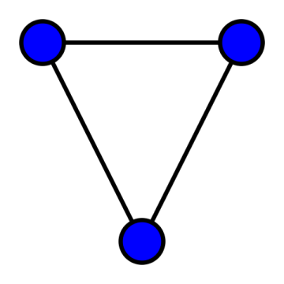
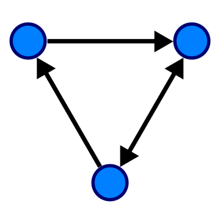
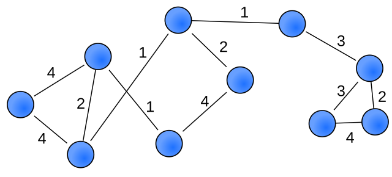
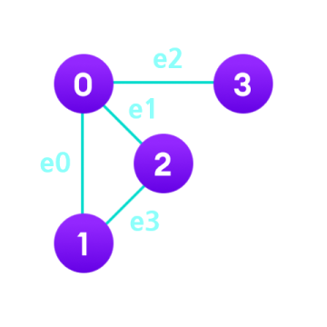
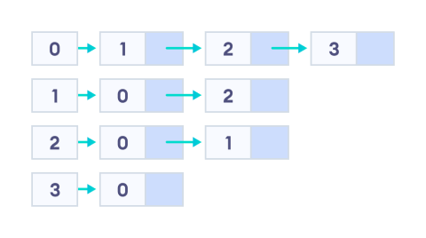
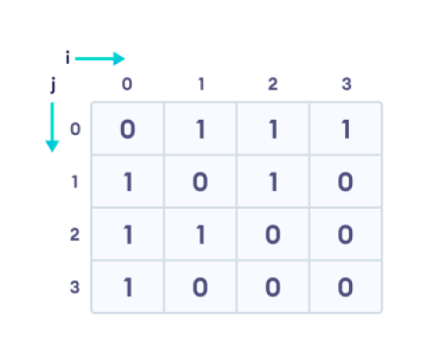
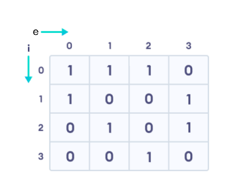

# :books: Graph & Tree & Heap <sub>그래프와 트리 그리고 힙</sub>

## :bookmark_tabs: 목차

[:arrow_up: **DataStructure**](./README.md)

1. ### [Graph](#📕-graph-그래프) <sub>그래프</sub>

   - 정의
   - 특징
   - 그래프의 기본 종류
   - 그래프의 구현 방법
   - 복잡도
   - 활용

2. ### [Tree](#📙-tree-트리) <sub>트리</sub>

   - 정의
   - 특징
   - 트리의 순회
   - 트리의 연산
   - 트리의 종류
   - 복잡도
   - 활용

3. ### [Heap](#📗-heap-힙) <sub>힙</sub>

   - 정의
   - 특징
   - 힙의 구현방법
   - 힙의 연산
   - 복잡도
   - 활용

# :closed_book: Graph <sub>그래프</sub>

## 정의

> 유한한 정점 집합<sub>Vertex Set</sub>과 간선 집합<sub>Edge Set</sub>의 연결 관계를 기록한 순서 쌍<sub>Pair</sub>으로 구성된 자료구조

## 특징

- 유한개의 정점<sub>Vertex</sub>과 간선<sub>Edge</sub>으로 구성되어 있음
  - 데이터의 위치를 나타내는 정점<sub>Vertex</sub>(또는 노드<sub>Node</sub> , 포인트<sub>Point</sub>)
  - 데이터의 연결 관계를 나타내는 간선<sub>Edge</sub>(또는 선<sub>Line</sub> , 링크<sub>Link</sub>)
- 간선은 방향성<sub>Direct</sub>과 가중치<sub>Weight</sub>를 가질 수 있음
- 두 점이 간선으로 연결되어 있으면 이를 인접<sub>Adjacent</sub>했다고 표현
- 서로 떨어진 두 정점을 여러 간선을 거쳐 연결된 것을 경로<sub>Path</sub>라 부름
- 경로의 시작 지점과 끝 지점이 동일할 경우도 있으며 이를 사이클<sub>Cycle</sub> 이라고 함

## 그래프의 기본 종류

- 기본적으로 무방향, 방향, 가중치 여부로 그래프를 분류하며, 방향과 가중치 모두 있는 경우나 사이클이 있는 경우에 따라 추가적으로 분류하기도 함

### Undirected graph <sub>무방향 그래프</sub>



- 간선에 방향성과 가중치가 모두 없는 그래프

### Directed graph <sub>방향 그래프</sub>



- 간선에 방향성 있는 그래프

### Weighted graph <sub>가중치 그래프</sub>



- 간선에 가중치가 있는 그래프

## 그래프의 구현 방법



### Adjacency list <sub>인접 리스트</sub>



- 그래프의 각 정점을 root로 가지는 리스트 배열을 생성한 뒤, 간선에 따라 인접한 두 정점 i, j를 `V[i].add(pair(j, weight))` 형태로 기록해서 구현
- 각 정점 리스트에 삽입된 노드는 비순차적으로 기록됨
- 리스트의 요소의 수는 간선의 개수와 일치
- **장점**
  - 간선의 개수가 적을 때 비교적 적은 공간을 활용해 그래프를 표현 가능
  - 정점의 연결 관계를 파악하기 위해서 `O(E)`의 시간 복잡도를 요구
- **단점**
  - 리스트의 링크를 표시하기 위해 추가적인 메모리 소모가 발생
  - 특정 정점 또는 간선 정보를 찾기 위해서 `O(V+E)`의 시간 복잡도 요구

### Adjacency matrix <sub>인접 행렬</sub>



- 그래프의 두 정점의 쌍(i, j)을 가지는 행렬을 생성한 뒤, 간선에 따라 인접한 두 정점을 i, j를 `adj[i][j] = weight` 형태로 기록해서 구현
- 행렬의 크기는 `O(V^2)`
- **장점**
  - 구현이 쉬움
  - 두 정점 간의 연결 정보를 찾기 위해서 `O(1)`의 시간 복잡도를 요구
- **단점**
  - 정점의 연결 관계를 파악하기 위해서 최대 `O(V^2)`의 시간 복잡도를 요구

### Incidence matrix <sub>결합 행렬</sub>



- 그래프의 각 정점과 간선의 쌍(i, e)을 가지는 행렬을 생성한 뒤, 간선에 따라 인접한 두 정점을 `inc[i][e] = weight` 형태로 기록해서 구현
- 행렬의 크기는 `O(VE)`
- 방향 그래프에서 연결된 정점의 시작 지점과 끝 지점을 구분하기 위해서 시작 정점의 가중치 값을 음수, 끝 정점의 가중치 값을 정수로 표현하기도 함
- **장점**
  - 구현이 쉬움
  - 인접 행렬에 비해서 메모리를 절약
  - 부분 그래프<sub>Sub-graph</sub>와 사이클을 파악하기 쉬움
  - 정점과 간선의 연결 정보를 찾기 위해서 `O(1)`의 시간 복잡도를 요구
- **단점**
  - 정점의 연결 관계를 파악하기 위해서 최대 `O(VE)`의 시간 복잡도를 요구

## 복잡도

| 연산 종류             | 평균<sub>Avg</sub> | 최악<sub>Worst</sub> |
| --------------------- | ------------------ | -------------------- |
| 공간<sub>Space</sub>  | `O(V+E)`           | `O(V+E)`             |
| 탐색<sub>Search</sub> | `O(V+E)`           | `O(V+E)`             |
| 삽입<sub>Insert</sub> | `O(1)`             | `O(1)`               |
| 삭제<sub>Delete</sub> | `O(V+E)`           | `O(V+E)`             |

- `V`는 정점의 수, `E`는 간선의 수
- 탐색에는 깊이 우선 탐색<sub>Depth First Search, DFS</sub>과 너비 우선 탐색<sub>Breadth First Search, BFS</sub>를 사용
- 삽입 시 필요한 시간 복잡도는 `O(1)`이지만, 삭제 시 원하는 데이터를 지우기 위해 모든 정점과 간선을 순회해 찾아야 하므로 시간복잡도는 `O(V+E)`
- 단, 인접 행렬이나 결합 행렬로 구현되었을 경우 삽입/삭제에 걸리는 시간 복잡도는 `O(1)`

## 활용

- 경로 탐색<sub>Path Searching</sub> 구현
- 상태 머신<sub>State Machine</sub> 구현
- 연결 관계 기반으로 데이터를 관리해야 할 때

# :orange_book: Tree <sub>트리</sub>

## 정의

> 그래프의 일종으로 정점<sub>Vertex</sub>과 간선<sub>Edge</sub>을 이용하여 데이터의 배치 형태의 일렬의 연결된 노드를 계층적인 트리 구조<sub>Tree Structure</sub>로 구성한 자료구조

## 특징

- 각 원소<sub>Element</sub>들 계층관계를 가지는 비선형 자료구조
- 부모에서 자식으로 내려가며 확장되는 트리 모양의 구조로 사이클<sub>Cycle</sub>이 없는 무방향 그래프
- 루트 노드를 제외한 원소들은 원소들은 부모-자식 간의 1:n 관계를 가짐
- 정점이 N개인 트리는 항상 N-1개의 간선을 보유함
- 트리는 다음과 같은 구조를 가짐  
  
  - 노드<sub>Node</sub>(또는 정점<sub>Vertex</sub>) : 트리를 구성하는 요소<sub>Element</sub>
  - 간선<sub>Edge</sub> : 부모 노드와 자식 노드를 연결하는 선
  - 루트<sub>Root</sub> : 트리의 가장 최상위에 위치한 노드이며 모든 노드의 공통 조상
  - 부모 노드<sub>Parent Node</sub> : 자식 노드를 가진 노드
  - 자식 노드<sub>Child Node</sub> : 부모 노드를 가진 노드
  - 형제 노드<sub>Sibling Node</sub> : 같은 부모를 가지는 노드
  - 리프 노드<sub>Leaf Node</sub> : 더이상의 자식 노드가 없는 차수가 0인 말단 노드
  - 서브트리<sub>Subtree</sub> : 특정 부모 노드를 루트 노드로 하는 작은 부분 트리
  - 높이<sub>Height, Level</sub> : 루트에서 임의의 노드에 이르는데 거치는 간선의 수
    - 트리의 높이 : 트리에 있는 노드의 높이 중에서 가장 큰 수
  - 차수<sub>Degree</sub> : 부모 노드에 연결된 자식 노드의 수
    - 트리의 차수 : 트리에 있는 노드의 차수 중에서 가장 큰 수

## 트리의 순회

### ProOrder <sub>전위 순회</sub>


- 루트노드 -> 왼쪽 서브트리 -> 오른쪽 서브트리 순서로 순회하는 방식
- 후위 순회와 같이 깊이 우선 순회라고도 불림

### Inorder <sub>중위 순회</sub>


- 왼쪽 서브트리 -> 노드 -> 오른쪽 서브트리 순서로 순회하는 방식
- 대칭 순회라고도 불림

### Postorder <sub>후위 순회</sub>


- 왼쪽 서브트리 -> 오른쪽 서브트리 -> 노드 순서로 순회하는 방식

## 트리의 구현 방법


### 배열을 이용한 구현

- 트리를 1차원 배열로 표현
- 각 노드의 부모와 자식 관계를 인덱스를 통해 유지
- 구현을 쉽게하기 위해 일반적으로 루트 노드를 인덱스 1로 시작
- 부모와 자식 관계를 유지하기 위해 적절한 계산식을 사용
  - 왼쪽 자식의 인덱스 : $Index_{parent} \times 2$
  - 오른쪽 자식의 인덱스 : $Index_{parent} \times 2 + 1$
  - 부모의 인덱스 : $Index_{child} \div 2$

### 리스트를 이용한 구현

- 자신의 값과 각 자식 노드를 가리키는 레퍼런스 변수 오른쪽, 왼쪽 2개로 노드를 구성
- 루트 노드로 부터 자식 노드를 가리키는 레퍼런스 변수에 자식 노드의 주소를 할당
- 각 노드의 부모와 자식 관계를 트리 구조를 통해 유지

## 트리의 연산

부모 값을 기준으로 하여 데이터를 정렬 하는 완전 이진 트리의 의사 코드

### 탐색

```
Tree-Find(node, value):
    if the node == NIL:
        return NIL
    else:
        if value < node.value:
            Tree-Find (node.left, value)
        else if value > node.value:
            Tree-Find (node.right, value)
        else:
            return node
```

### 삽입

```
Tree-Insert(node, value):
    if the node == NIL:
        root = new node with the value
    else:
        if value < node.value:
            Tree-Insert (node.left, value)
        else:
            Tree-Insert (node.right, value)
```

### 삭제

```
Tree-Delete(node, value):
    if the node == NILL:
        exit
    else:
        if value < node.value:
            Tree-Delete (node.left, value)
        else if value > node.value:
            Tree-Delete (node.right, value)
        else:
            if the node is a leaf node:
                Delete the node
            else:
                find the minValue in the right subtree
                node.value = minValue
                Tree-Delete (node.right, minValue)
```

## 트리의 종류

### 이진 트리 <sub>Binary Tree</sub>


- **정 이진트리** <sub>Full Binary Tree</sub>

  - 각 노드가 항상 두 개의 자식 노드를 갖는 순서화된 트리
  - 항상 짝수 개를 유지하므로 홀수 개의 자식 노드를 가질 수 없음

- **완전 이진 트리** <sub>Complete Binary Tree</sub>

  - 부모, 왼쪽 자식, 오른쪽 자식 순으로 채워지는 트리
  - 리프 노드를 제외한 모든 노드가 가득 차 있어야 함
  - 마지막 레벨의 노드는 전부 차 있지 않아도 되지만 가장 왼쪽부터 채워야 함

- **변질 이진 트리** <sub>Degenerate Binary Tree</sub>

  - 각 부모 노드가 한 개의 자식 노드를 갖는 트리
  - 연결 리스트 데이터 구조처럼 동작시키는 것

- **포화 이진 트리** <sub>Perfect Binary Tree</sub>

  - 정 이진 트리이면서 완전 이진 트리
  - 리프 노드를 제외한 모든 노드가 가득 차 있어야 함
  - 모든 리프 노드의 레벨이 동일하고, 리프 노드는 자식 노드가 0개임

- **균형 이진 트리** <sub>Balanced Binary Tree</sub>
  - 왼쪽, 오른쪽 자식의 서브트리가 지나치게 한쪽으로 치우치지 않은 트리
  - 트리가 한 쪽으로 치우쳐져 있는 경우, 시간 복잡도가 악화됨
  - 자체적으로 균형 잡히도록 하는 기능을 포함되면 자가 균형 이진 탐색트리 <sub>Self-Balancing Binary Search Tree</sub>가 됨

### 이진 탐색 트리 <sub>Binary Search Tree</sub>

이진 트리를 사용해 데이터의 탐색 성능을 올린 트리

### 자가 균형 이진 탐색트리 <sub>Self-Balancing Binary Search Tree</sub>

삽입, 삭제 시 균형이 왼쪽과 오른쪽 서브트리가 균형이 맞도록 재조정하는 트리

- AVL Tree
- Red-Black Tree
- B-Tree

### 트라이 <sub>Trie</sub>

문자열이나 연속된 값의 색인을 위한 트리 기반의 자료구조

### 삼진 트리 <sub>Ternary Tree</sub>

자식 노드를 최대 3개까지 가지는 트리

## 복잡도

| 연산 종류             | 평균<sub>Avg</sub> | 최악<sub>Worst</sub> |
| --------------------- | ------------------ | -------------------- |
| 공간<sub>Space</sub>  | `O(N)`             | `O(N)`               |
| 탐색<sub>Search</sub> | `O(N)`             | `O(N)`               |
| 삽입<sub>Insert</sub> | `O(N)`             | `O(N)`               |
| 삭제<sub>Delete</sub> | `O(N)`             | `O(N)`               |

- `N`은 트리에 포함된 노드의 개수
- 단순 이진 트리의 모든 연산의 시간 복잡도는 `O(N)`

## 활용

- 다양한 기능으 포함한 확장된 자료구조로 사용
  - 이진 탐색 트리
  - 자가 균형 이진 트리
  - 트라이
- 빠르고 안정적인 탐색 속도를 가진 알고리즘을 구현(대부분의 경우 `NlogN`의 시간 복잡도를 보장)

# :green_book: Heap <sub>힙</sub>

## 정의

> 최댓값<sub>Max Value</sub> 또는 최솟값<sub>Min Value</sub>을 빠르게 탐색하기 위해 고안된 완전 이진 트리<sub>Complete Binary Tree</sub> 기반의 자료구조

## 특징

- 우선순위큐<sub>Priority Queue</sub>라는 ADT를 구현하기 위한 자료구조 중 하나
- 완전 이진 트리<sub>Complete Binary Tree</sub> 구조로 구현
- 여러 개의 값 중에서 최대 값이나 최솟값을 빠르게 찾아낼 수 있는 특성을 가짐
- 모든 노드는 부모와 자식 간의 일정한 관계를 유지함
  - **최대 힙**<sub>Max Heap</sub>은 루트 노드가 가장 큰 값을 가지고 부모는 자식보다 큰 값을 가짐
  - **최소 힙**<sub>Min Heap</sub>은 루트 노드가 가장 작은 값을 가지고 부모는 자식보다 작은 값을 가짐
    

## 힙의 구현 방법

[#트리의-구현-방법](#트리의-구현-방법) 참고

## 힙의 연산

max heap 기준 설명하며, min heap은 정렬 순서의 차이만 있고 과정은 동일함

### 힙정렬

```
Heapify(A, i) {
   leftChild <- left(i)
   rightChild <- right(i)
   if (leftChild <= heapsize) and (A[leftChild] > A[i])
      largest <- leftChild
   else
      largest <- i
   if (rightChild <= heapsize) and (A[rightChild] > A[largest])
      largest <- rightChild
   if (largest != i) {
      exchange A[i] <-> A[largest]
      Heapify(A, largest)
   }
}
```

### 데이터 삽입


### 데이터 삭제


## 복잡도

| 연산 종류             | 평균<sub>Avg</sub> | 최악<sub>Worst</sub> |
| --------------------- | ------------------ | -------------------- |
| 공간<sub>Space</sub>  | `O(N)`             | `O(N)`               |
| 탐색<sub>Search</sub> | `O(1)`             | `O(1)`               |
| 삽입<sub>Insert</sub> | `O(log N)`         | `O(log N)`           |
| 삭제<sub>Delete</sub> | `O(log N)`         | `O(log N)`           |

- `N`은 힙의 요소 수
- 탐색의 시간복잡도는 최대/최소힙에서 최대/최소 값을 조회한다는 전제로 작성됨
- 최대/최소힙에서 최소/최대 값 또는 임의의 값을 조회 할 시 시간 복잡도는 `O(N)`

## 활용

- 우선순위 큐(Priority Queue) 구현
- 힙 정렬(Heap Sort) 알고리즘
- 다익스트라 알고리즘(Dijkstra's Algorithm) 등
