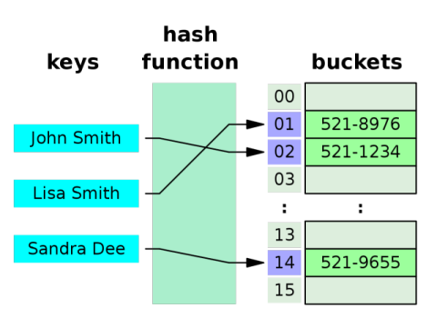
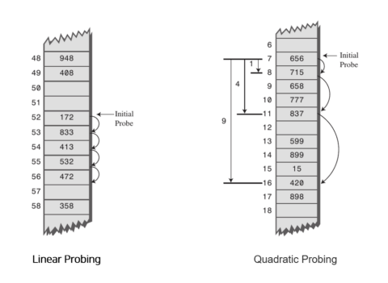

# Hash

## Hash Function (해시 함수)

### Hash Function의 특징

- hash function의 모식도  
  

- Hash Function은 임의의 길이를 가진 데이터를 고정된 길이의 값으로 바꾸어 사용하는 함수를 뜻하며, 이 결과 함수의 결과 값을 해시(Hash)라고 함

- 일반적으로 테이블이라고 불리는 고정 크기 배열을 인덱싱 하는데 사용하며, 이러한 과정을 해싱(Hashing)이라 부름

- 데이터의 저장 및 탐색에 필요한 평균 시간 복잡도는 `O(1)`

- 무한 길이의 데이터를 유한 길이로 줄이므로 이 과정에서 중복되는 Key가 발생할 수 있으며, 이러한 일을 충돌(Collision)이라 부름

  > Collision : 서로 다른 두 개의 키가 같은 인덱스로 해싱되는 현상

- 비교적 적은 공간 복잡도`O(N)`로 많은 데이터를 효율적으로 관리 할 수 있음

### Hash Function의 조건

- 임의의 길이를 가진 키를 `ADD` 또는 `XOR`과 같은 패리티 보존 연산자를 사용하여 단어 또는 다른 단위로 접어서 고정된 길이의 키로 변환

- 결과 값이 키 공간에 균일하게 분포되도록 키의 비트를 스크램블

  > Scrambles : 무작위 방식으로 데이터의 각 비트를 섞어버리는 것

- 키 값을 테이블 크기보다 작거나 같은 값으로 매핑

### Good Hash Function

1. 계산 속도가 아주 빠를 것

   - 해시가 필요한 모든 연산에 전처리 연산으로 포함 될 것이므로 무거우면 불리함

1. 출력된 해시의 충돌이 최소화 되어야 할 것

   - 해시의 충돌이 많아질 수록 인덱싱과 체이닝이에 로스가 발생, 시간 복잡도가 `O(1)` -> `O(N)`으로 점차 증가함

### Hash Collision을 해결 하는 방법

1. 분리 연결법(Separate Chaining)

   - 동일한 버킷의 데이터에 대해 List등의 자료구조를 활용해 추가적인 메모리를 할당하는 것으로 해결  
     

   - 동일한 버킷으로 접근하는 데이터들을 연결(Chaining)해 관리함

   - 해시 버킷의 물리적인 확장 없이 손쉽게 구현 가능

   - 중복되는 데이터의 수가 많아지면 동일 버킷에 연결된 데이터가 많아지면 캐싱 성능이 하락함

1. 개방 주소법(Open Addressing)

   - 추가적인 메모리 공간을 확보하지 않고, 인덱스를 이동시켜 버킷의 비어있는 공간에 값을 채워 넣음

   - 대표적인 탐색 방법은 아래와 같음  
     

   1. 선형 탐사(Linear Probing)

      - 정해진 고정 폭으로 옮겨 해시 값의 중복을 피함

   1. 제곱 탐사(Quadratic Probing)

      - 정해진 고정 폭의 제곱수 만큼 인덱스를 옮겨 해시 값의 중복을 피함

   1. 이중 해시 탐사(Double Hashing Probing)

      - 해시 값을 다시 한번 더 해싱하여 해싱 인덱싱의 규칙성을 더 복잡하게 함

1. 캐싱 성능 차이 비교

   - 분리 연결법과 개방 주소법(선형)의 캐싱 누락 횟수를 비교한 그래프  
     

### Hash Function의 사용처

- 아래에 기술된 해시 함수와 원리적으로 중복되는 부분이 있을 뿐이며, 상세한 구현체와 설계는 다를 수 있음

1. 체크섬, 체크 숫자, 오류 수정 코드 등 데이터 무결성을 체크

1. 손실 압축과 같은 데이터 압축 기법

1. 무작위화 함수나 암호와 같은 보안

## HashTable (해시 테이블)

### HashTable의 특징

- Hash Function의 해시를 통해 Key-Value의 쌍의 구조로 구현

- 버킷(Bucket)이라 불리는 고유 공간(대체로 배열)을 생성하여 데이터를 저장

### HashTable의 충돌 방지

- [내용 참고 - Hash Collision을 해결 하는 방법](#hash-collision을-해결-하는-방법)

### HashTable의 부하율(load factor)과 동적 확장(Resize)

- 부하율(load factor) 계산식

  $load factor(a) = \frac{n}{m}$

  - n : 헤시 테이블을 차지하는 요소의 수

  - m : 버킷의 총 용량

- 해시테이블 버킷 안의 데이터가 차지하는 영역의 비율

- 부하율이 낮으면 비효율 적인 공간 활용을 의미

- 부하율이 높으면 잦은 충돌 발생 및 충돌 해결 알고리즘을 호출을 의미하며, 캐싱 성능을 저하시킴

- 부하율을 계산하여 해당 로드 팩터를 사용해 해시테이블의 크기를 동적으로 관리 할 수 있음

- 일반적으로 적절한 성능의 부하율 범위는 `0.60 ~ 0.75` 정도

### HashTable의 복잡도

| 연산 종류   | 평균Avg | 최악Worst |
| ----------- | ------- | --------- |
| 공간 복잡도 | `O(N)`  | `O(N)`    |
| 탐색        | `O(1)`  | `O(N)`    |
| 삽입        | `O(1)`  | `O(N)`    |
| 삭제        | `O(1)`  | `O(N)`    |

### HashTable의 사용 예시

1. 연관 배열 (Associative arrays)

1. 데이터베이스 인덱싱 (Database indexing)

   - 디스크 기반 데이터 구조 및 DBM의 인덱싱에 사용되기도 하지만 주로 B-Tree를 씀

1. 캐시 (Caches)

   - 데이터 저장장치의 엑세스 속도를 높이는데 사용되는 캐시 구조를 구현하는데 사용

1. 맵과 셋 (Maps & Sets)

   - Key를 해싱해 Value를 저장 할 수 있는 특징을 활용해 map에 활용

   - 특정한 순서 없이 고유한 값을 저장 할 수 있는 특징을 활용해 set에 활용
