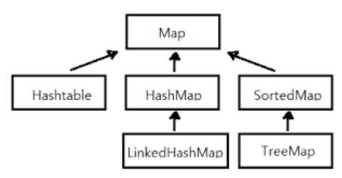

# Map & Set

- JAVA Collection Framework의 상속 기본 구조  
  

## Map (맵)

### Map의 특징

- Key와 Value의 쌍으로 이루어진 자료구조

- Key를 통해 Value에 접근하거나, Value를 통해 Key에 접근하는 것이 가능

- Key와 Value를 매칭시키는 것을 매핑(Mapping)이라고 표현함

- Key는 중복을 허용하지 않는 고유 값(Unique)이며 Value는 중복을 허용한다

### Map을 사용하는 경우

- 특정 데이터를 순간마다 조회해야 할 때

- 특정 품목의 개수를 카운트 해야 할 때

- 저장하고 싶은 데이터를 Key-Value 구조로 다루는 것이 용이할 때

### Map의 구현체

1. 구조도  
   

1. Hash Map

   - `Hash Table`을 활용한 가장 보편적인 Map의 구현체

   - 삽입과 탐색과 같은 작업에 걸리는 평균 시간 복잡도는 `O(1)`

   - Key와 Value의 쌍으로만 구성하므로 안에 있는 Value들의 순서를 보장하지 않음

1. Tree Map

   - `Binary Search Tree(BST)`를 사용해 Key의 값이 정렬된 순서대로 데이터를 저장하는 구현체

   - 삽입과 탐색과 같은 작업에 걸리는 평균 시간 복잡도는 `O(log N)` (N은 element 개수)

   - Key 값의 정렬을 통한 탐색 등에 용이함

1. LinkedHashMap

   - `DoubleLinkedList`를 사용해 목록이 삽입된 순서대로 유지 및 관리하는 Map의 구현체

   - 배열, 리스트와 같이 인덱싱을 통한 접근이 용이

   - 맵의 각 element에 빠른 반복 탐색 및 삽입, 검색, 삭제가 가능

> ### HashMap(해시맵) vs HashTable(해시테이블) (JAVA 질문)
>
> - HashTable과 HashMap의 차이는 동기화 지원 여부
>
>   - 병렬 처리를 하면서 자원의 동기화를 고려해야 하는 상황 → 해시테이블(HashTable)
>
>   - 병렬 처리를 하지 않거나 자원의 동기화를 고려하지 않는 상황 → 해시맵(HashMap)

## Set (셋)

### Set의 특징

- Key로만 이루어진 자료구조

- 별도의 인덱스를 사용하지 않고, 인덱스 매개변수가 없음

- Key는 중복을 허용하지 않는 고유 값(Unique)으로 구성

- 빠른 검색 속도를 가지며 인덱스가 없어 iterator를 활용해 요소를 순회함

### Set을 사용하는 경우

- 특정 품목의 중복을 허용하지 않을 때

- 특정 품목의 포함 여부만 중요할 때

### Set의 구현체

1. Hash Set

   - `Hash Table`을 활용한 가장 보편적인 Set의 구현체

   - 삽입과 탐색과 같은 작업에 걸리는 평균 시간 복잡도는 `O(1)`

   - 데이터를 중복 저장할 수 없고, 순서를 보장하지 않음

   - null의 입력이 가능하나 중복되지 않음(공집합??)

1. Tree Set

   - `Binary Search Tree(BST)`를 사용해 데이터를 정렬된 순서대로 저장하는 구현체

   - 삽입과 탐색과 같은 작업에 걸리는 평균 시간 복잡도는 `O(log N)` (N은 element 개수)

   - 포함된 데이터 값의 정렬을 통한 우선순위 탐색 등에 용이함

   - null의 입력이 가능하나 중복되지 않음

1. LinkedHashSet

   - `DoubleLinkedList`를 사용해 데이터가 삽입된 순서대로 유지 및 관리하는 Set의 구현체

   - 데이터를 중복 저장할 수 없지만 입력한 순서대로 데이터를 정렬

   - null의 입력이 가능하나 중복되지 않음
