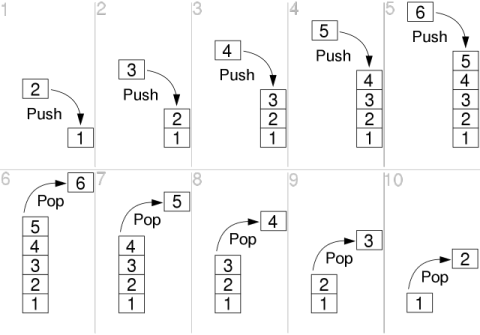
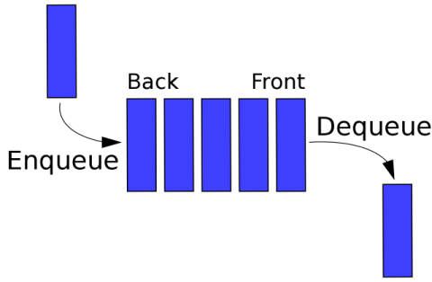
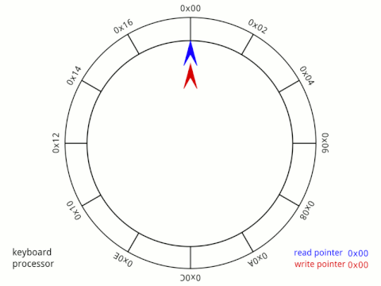
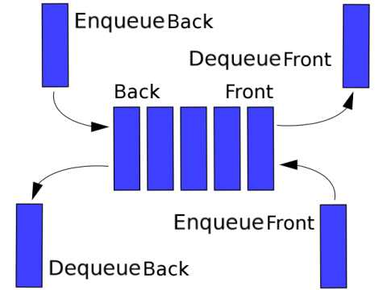

# :books: Stack & Queue 스택과 큐

## :bookmark_tabs: 목차

[:arrow_up: **DataStructure**](./README.md)

1. ### [Stack](#📕-stack-스택) 스택

   - 정의
   - 특징
   - 복잡도
   - 장단점
   - 활용

2. ### [Queue](#📙-queue-큐) 큐

   - 정의
   - 특징
   - 큐의 파생형
   - 복잡도
   - 장단점
   - 활용

# :closed_book: Stack 스택

## 정의

> 한쪽으로만 데이터를 넣고 뺄 수 있도록 제한적으로 접근하는 **선입후출**(First-In-Last-Out, FILO) 또는 **후입선출**(Last-In-First-Out, LIFO) 형태의 선형 자료구조

## 특징

- 선입후출(First-In-Last-Out, FILO) 또는 후입선출(Last-In-First-Out, LIFO) 구조
- 다음과 같은 기본 연산을 가짐  
  
  - 데이터를 삽입하는 `push()`
  - 데이터를 삭제하는 `pop()`
- 스택 오버플로우Stack Overflow가 발생할 수있다.
  > 스택 오버플로우: 스택이 가득차서 다른 요소를 수용할 수 없으면 발생하는 예외
- 재귀 함수 호출Recursive Function Call을 통한 스택 구현이 가능

## 복잡도

| 연산 종류             | 평균Avg | 최악Worst |
| --------------------- | ------------------ | -------------------- |
| 공간Space  | `O(N)`             | `O(N)`               |
| 탐색Search | `O(N)`             | `O(N)`               |
| 삽입Insert | `O(1)`             | `O(1)`               |
| 삭제Delete | `O(1)`             | `O(1)`               |

- 스택의 삽입(또는 삭제)은 항상 정해진 지점에서만 발생하므로 걸리는 시간은 `O(1)`

## 장단점

- ### 장점

  - 단순한 구조를 가져 구현하기 쉬움
  - 데이터의 삽입/삭제가 빠름

- ### 단점

  - 데이터 탐색이 어려움
  - 재귀적으로 사용할때 최대 사용량의 제한이 있음
  - 배열과 같이 고정된 크기의 자료구조를 통해 구현시, 공간 낭비 발생

## 활용

- 메모리의 스택 영역(물리적인 구현)
- 깊이우선탐색(Depth-first Search, DFS)의 구현
- 작업 되돌리기(Undo)와 같은 기능 구현
- 후위표기법Postfix Notation 표현 및 연산에 사용

# :orange_book: Queue 큐

## 정의

> 한 방향으로 데이터를 넣고 뺄 수 있도록 제한적으로 접근하는 **선입선출**(First-In-First-Out, FIFO) 또는 **후입후출**(Last-In-Last-Out, LILO) 형태의 선형 자료구조

## 특징

- 선입선출(First-In-First-Out, FIFO) 또는 후입후출(Last-In-Last-Out, LILO) 구조
- 다음과 같은 기본 연산을 가짐  
  
  - 데이터를 추가하는 `enqueue()`
  - 데이터를 출력하는 `dequeue()`

## 큐의 파생 자료구조

### Circular Queue 순환 큐

- 데이터의 삽입/삭제 지점이 원형으로 이루어진 구조위에서 움직이며 큐 연산을 수행
  - 순환 큐 예시 - 키보드 순환 버퍼
    

### Deque Double-ended queue, 덱

- 양방향으로 선입선출이 가능한 큐
  
  - 데이터를 앞에서 삽입하는 `enqueue_front()`와 뒤에서 삽입하는 `enqueue_back()`
  - 데이터를 앞에서 삭제하는 `dequeue_front()`와 뒤에서 삽입하는 `dequeue_back()`

## 복잡도

| 연산 종류             | 평균Avg | 최악Worst |
| --------------------- | ------------------ | -------------------- |
| 공간Space  | `O(N)`             | `O(N)`               |
| 탐색Search | `O(N)`             | `O(N)`               |
| 삽입Insert | `O(1)`             | `O(1)`               |
| 삭제Delete | `O(1)`             | `O(1)`               |

- 큐의 삽입(또는 삭제)은 항상 정해진 지점에서만 발생하므로 걸리는 시간은 `O(1)`

## 장단점

- ### 장점

  - 데이터의 흐름을 다룰 때 용이함
  - 단순한 구조를 가져 구현하기 쉬움
  - 데이터의 삽입/삭제가 빠름

- ### 단점

  - 데이터 탐색이 어려움
  - 배열과 같이 고정된 크기의 자료구조를 통해 구현시, 공간 낭비 발생

## 활용

- 컴퓨터의 캐시(물리적인 구현)
- 각종 프로그램의 데이터 버퍼Data Buffer
- 너비우선탐색(Breadth-first Search, DFS)의 구현
