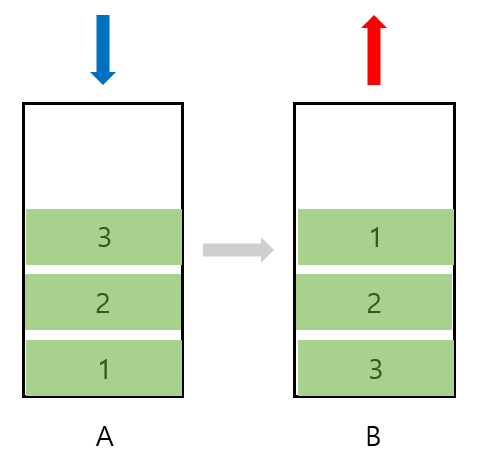
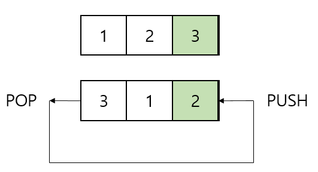

# Stack
### ❓데이터를 차곡차곡 쌓아 올린 형태의 선형 자료 구조
![[https://www.geeksforgeeks.org/stack-data-structure/]](./img/Stack_basic.png)
*https://www.geeksforgeeks.org/stack-data-structure/*

- **LIFO**(Last In First Out, 후입선출)의 구조로 데이터가 입출력됨.
- List 컬렉션 클래스의 Vector 클래스를 상속받아, 전형적인 스택 메모리 구조의 클래스 제공
- Array와 LinkedList로 구현할 수 있음.
- List로 구현 시 객체를 제거하는 작업이 필요하지만 Array로 구현 시 제거할 필요 없이 index를 줄이면 되기 때문에 Array로 구현하는 것이 좋음. (위 그림 참고)
- DFS, 재귀에 주로 사용됨.
- Java에서 스택 사용 시 Stack 클래스를 사용하기 보다 ArrayDeque를 사용하는 것이 좋음. 이유는 아래 글을 참고하자.
    
    [[Deque 00] Deque란? (with  자료구조 - 선형구조)](https://jjhwang.tistory.com/21)
    
    [[Deque 01] Stack말고 ArrayDeque](https://jjhwang.tistory.com/22)
    
 

# Queue
### ❓FIFO(First In First Out, 선입선출)의 구조로 데이터가 입출력되는 선형 자료 구조
![[https://www.geeksforgeeks.org/queue-data-structure/]](./img/Queue_basic.png)
*https://www.geeksforgeeks.org/queue-data-structure/*

- 한쪽 끝에서만 삽입이 이루어지고, 다른 한쪽 끝에서는 삭제 연산만 이루어짐.
- Stack과 마찬가지로 Array와 LinkedList로 구현할 수 있음.
- 위 그림과 같은 방식으로 데이터가 관리 되므로 Array로 구현하는 것보다 LinkedList로 구현하는 것이 좋음.
- 즉, 큐는 항상 가장 먼저 저장된 데이터를 삭제하므로 배열 기반의 자료구조를 사용하게 되면 앞의 빈 공간을 채우기 위해 데이터 복사가 발생하므로 비효율적
- 주로 데이터가 입력된 시간 순서대로 처리되어야 하는 경우 사용
    - ex) BFS나 캐시를 구현할 때 사용

 

### 특징
|  | Stack | Queue |
| --- | --- | --- |
| 데이터들의 input 순서 보장 여부 | yes | yes |
| 중복된 데이터 허용 여부 | yes | yes |
| 데이터 정렬 여부 | no | no |

 

### ⏰ 시간 복잡도

| 연산 | Stack | Queue |
| --- | --- | --- |
| 삽입 | O(1) | O(1) |
| 검색 | O(N) | O(N) |
| 삭제 | O(1) : pop()   O(N) : remove() | O(1) |

 

## 면접에 나올만한 질문 모음

### Stack과 Queue의 차이점

- 데이터 입출력 <u>위치</u>가 다름.
    - stack은 한 방향에서만 데이터가 추가되고 삭제됨.
    - queue는 한 방향에서는 삽입만 일어나고,다른 방향에서 삭제만 하는 자료구조임. 즉, add 하는 곳과 remove하는 곳의 방향이 다르다.
- 데이터 입출력 <u>순서</u>가 다름.
    - **Stack**은 `LIFO`, **Queue**는 `FIFO` 순서이다.

### Stack과 Queue의 실 사용 예시

- Stack
    - **Java의 Stack 메모리 영역**
        - 지역변수와 매개변수 데이터 값이 저장되는 공간이며, 메소드 호출 시 메모리에 할당되고 종료되면 메모리가 해제된다.
- Queue
    - **OS의 스케줄러**
        - 자원의 할당과 회수를 하는 스케쥴러 역할을 할 수 있다.
        - 메모리에 적재된 다수의 프로세스 중 어떤 프로세스에 자원을 할당할 것인가 순서를 결정하는 것이 자원의 효율적인 사용에 있는데, 가장 단순한 형태의 스케쥴링 정책이 선입선처리(First Com First Served) 즉, 큐라고 볼 수 있다.

### 두 클래스를 손 코딩으로 구현해주세요.

- [Stack](./algorithm/Stack.java)
- [Queue](./algorithm/Queue.java)

### 스택으로 큐 구현하기

- A와 B라는 2개의 스택을 만든다.
- push는 A 스택에 하고, pop 연산을 하게 되면 A의 모든 데이터를 B 스택으로 옮긴다.
- 그럼 A의 데이터와 역순으로 B에 저장되므로 FIFO(선입선출)의 순서로 출력된다.
    
    
    

### 큐로 스택 구현하기

- pop할 때 가장 마지막에 넣은 데이터가 나올 때까지 `큐의 사이즈-1`만큼 pop하고 다시 큐에 push한다. 그럼 후입선출의 순서로 데이터가 출력된다.
    
    
    

### 우선순위 큐가 무엇인지, 내부 구조 및 시간 복잡도에 대해 설명해주세요.

❓ **우선순위 큐**

- 들어간 순서에 상관없이 우선순위가 높은 데이터를 먼저 나가는 형태의 자료구조로 힙이라고도 부름.
    - **`최소힙`** : 부모 노드의 값이 자식 노드의 값보다 항상 작거나 같은 경우
    - **`최대힙`** : 부모 노드의 값이 자식 노드의 값보다 항상 크거나 같은 경우
- 저장되는 값들 사이의 상대적인 우선순위를 비교하여 데이터를 정렬하거나 추출하는 구조이기 때문에 null을 저장하면 NullPointerException이 발생
- 다익스트라 알고리즘에 사용됨.
- 우선순위 큐 구현 방식 : `배열`, `연결 리스트`, `힙`
- **일반적으로 힙을 이용해 구현하는 이유**
    - 배열이나 연결리스트로 구현할 경우 간단하게 구현이 가능하지만, 데이터 삽입과 삭제 과정에서 데이터를 한 칸씩 당기거나 밀어야 하는 연산을 계속 하여야 한다. 또 삽입의 위치를 찾기 위해 배열에 저장된 모든 데이터와 우선순위를 비교해야 한다. 연결리스트의 경우, 삽입의 위치를 찾기 위해 첫번째 노드부터 시작해 마지막 노드에 저장된 데이터와 우선순위 비교를 진행해야 할 수도 있다.
    - 힙 방식의 우선순위 큐는 O(logN)을 보장
- 힙으로 구현된 우선순위 큐의 특징
    - <u>완전 이진 트리 구조</u>의 형태를 가짐.
    - 반 정렬 상태 즉, 느슨한 정렬 상태를 유지한다.

### ⏰ Priority Queue 구현 방법에 따른 시간 복잡도

| 구현방법 | 삽입 | 삭제 |
| --- | --- | --- | 
| 순서없는 배열 | O(1)| O(N)|
| 정렬된 배열 | O(N) | O(1)|
| 순서없는 연결리스트| O(1) | O(N) |
| 정렬된 연결리스트 | O(N) | O(1) |
| 힙 | O(log2N) | O(log2N) |

 

- 참고

[[기술면접] CS 기술면접 질문 - 자료구조 (2/8)](https://mangkyu.tistory.com/89)

[신입 개발자 기술면접 질문 정리 - 자료구조](https://dev-coco.tistory.com/159)

[Stack Data Structure - GeeksforGeeks](https://www.geeksforgeeks.org/stack-data-structure/)

[Queue Data Structure - GeeksforGeeks](https://www.geeksforgeeks.org/queue-data-structure/)

[Difference between Stack and Queue Data Structures - GeeksforGeeks](https://www.geeksforgeeks.org/difference-between-stack-and-queue-data-structures/)

[[자료구조] 면접질문 모음](https://velog.io/@humblechoi/자료구조-면접질문-모음)

[[자료구조] 스택과 큐, 데크(Stack, Queue, Deque)](https://bigsong.tistory.com/32)

[[자료구조] 스택으로 큐, 큐로 스택 구현하기](https://kimmeh1.tistory.com/535)

[[자료구조] Stack & Queue](https://velog.io/@humblechoi/자료구조-Stack-Queue)

[자료구조 - 우선순위 큐(Heap, Priority Queue)](https://hongjw1938.tistory.com/22)