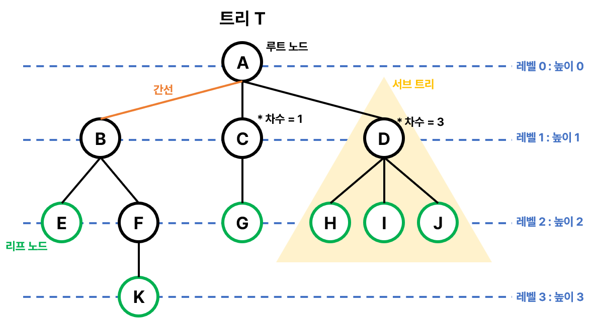

# Tree
### ❓노드들이 나뭇가지처럼 연결된 계층적 자료구조

- 원소들 간에 계층관계를 가지는 <u>비선형 자료구조</u>
- 원소들 간에 1:n 관계를 가지는 자료구조
- `노드`와 `간선`으로 이루어져 있음.
- 상위 원소에서 하위 원소로 내려가면서 확장되는 트리 모양의 구조
- 루프를 갖지 않고 연결된 무방향 그래프 구조
- 노드가 n개인 트리는 항상 n-1개의 간선을 보유
- 간선은 부모 노드와 자식 노드만을 연결하기 때문에 싸이클이 없는 그래프라고 볼 수 있음.

### Tree 용어

- **노드** : 트리를 구성하는 각각의 요소
- **간선(Edge)** : 노드와 노드를 연결하는 선, 부모 노드와 자식 노드를 연결
- **루트 노드** : 트리에서 가장 최상위에 있는 노드, 부모 노드가 없는 노드
- **부모 노드(Parent node)** : 자식 노드를 가진 노드(C = G의 부모 노드)
- **자식 노드(Child node)** : 부모 노드를 가진 노드(G = C의 자식 노드)
- **형제 노드(Sibling node)** : 같은 부모를 가지는 노드(H, I, J)
- **리프 노드(Leaf node)** : 자식 노드가 없는 노드(External node, 단말노드 라고도 부름), 차수가 0인 노드
- **비단말 노드(Internal node)** : 자식 노드가 있는 노드
- **조상 노드(Ancestor node)** : 간선을 따라 루트 노드까지 가는 경로상에 있는 모든 노드(E의 조상 노드는 B, A)
- **자손 노드(Descendent node)** : 서브 트리에 있는 하위 레벨의 노드들, B의 자손은 E, F, K
- **서브트리(Subtree)** : 부모 노드와 연결된 간선을 끊었을 때 생성되는 트리
    - 큰 트리는 작은 트리들의 모음으로 구성
    - 노드가 한 개여도 트리라고 할 수 있음.
- **높이(height, level)**
    - 노드의 높이(레벨) : 루트에서 노드에 이르는 간선의 수(B의 높이 = 1, F의 높이 = 2)
    - 트리의 높이 : 트리에 있는 노드의 높이 중에서 가장 큰 값, 최대 레벨(트리 T의 높이 = 3)
- **차수(degree)**
    - 노드의 차수 : 노드에 연결된 자식 노드의 수 (B의 차수 = 2, C의 차수 = 1)
    - 트리의 차수 : 트리에 있는 노드의 차수 중에서 가장 큰 값(트리 T의 차수 = 3)

 

### Tree 유형의 자료구조
- [이진 트리(Binary Tree)](./BinaryTree.md)
    - 완전 이진 트리(Complete Binary Tree)
    - 포화 이진 트리(Perfect Binary Tree)
    - 편향 이진 트리(Skewed Binary Tree)
- [Binary Search Tree(BST, 이진 탐색 트리)](./BinarySearchTree.md)
- 자가 균형 이진 탐색 트리(Self-Balancing Binary Search Tree) : 삽입, 삭제 시 균형이 맞도록 재조정을 하는 트리
    - [AVL 트리](./AVL_Tree.md)
    - [Red-Black Tree](./RedBlackTree.md)
    - [B Tree](./B-Tree.md)
- [Trie](./Trie.md)
- Ternary Tree : 자식 노드가 최대 3개까지 존재하는 트리

 

### 장점
- 빠른 탐색 속도 : 이진 탐색 트리의 경우 데이터를 정렬된 상태로 유지하므로 탐색, 삽입, 삭제 연산에 대해 평균적으로 O(log N)의 시간 복잡도를 가짐.
- 자기 참조적 구조 : 트리는 자기 참조적인 구조를 가지고 있어 특정 노드에서 서브트리 전체를 나타내거나 탐색할 수 있음. 이를 활용하여 효율적인 재귀 알고리즘 구현 가능
- 정렬된 상태를 유지하므로 효율적인 검색이 가능

### 단점
- 삽입 및 삭제의 복잡성
    - 트리의 구조를 유지하기 위해 삽입 및 삭제 연산이 복잡할 수 있음.
    - 특히, 불균형한 트리의 경우 트리의 재조정이 필요할 수 있어 추가적인 연산이 필요
- 메모리 사용
    - 포인터로 연결된 노드 구조를 가지고 있기 때문에 메모리 사용이 비교적 큼.
    - 트리의 균형을 유지하기 위해 추가적인 포인터를 사용하는 경우 메모리 사용이 더욱 증가할 수 있음.
- 순회 순서의 의존성
    - 순회 순서는 트리의 구성에 따라 달라짐.
    - 따라서 트리에 저장된 데이터를 순차적으로 접근해야 하는 경우 순회 순서에 따라 접근해야 하므로 일반적인 순차 자료구조보다는 조금 복잡할 수 있음.

- 참고

[tree](https://www.javatpoint.com/tree)   
[What is Tree Data Structure?](https://www.geeksforgeeks.org/tree-data-structure/)   
[이진트리 Binary Tree의 세 가지 종류와 특징](https://velog.io/@vermonter/Data-Structure-%EC%9D%B4%EC%A7%84-%ED%8A%B8%EB%A6%ACBinary-Tree%EC%9D%98-%EC%84%B8-%EA%B0%80%EC%A7%80-%EC%A2%85%EB%A5%98%EC%99%80-%ED%8A%B9%EC%A7%95)   
[트리(Tree) 자료구조 알아보기 & Java 예제 코드](https://hoehen-flug.tistory.com/34)