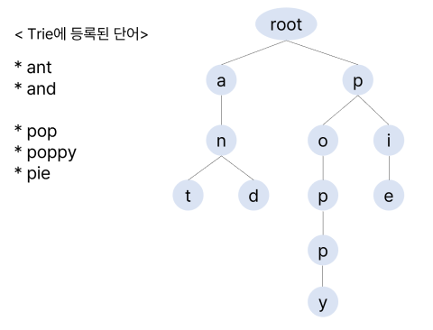
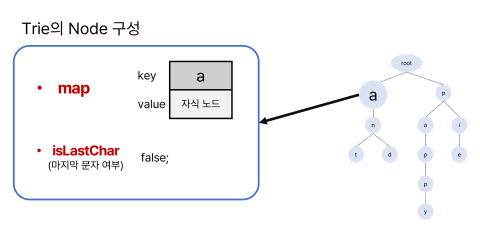
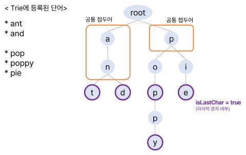
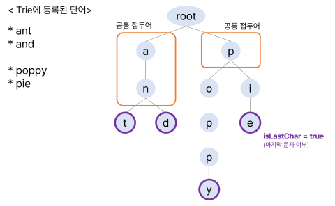

# :books: Trie <sub>트라이</sub>

## :bookmark_tabs: 목차

[:arrow_up: **DataStructure**](./README.md)

1. ### [Trie](#📕-trie-트라이) <sub>트라이</sub>

   - 정의
   - 특징
   - 트라이의 구조
   - 트라이의 연산
   - 복잡도
   - 활용

# :closed_book: Trie <sub>트라이</sub>

## 정의

> 문자열이나 연속된 값의 색인을 위한 트리<sub>Tree</sub> 기반의 자료구조

## 특징

- 래딕스<sub>Radix Tree</sub> , 접두사 트리<sub>Prefix Tree</sub> , 탐색 트리<sub>Retrieval Tree</sub>라는 별칭을 가짐
- 노드는 별개의 키를 가지고 있지 않고, 트리 상에서 노드가 저장된 위치가 키로 활용됨
- 모든 탐색 과정은 루트 노드<sub>Root Node</sub>에서 시작됨
- 루트는 빈 문자열을 연관된 값으로 가지고 있음
- 노드의 모든 자손은 부모 노드와 연관된 문자열의 공통 접두사를 공유함
- 데이터의 입력 순서와 정렬 순서를 보장하지 않음

## 트라이의 구조



### 트라이의 노드 <sub>Trie Node</sub>



- `map` : 문자를 키로 하는 자식 노드를 저장하는 맵
- `key` : 특정 문자
- `value` : key에 해당하는 자식 노드
- `isLastChar` : 마지막 문자 여부. 정수로 바꾸어 중복 개수를 체크할 수도 있음

### 트라이의 원리



- 등록한 단어의 마지막 문자에 `isLastChar`를 `true`로 마킹
- 루트를 제외한 노드의 자손은 부모 노드와 공통 접두어<sub>Common Prefix</sub>를 가짐  
  ex) `an`의 자손인 `ant`와 `and`는 `an-`이라는 공통 접두어에서 파생됨

> **만약 'pop'의 마지막 'p'에 `isLastChar`가 체크되지 않은 경우**
>
> 
>
> 'poppy'의 일부에서 'pop'을 찾을 순 있지만 마지막 문자 'p'에 `isLastChar`가 활성화 되어있지 않으므로 'pop'은 아직 트라이에 색인되지 않은 단어임을 유추할 수 있음

## 트라이의 연산

### 탐색

```
Trie-Find(x, key)
    for 0 ≤ i < key.length do
        if x.Children[key[i]] = nil then
            return false
        end if
        x := x.Children[key[i]]
    repeat
    return x.Value
```

### 삽입

```
Trie-Insert(x, key, value)
    for 0 ≤ i < key.length do
        if x.Children[key[i]] = nil then
            x.Children[key[i]] := Node()
        end if
        x := x.Children[key[i]]
    repeat
    x.Value := value
    x.Is-Terminal := True
```

### 삭제

```
Trie-Delete(x, key)
    if key = nil then
        if x.Is-Terminal = True then
            x.Is-Terminal := False
            x.Value := nil
        end if
        for 0 ≤ i < x.Children.length
            if x.Children[i] != nil
                return x
            end if
        repeat
        return nil
    end if
    x.Children[key[0]] := Trie-Delete(x.Children[key[0]], key[1:])
    return x
```

## 복잡도

| 연산 종류             | 평균<sub>Avg</sub> | 최악<sub>Worst</sub> |
| --------------------- | ------------------ | -------------------- |
| 공간<sub>Space</sub>  | `O(N)`             | `O(N)`               |
| 탐색<sub>Search</sub> | `O(N)`             | `O(N)`               |
| 삽입<sub>Insert</sub> | `O(N)`             | `O(N)`               |
| 삭제<sub>Delete</sub> | `O(N)`             | `O(N)`               |

## 장단점

- ### 장점

  - 문자열 검색 시 빠름
  - 접두사가 중복되는 문자열이 많을수록 해시테이블을 사용하는 것보다 효율적

- ### 단점

  - 노드가 자식 노드의 포인터들을 모두 기록해 메모리 공간의 크기 비교적 큼
  - 효율적으로 해싱된 자료의 시간 복잡도는 `O(1)`이지만 트라이는 `O(N)`

## 활용

- 자동완성 기능, 사전 검색 등의 구현
