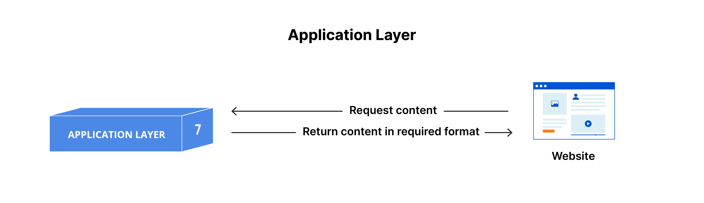
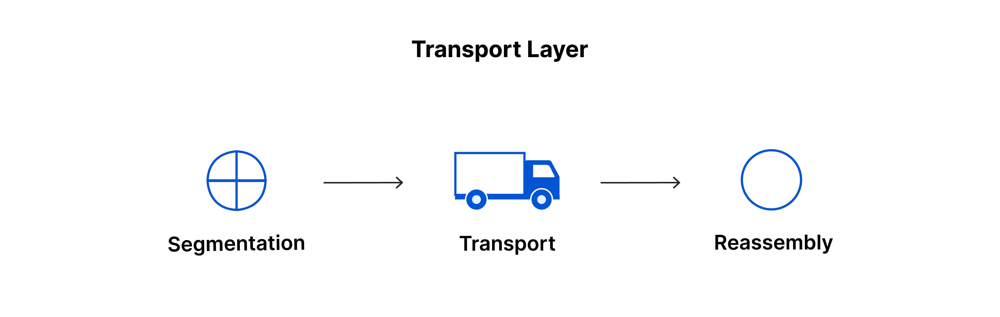
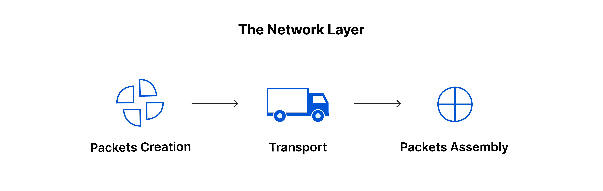
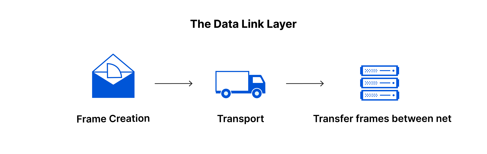

# :books: OSI 7 Layer OSI 7 계층

## :bookmark_tabs: 목차

[:arrow_up: **Network**](../README.md)

1. ### [OSI 7 Layer](#📕-osi-7-layer)

# :closed_book: OSI 7 Layer

## 정의

> 국제표준화기구(ISO)에서 개발한 컴퓨터 네트워크 프로토콜Computer Network Protocol 디자인과 통신을 계층으로 나누어 설명한 네트워크 프로토콜 모델

## 특징

- 1984년 국제표준화기구(ISO)에서 개발
- OSI 7 Layer 모델은 네트워크 프로토콜을 기능별로 7개의 계층으로 나눈 것
- 각 계층은 하위 계층의 기능을 이용하고 상위 계층에게 기능을 제공
- 프로토콜 스택Protocol Stack은 이러한 계층들로 구성되는 프로토콜 시스템이 구현된 시스템을
  - 하드웨어나 소프트웨어 혹은 둘의 혼합으로 구현될 수 있음
  - 일반적으로 하위 계층들은 하드웨어로, 상위 계층들은 소프트웨어로 구현
- 각 계층을 거치면서 계층별 정보를 담고 있는 헤더를 추가함
  - 수신 받는 쪽에선 헤더를 언팩하면서 목표하는 최종사용자에게 데이터가 도달
    

## OSI 7 Layer별 설명

### 7. 응용 계층 Application Layer

- 응용프로그램의 요청을 받아 필요한 형식으로 반환되는 계층
- 사용자의 데이터와 직접 상호 작용하는 유일한 계층
- 애플리케이션이 응용 프로그램 계층인 것이 아니며, 애플리케이션에서 제공된 데이터를 통신 및 변환
- 프로토콜 예시
  - HTTP
  - SMTP{이메일 통신 프로토콜)
  - FTP(파일 통신 프로토콜)
  - Telnet

### 6. 표현 계층 Presentation Layer

- 암호화, 압축, 번역을 담당하는 계층
- 이 계층은 주로 데이터를 준비하는 역할을 하여 애플리케이션 계층이 이를 사용할 수 있게 함
- 통신에 암호화가 적용된 경우, 해당 계층에서 암호화 추가 및 디코딩을 지원
- 응용 계층에서 세션 계층으로 전송할 데이터의 양을 최소하 하는 압축 작업을 진행
- 서로 다른 두 통신 장치의 인코딩 방법을 응용 계층이 이해할 수 있는 수신 데이터로 변환
  - 코드 간의 번역을 담당하여 사용자 시스템에서 데이터의 형식상 차이를 다루는 부담을 담당
- 프로토콜 예시
  - MIME 인코딩(JPEG, MPEG)
  - 데이터 암호화(복호화)

마지막으로, 프레젠테이션 계층은 애플리케이션 계층에서 수신한 데이터를 계층 5로 전송하기 전에 압축하는 일도 담당합니다. 전송할 데이터의 양을 최소화함으로써 통신의 속도와 효율을 높이는 데 도움이 됩니다.

### 5. 세션 계층 Session Layer

- 두 기기 사이의 통신을 시작하고 종료하는 일을 담당하는 계층
- 세션Session은 통신이 시작될 때부터 종료될 때까지의 시간
- 세션 계층은 교환되고 있는 모든 데이터를 전송할 수 있도록 세션을 개방하고 닫을 수 있도록 보장
- 통신에는 다음 방식을 통해 통신을 진행
  - 동시 송수신 방식 Duplex
  - 반이중 방식 Half Duplex
  - 전이중 방식 Full Duplex
- 데이터 전송을 체크포인트와 동기화하는 기능을 가짐
  - 체크포인트Checkpoint는 특정 데이터 전송 용량 구간을 지정해 둔 것
  - 통신 연결이 끊어지거나 충돌이 발생 될 경우 마지막 체크포인트 부터 다시 데이터 전송
- 프로토콜 예시
  - TLS
  - SSL
  - RPC

### 4. 전송 계층 Transport Layer

- 세그멘테이션, 디세그멘테이션, 전송, 인터네트워킹을 담당하는 계층
- 두 기기 간의 종단 간 통신을 담당
- 세션 계층의 데이터를 네트워크 계층으로 보내기 위해 세그먼트Segment 단위로 분할
  - 송신 측 전송 계층에서 데이터를 세그먼트로 분해
  - 수신 측 전송 계층에선 세그먼트를 데이터로 재조립
- 전송 계층은 또한 흐름 제어 및 오류 제어 기능의 역할도 담당
  - 흐름제어로 속도가 빠른 송신자가 느린 수신자를 압도하지 않도록 최적의 전송 속도를 결정함
  - 오류제어로 전송 계층은 수신 데이터가 완료됐는지 확인하고 수신되지 않은 경우 재전송을 요청
- 프로토콜 예시
  - TCP(전송 제어 프로토콜)
  - UDP(사용자 데이터그램 프로토콜)

### 3. 네트워크 계층 Network Layer

- 패킷 생성, 전송, 라우팅, 패킷 어셈블리를 담당하는 계층
- 서로 다른 두 네트워크 간 데이터 전송을 용이하게 하는 역할을 담당
  - 통신하는 두 장치가 동일한 네트워크에 있는 경우에는 네트워크 계층을 거치지 않음
- 계층의 세그먼트를 송신자의 장치에서 패킷Packet이라 불리는 더 작은 단위로 분할
  - 송신 측 전송 계층에서 세그먼트를 패킷으로 분해
  - 수신 측 전송 계층에선 패킷을 세그먼트로 재조립
- 데이터가 표적에 도달하기 위한 최상의 물리적 경로를 찾는 라우팅Routing을 수행
- 프로토콜 예시
  - IP
  - ICMP(인터넷 제어 메시지 프로토콜)
  - IGMP(인터넷 그룹 메시지 프로토콜)
  - ARP

### 2. 데이터 연결 계층 Data Link Layer

- 프레임 생성, 주소 부여, 네트워크 장비 간에 전송되는 데이터를 담당하는 계층
- 물리적인 부분으로 구성되어 있으며, 물리적인 주소 값을 할당 받음
- 인트라 네트워크 통신에서 CRC기반의 흐름 제어 및 오류 제어를 담당
  - (전송 계층은 네트워크 간 통신에 대해서만 흐름 제어 및 오류 제어만을 담당함)
- 프로토콜 예시
  - Ethernet
    - LAN
    - WIFI
  - ATM

### 1. 물리적 계층 Physical Layer

- 케이블, 스위치 등 데이터 전송과 관련된 물리적 장비가 포함 함
  - 허브, 케이블 등 물리적인 장비를 사용
- 데이터를 1과 0의 문자열인 비트 스트림Bit Stream으로 변환해 전송
- 일반적으로 오류 제어가 없이 데이터를 전송하기만 함
- 프로토콜 예시
  - Modem
  - Cable
  - Fiber
