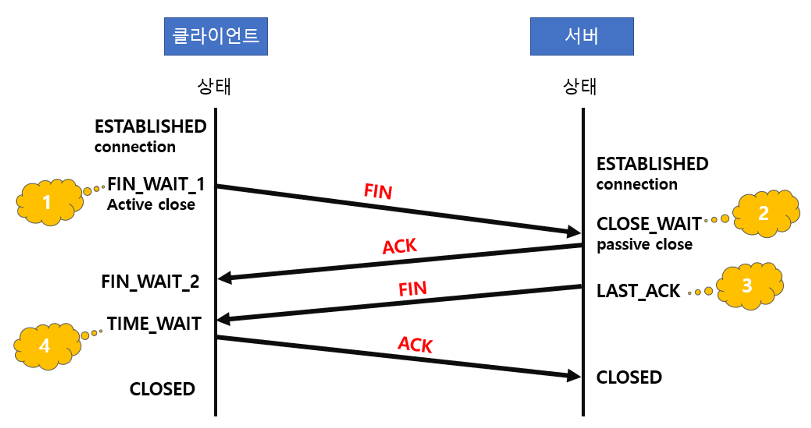

# :books: Interview - TCP & UDP

## :bookmark_tabs: 목차

[:arrow_up: **Network**](../README.md)

1. ### [Question](#) 면접 질문

- TCP
    - 4-way handshake에서 클라이언트는 서버로부터 FIN을 수신한 후 곧바로 연결을 종료시키지 않고 왜 일정 시간이 지난 후에 연결을 종료시키나요?
- UDP
   - 어떤 상황에서 주로 사용하는지 설명하세요.
   - TCP와 UDP의 특징을 비교하여 설명해주세요.

# :closed_book: Question 면접 질문

## TCP

### 4-way handshake에서 클라이언트는 서버로부터 FIN을 수신한 후 곧바로 연결을 종료시키지 않고 왜 일정 시간이 지난 후에 연결을 종료시키나요?

- Server에서 FIN을 전송하기 전에 전송한 패킷이 Routing 지연이나 패킷 유실로 인한 재전송 등으로 인해 FIN패킷보다 늦게 도착하는 상황이 발생한다면 Client에서 세션을 종료시킨 후 뒤늦게 도착하는 패킷이 있다면 이 패킷은 Drop되고 데이터는 유실될 것입니다.
- 클라이언트는 이러한 현상에 대비하여 Server로부터 FIN을 수신하더라도 일정시간(디폴트 240초) 동안 세션을 남겨놓고 잉여 패킷을 기다리는 과정을 거치게 되는데 이 과정을 "TIME_WAIT" 라고 합니다.

## UDP

### 어떤 상황에서 주로 사용하는지 설명하세요.
- 신뢰성보다는 연속성이 중요한 서비스에서 많이 사용합니다. 예를 들어 실시간으로 데이터가 오고 가는 서비스인 스트리밍 애플리케이션, 온라인 게임 등에서 많이 쓰입니다.

### TCP와 UDP의 특징을 비교하여 설명해주세요.

- 아래 표를 참고하여 설명하자.

|  | TCP | UDP |
| --- | --- | --- |
| 연결 방식 | 연결형 | 비연결형 |
| 패킷 교환 방식 | 가상 회선 방식 | 데이터그램 방식 |
| 전송 순서 | 전송 순서 보장 | 전송 순서가 바뀔 수 있음. |
| 수신 여부 확인 | 수신 여부를 확인함. | 수신 여부를 확인하지 않음.|
| 통신 방식 | 1:1 통신 | 1:1 , 1:N, N:N 통신 |
| 신뢰성 | 높음 | 낮음 |
| 속도 | UDP 보다 느림. | TCP 보다 빠름.|

