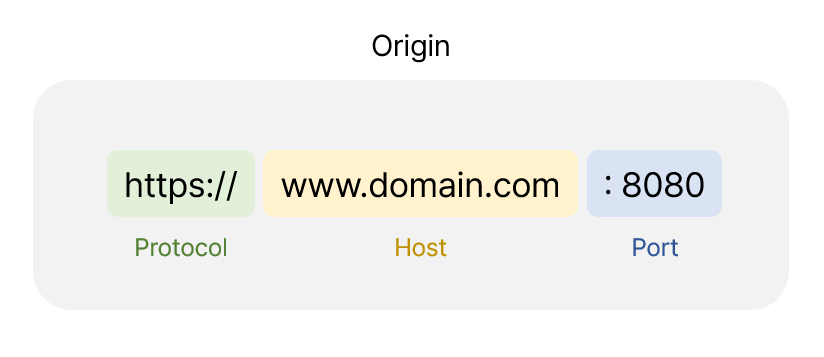
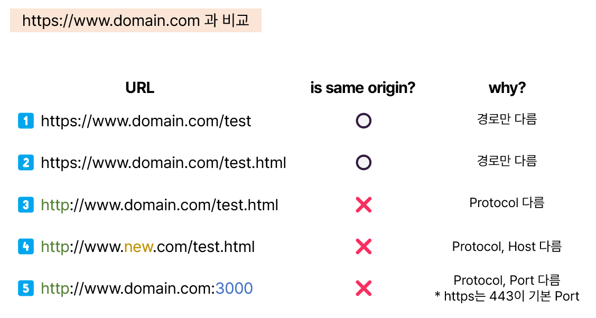
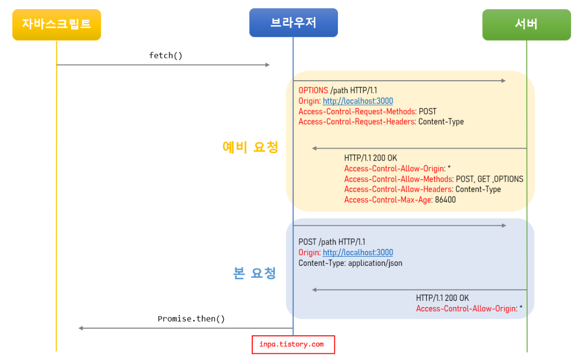
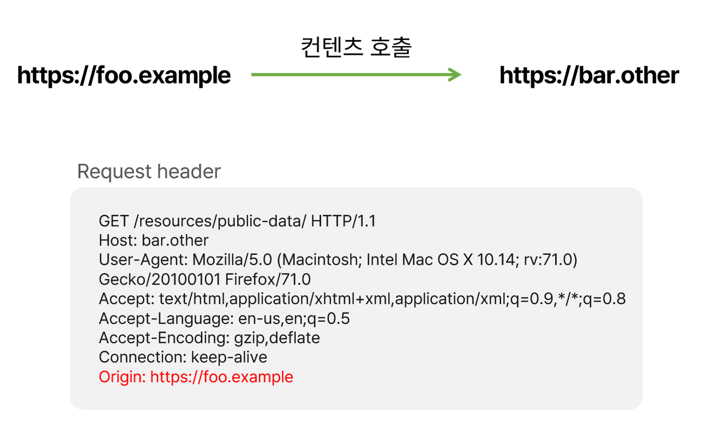
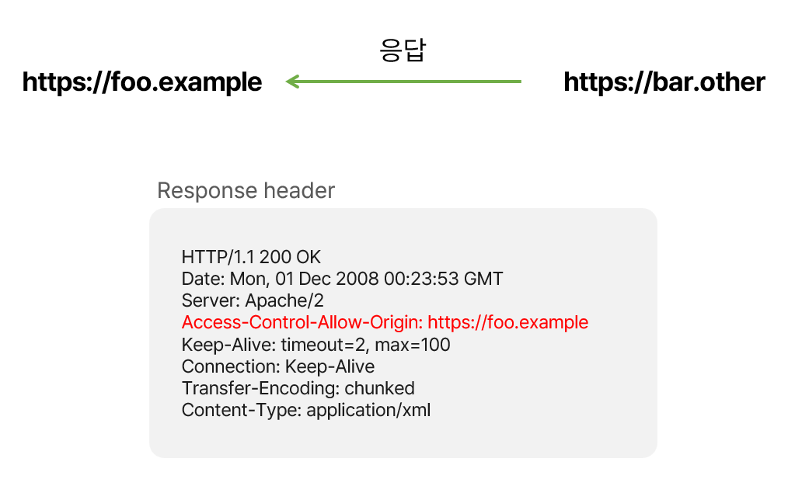
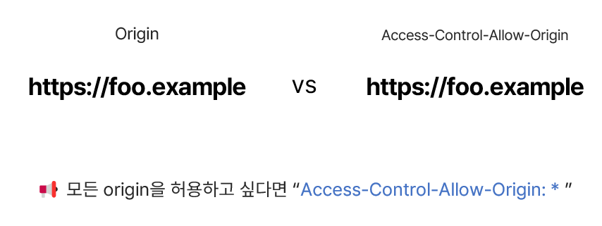
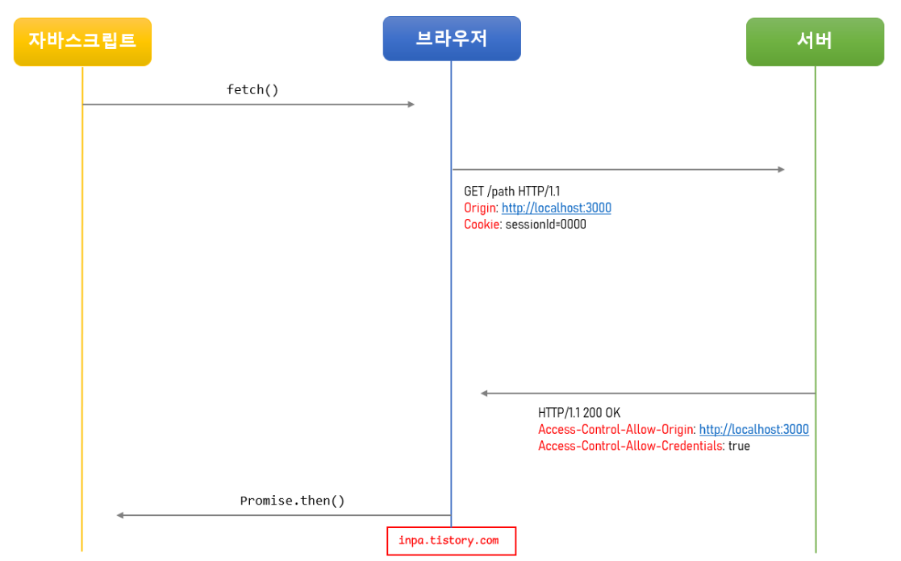

# CORS Cross-Origin Resource Sharing

## :bookmark_tabs: 목차

[:arrow_up: **Network**](../README.md)

1. ### CORS
   - [:page_facing_up: CORS](#cors-cross-origin-resource-sharing-1)
   - [:page_facing_up: 왜 CORS가 필요할까?](#왜-cors가-필요할까)
   - [:page_facing_up: CORS 3가지 동작 방식](#cors-3가지-작동-방식)
   - [:page_facing_up: CORS 해결 방법](#cors-해결-방법)

## CORS Cross-Origin Resource Sharing

> 서로 다른 출처(도메인)에서 리소스를 공유하는 것을 허용하는 정책

### 왜 CORS가 필요할까?

- CSRF 1 문제를 방지하기 위해 브라우저는 기본적으로 동일 오리진 정책(SOP) 2을 사용
- 승인된 다른 origin에서 데이터를 가져오는 것이 제한됨.
- 다른 origin에서 데이터를 공유해야 하는 경우가 있을 수 있음.
- 따라서 데이터 공유를 허용할 특정 origin을 적어놓은 것이 CORS이다.

#### 1 CSRF Cross Site Request Forgery

- 사이트 간 요청 위조
- 사용자가 자신의 의지와는 무관하게 공격자가 의도한 행위(수정, 삭제, 등록 등)를 특정 웹사이트에 요청하게 하는 공격

#### 2 동일 오리진 정책(SOP, Same-Origin Policy)

- 동일한 origin(도메인, 출처) 간 요청과 응답만 허용하는 정책
- 동일한 출처에서만 리소스를 공유할 수 있음.
- Origin = Protocol + Host + Port를 합친 URL

 

### 요청 방식에 따라 다른 CORS 발생 여부

1. Same-Origin 정책을 따르는 경우
    - 자바스크립트에서의 요청은 기본적으로 Same-Origin 정책을 따름.
    - XMLHttpRequest, Fetch API 스크립트 모두 Same-Origin 정책을 따름.

2. Cross-Origin 정책을 지원하는 경우
    - \, \<video>, \<script>, \<link> 태그 등

### CORS 3가지 작동 방식

1. [Preflight Request 예비 요청](#1-preflight-request-예비-요청)
1. [Simple Request 단순 요청](#2-simple-request-단순-요청)
1. [Credentialed Request 인증된 요청](#3-credentialed-request-인증된-요청)

#### 1. Preflight Request 예비 요청

> 브라우저는 요청을 보낼때 한번에 바로 보내지않고, 먼저 예비 요청을 보내서 검사하는 방식

- 예비 요청의 역할은 본 요청을 보내기 전에 브라우저 스스로 안전한 요청인지 미리 확인하는 것

`Preflight` : 브라우저가 예비요청을 보내는 것.

예비요청의 HTTP Method는 GET이나 POST가 아니라 **OPTIONS**라는 요청이 사용됨.

✔️ **Preflight Reqeust가 이루어지는 과정**

1. **자바스크립트의 fetch() 메서드를 통해 리소스를 받아오려고 함.**
1. **브라우저는 서버로 HTTP OPTIONS 메소드로 예비 요청(Preflight)을 먼저 보냄.**

    - Origin 헤더에 자신의 출처를 넣음.
    - Access-Control-Request-Method 헤더에 실제 요청에 사용할 메소드를 설정
    - Access-Control-Request-Headers 헤더에 실제 요청에 사용할 헤더들을 설정

1. **서버는 이 예비 요청에 대한 응답으로 어떤 것을 허용하고 어떤것을 금지하고 있는지에 대한 헤더 정보를 담아서 브라우저로 보내줌.**

    - Access-Control-Allow-Origin 헤더에 허용되는 Origin들의 목록을 설정
    - Access-Control-Allow-Methods 헤더에 허용되는 메소드들의 목록을 설정
    - Access-Control-Allow-Headers 헤더에 허용되는 헤더들의 목록을 설정
    - Access-Control-Max-Age 헤더에 해당 예비 요청이 브라우저에 캐시 될 수 있는 시간을 초 단위로 설정

1. **이후 브라우저는 보낸 요청과 서버가 응답해준 정책을 비교하여, 해당 요청이 안전한지 확인하고 본 요청을 보냄.**
1. **서버가 본 요청에 대한 응답을 하면 최종적으로 이 응답 데이터를 자바스립트로 넘겨줌.**

 

- 캐싱을 통한 예비 요청의 문제점 해결
    - 수행하는 API 호출 수가 많으면 많을 수록 예비 요청으로 인해 서버 요청을 배로 보내게 되니 비용 적인 측면에서 폐가 될 수 있음. 
    - 따라서 브라우저 캐시(Cache)Visit Website 를 이용해 Access-Control-Max-Age 헤더에 캐시될 시간을 명시해 주면, 이 Preflight 요청을 캐싱 시켜 최적화를 시켜줄 수 있음.

 

#### 2. Simple Request 단순 요청

> 예비 요청 없이 바로 본 요청을 서버에 보내서 검사하는 방식

- 아래 3가지 조건을 만족하는 경우 예비 요청 생략 가능
    
    1. 요청의 메소드는 GET, HEAD, POST 중 하나여야 함.
    1. `Accept`, `Accept-Language`, `Content-Language`, `Content-Type`, `DPR`, `Downlink`, `Save-Data`, `Viewport-Width`, `Width` 헤더일 경우 에만 적용됨.
    1. Content-Type 헤더가 `application/x-www-form-urlencoded`, `multipart/form-data`, `text/plain`중 하나여야함. 아닐 경우 예비 요청으로 동작됨.
- 대부분 HTTP API 요청은 `text/xml` 이나 `application/json` 으로 통신하기 때문에 3번째 Content-Type이 위반
- 따라서 대부분의 API 요청은 그냥 예비 요청(preflight)으로 이루어진다 라고 이해하면 됨.

 

✔️ **Simple Request가 이루어지는 과정**

1. **클라이언트에서 HTTP Request시 브라우저가 header에 Origin을 담아서 보냄.**

    

2. **서버는 응답 header에 Access-Control-Allow-Origin을 담아서 전송**

    

3. **브라우저가 Origin과 Access-Control-Allow-Origin을 비교**

    비교 후 Access-Control-Allow-Origin에 Origin이 없거나 다르다면 CORS 에러 발생

    

 

#### 3. Credentialed Request 인증된 요청

> 클라이언트에서 서버에게 자격 인증 정보(Credential)를 실어 요청할때 사용되는 요청

- 자격 인증 정보 : 세션 ID가 저장되어있는 쿠키(Cookie) 혹은 Authorization 헤더에 설정하는 토큰 값

✔️ **Credentialed Request가 이루어지는 과정**

1. **클라이언트에서 인증 정보를 보내도록 설정하기**

    기본적으로 브라우저가 제공하는 요청 API 들은 별도의 옵션 없이 브라우저의 쿠키와 같은 인증과 관련된 데이터를 함부로 요청 데이터에 담지 않도록 되어있음.

    - credentials : 요청에 인증과 관련된 정보를 담을 수 있게 해주는 옵션

    - credentials의 3가지 옵션
        - `same-origin`(기본값) : 같은 출처 간 요청에만 인증 정보를 담을 수 있음.
        - `include` : 모든 요청에 인증 정보를 담을 수 있음.
        - `omit` : 모든 요청에 인증 정보를 담지 않음.
    - 위와 같은 옵션을 별도로 설정하지 않으면 쿠키 등의 인증 정보는 절대로 자동으로 서버에게 전송되지 않음.

2. **서버에서 인증된 요청에 대한 헤더 설정하기**

    서버도 마찬가지로 이러한 인증된 요청에 대해 일반적인 CORS 요청과는 다르게 대응해줘야 함.

    - 응답 헤더의 `Access-Control-Allow-Credentials` 항목을 true로 설정해야 한다.
    - 응답 헤더의 `Access-Control-Allow-Origin`, `Access-Control-Allow-Methods`, `Access-Control-Allow-Headers` 의 값에 와일드카드 문자("*")는 사용할 수 없음.
    - 즉 인증 정보는 민감한 정보이기 때문에 분명한 Origin으로 설정되어야 하고 Access-Control-Allow-Credentials` 항목을 true로 설정해야 함.

 

### CORS 해결 방법

**서버에서 Access-Control-Allow-Origin 헤더를 세팅하기**

- 직접 서버에서 HTTP 헤더 설정을 통해 출처를 허용하게 설정하는 가장 정석적인 해결책입니다.

`Access-Control-Allow-Origin` : 특정 브라우저가 리소스에 접근이 가능하도록 허용

`Access-Control-Allow-Method` : 특정 HTTP Method만 리소스에 접근이 가능하도록 허용

`Access-Control-Expose-Headers` : 자바스크립트에서 헤더에 접근할 수 있도록 허용

`Access-Control-Max-Age : 60` : 클라이언트에서 preflight 의 요청 결과를 저장할 기간을 지정

60초 동안 preflight 요청을 캐시하는 설정으로, 첫 요청 이후 60초 동안은 OPTIONS 메소드를 사용하는 예비 요청을 보내지 않음.

`Access-Control-Allow-Credentials : true` : 클라이언트 요청이 쿠키를 통해서 자격 증명을 해야 하는 경우에 true. 
자바스크립트 요청에서 credentials가 include일 때 요청에 대한 응답을 할 수 있는지를 나타냄.

`credentials` : 쿠키 등의 인증 정보를 전달 관련 옵션

`Access-Control-Expose-Headers : Content-Length` : 기본적으로 브라우저에게 노출이 되지 않지만, 브라우저 측에서 접근할 수 있게 허용해주는 헤더를 지정

 

---

- 참고

    [CORS란 무엇인가요?](https://aws.amazon.com/ko/what-is/cross-origin-resource-sharing/)

    [CSRF(Cross-Site Request Forgery) 공격과 방어](https://junhyunny.github.io/information/security/spring-boot/spring-security/cross-site-reqeust-forgery/)

    [교차 출처 리소스 공유 (CORS)](https://developer.mozilla.org/ko/docs/Web/HTTP/CORS)
    
    [악명 높은 CORS 개념 & 해결법 - 정리 끝판왕](https://inpa.tistory.com/entry/WEB-%F0%9F%93%9A-CORS-%F0%9F%92%AF-%EC%A0%95%EB%A6%AC-%ED%95%B4%EA%B2%B0-%EB%B0%A9%EB%B2%95-%F0%9F%91%8F)

    [CORS](https://dev-hyun.tistory.com/188)