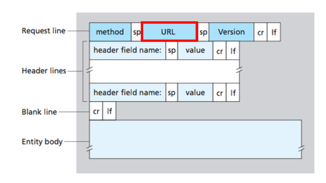
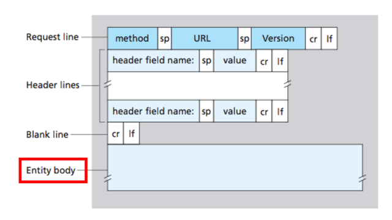

# :books: HTTP Method - GET & POST HTTP Method - GET과 POST

## :bookmark_tabs: 목차

[:arrow_up: **Network**](../README.md)

1. ### [GET](#📕-get)
2. ### [POST](#📙-post)

# :closed_book: GET

## 정의

> 특정한 리소스를 가져오도록 요청하는 HTTP 메소드

## 특징

- GET 요청을 전송할 때 필요한 데이터를 쿼리스트링Query String을 통해 전송
  - URL의 끝에 `?`와 함께 키-값쌍으로 이루어진 요청 파라미터를 제공
  - `http://www.example-url.com/resources?name1=value1&name2=value2`
- 불필요한 요청을 제한하기 위해 요청을 캐싱할 수 있음
  - 브라우저에서 데이터를 캐싱해 동일한 요청 발생시 서버가 아닌 캐싱 데이터 활용
  - HTTP Header에서 `cache-control` 헤더를 통해 캐시 옵션을 지정할 수 있음
- GET 요청은 브라우저 히스토리에 기록되며, URL의 최대 길이만큼 길이가 제한됨
  - `HTTP 1.1`이후 무제한 URL을 지원하지만, 브라우저 프로그램에서 제약을 둠
- GET 요청은 URL이 노출되고 히스토리가 남으며, 캐싱 가능하므로 보안에 취약함

# :orange_book: POST

## 정의

> 특정한 리소스를 생성또는 변경하기 위해 서버로 전송하는 HTTP 메소드

## 특징

- POST 요청을 전송할때 필요한 데이터를 HTTP Body에 담아서 전송
  - HTTP Body는 요청 데이터의 길이 제한이 없어 대용량 전송이 가능
  - 쿼리 스트링과 같이 URL에 직접 노출되진 않지만 개발자 도구로 내용 확인 가능
  - 민감한 정보를 전송할 경우 HTTP Body를 암호화 해서 전송해야 함
- POST 요청시 HTTP Header에 `Content-Type`에 데이터 타입을 명시해야함
  - `application/x-www-form-urlencoded`, `text/plain`, `multipart/form-data` 등
  - 데이터 타입이 없다면 서버에서 URL에 포함된 리소스를 분석해 타입을 추측함
  - 알 수 없는 경우, `application/octet-stream`로 처리
- POST 요청은 브라우저 히스토리에 기록되지 않으며, 요청이 캐싱되지 않음
