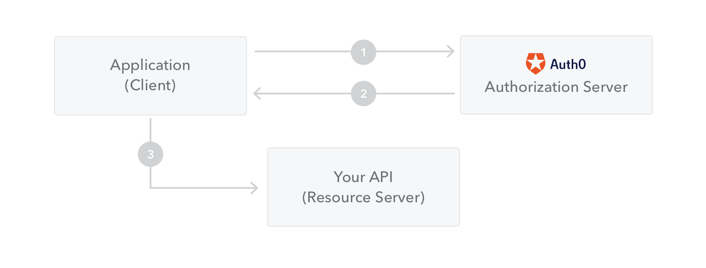

# :books: JSON Web Token <sub>JWT토큰</sub>

## :bookmark_tabs: 목차

[:arrow_up: **Network**](../README.md)

1. ### [JWT](#📕-jwt)

# :closed_book: JWT

## 정의

> JWT(JSON Web Token)는 당사자 간에 정보를 JSON 개체로 안전하게 전송하기 위한 방법을 정의하는 개방형 표준([RFC 7519](https://tools.ietf.org/html/rfc7519)) 규격 토큰

## 특징

- 디지털 서명이 되어있으므로 JWT는 당사자 간 신뢰하고 확인할 수 있음
- JWT는 전자 서명이 가능함
  - 비밀키(HMAC 알고리즘 포함)
  - RSA 또는 ECDSA를 사용하는 공개/개인 키 쌍을 사용

## JWT의 사용 시나리오

### 권한 부여

- 사용자가 로그인하면 이후의 각 요청에는 JWT가 포함되어 사용자가 해당 토큰으로 허용된 경로, 서비스 및 리소스에 액세스할 수 있음
- SSO <sub>Single Sign On</sub>는 오버헤드가 적고 다양한 도메인에서 쉽게 사용할 수 있기 때문에 현재 JWT를 널리 사용

### 정보 교환

- 당사자 간에 정보를 안전하게 전송하는 방법 중 하나
- 공개/개인 키 쌍을 사용하여 JWT에 서명하므로 보낸 사람이 누구인지 확인 가능
- 헤더와 페이로드를 사용하여 서명을 검증하므로 콘텐츠가 변조되지 않았음을 보장

## JWT 구조

`{Header}.{Payload}.{Signature}` `xxxxx.yyyyy.zzzzz`

- JWT는 세가지 파트로 구성되어 있으며, 각 파트는 dot(.)으로 구분
- [jwt 디버거](https://jwt.io/#debugger-io)를 활용해 jwt의 토큰 구조와 정보를 간단히 확인 가능

### JWT Header

- 일반적으로 토큰의 유형(type)과 서명에 사용된 알고리즘(algorithm)으로 구분
- Header는 **Base64url**로 인코딩되어 JWT의 첫 번째 부분을 구성

```json
{
  "alg": "HS256",
  "typ": "JWT"
}
```

### JWT Payload

- Claim을 포함하는 영역으로 Claim은 Entity(주로 사용자 정보) 및 추가 데이터에 대한 설명을 포함하며 Claim의 type은 registered, public, private으로 구분됨
- Payload 또한 **Base64url**로 인코딩되어 있으며 JWT의 두 번째 부분을 구성
- **Registered claims**
  - 필수는 아니지만 주로 사용되는 클레임을 제공하기 위해 미리 정의된 클레임 집합. iss(발급자), exp(만료 시간), sub(제목), aud(수신자) 등을 정의
- **Public claims**
  - 자유롭게 정의 할 수 있는 클레임, 그러나 다른 종류의 클레임과 충돌이 발생할수 있으므로 이러한 충돌을 방지하기 위해 [IANA JWT Registry](https://www.iana.org/assignments/jwt/jwt.xhtml)에 정의 하거나 네임 스페이스를 활용해 URI 형식으로 정의한 이름을 사용
- **Private claims**
  - 사용에 동의한 당사자 간에 정보를 공유하기 위해 생성된 사용자 정의 클레임으로 등록이나 공개 클레임이 아니므로 내용을 아무나 알 수 없음

```json
{
  "sub": "1234567890",
  "name": "John Doe",
  "admin": true
}
```

### JWT Signature

- 서명은 인코딩된 헤더와 페이로드, 비밀 키, 헤더에 지정된 알고리즘을 가져와서 생성함
- 서명은 메시지가 도중에 변경/위조 되지 않았는지 확인하는 데 사용되며 개인 키로 서명된 토큰의 경우 JWT 발신자가 누구인지 확인할 수도 있음

## JWT 작동 구조

- 사용자가 성공적으로 자격 증명을 하면 로그인하면 JSON 웹 토큰이 반환됨
- 토큰은 자격 증명이므로 보안 문제를 방지하기 위해 보관에 주의를 요하며, 필요 이상으로 토큰을 보관하지 않음
- 사용자가 보호된 경로 또는 리소스에 접근 할 때마다 사용자 에이전트는 일반적으로 **Bearer 스키마** 를 사용하여 **Authorization 헤더** 에서 JWT 전송
  ```plain
  Authorization: Bearer <token>
  ```
- HTTP 헤더를 통해 JWT 토큰을 보내는 경우 토큰이 너무 커지면 안됨.
  - 일부 레거시 서버는 8KB 이상의 헤더를 허용하지 않기 때문
- 아래 다이어그램은 Web API에 액세스하기 위한 JWT를 사용하는 방법을 도식화
  
  1. 애플리케이션 또는 클라이언트가 권한 부여 서버에 권한 부여를 요청
  2. 권한이 부여되면 권한 서버는 애플리케이션에 액세스 토큰을 반환
  3. 애플리케이션은 액세스 토큰을 사용하여 보호된 리소스(예: API)에 액세스
