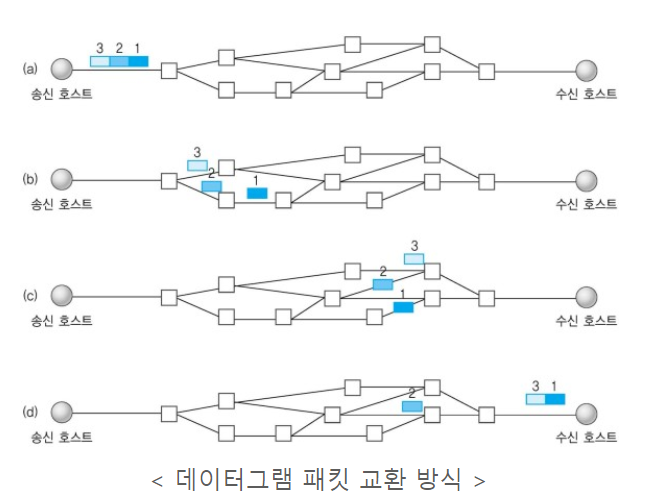

# :books: TCP & UDP TCP와 UDP

## :bookmark_tabs: 목차

[:arrow_up: **Network**](../README.md)

1. ### [TCP](#📕-tcp-transmission-control-protocol)

2. ### [UDP](#📙-udp-user-datagram-protocol)

# :closed_book: TCP Transmission Control Protocol

## 정의

> TCP/IP 통신에서 사용하는 클라이언트와 서버가 연결된 상태에서 데이터를 주고받는 연결 지향적 프로토콜

## 특징

- 클라이언트와 서버가 연결된 상태에서 데이터를 주고받는 연결 지향적 프로토콜
- 네트워크에 연결된 컴퓨터에서 실행되는 프로그램 간에 일련의 옥텟(데이터, 메시지, 세그먼트라는 블록 단위)을 안정적으로, 순서대로, 에러 없이 교환할 수 있음
- 연결형 서비스로 가상 회선 방식을 제공
  - 발신지와 수신지를 연결하여 패킷을 전송하기 위한 논리적 경로를 배정
  - 3-way handshaking로 연결하고, 4-way handshaking로 연결을 해제함
- 연결 과정에 높은 신뢰성을 보장하나 UDP보다 느림
- 흐름 제어Flow control와 혼잡 제어Congestion control를 지원
  - 흐름 제어로 데이터 처리 속도를 조절하여 수신자의 버퍼 오버플로우를 방지
  - 혼잡 제어로 네트워크 내의 패킷 수가 과도하게 증가하지 않도록 방지
- 전이중Full-Duplex, 점대점Point to Point 방식 사용
  - 전이중 : 전송이 양방향으로 동시에 일어남
  - 점대점 : 각 연결이 정확히 2개의 종단점을(1:1 통신)

## 3-way handshaking

- TCP에서 장치들 사이에 논리적인 접속을 성립Establish하기 위해 사용하는 방법
- PARPositive Acknowledgement with Re-transmission 을 통해 신뢰적인 통신을 제공
- TCP를 이용해서 통신을 하는 응용프로그램이 데이터를 전송하기 전에 먼저 정확한 전송을 보장하기 위해 상대방 컴퓨터와 사전에 세션을 수립하는 과정을 의미

### 연결 과정

> Client > Server : TCP SYN  
> Server > Client : TCP SYN ACK  
> Client > Server : TCP ACK
>
> \* SYN : Synchronize Sequence Numbers, 연결 확인을 위한 무작위 값  
> \* ACK : Acknowledgment, Client 혹은 Server로부터 받은 SYN 값에 +1 반환

1. 먼저 Open 한 클라이언트가 SYN를 전송하고 SYN_SENT 상태로 대기
2. 서버는 SYN-RECEIVED 상태로 바꾸고 SYN과 ACK를 전송
3. SYN과 ACK를 받은 클라이언트는 ESTABLISHED 상태로 변경 후 서버에게 ACK를 전송
4. ACK를 받은 서버는 ESTABLISHED 상태로 변경

| State        | Description                                                |
| ------------ | ---------------------------------------------------------- |
| CLOSED       | 연결 수립을 시작하기 전의 기본 상태 (연결 없음)            |
| LISTEN       | 포트가 열린 상태로 연결 요청 대기 중                       |
| SYN-SENT     | SYN을 요청한 상태                                          |
| SYN-RECEIVED | SYN 요청을 받고 상대방의 응답을 기다리는 중                |
| ESTABLISHED  | 연결 수립이 완료된 상태, 서로 데이터를 교환할 수 있는 상태 |

## 4-way handshaking

- TCP에서 장치들 사이에 논리적인 접속을 종료하고 포트를 닫기Closed 위해 사용하는 방법

### 연결 과정

> Client > Server : TCP FIN  
> Server > Client : TCP ACK  
> Server > Client : TCP FIN  
> Client > Server : TCP ACK
>
> \* FIN : 연결을 종료한다는 의미의 값

1. 먼저 close를 실행한 클라이언트가 FIN을 보내고 FIN-WAIT-1 상태로 대기
2. 서버는 CLOSE-WAIT으로 바꾸고 ACK를 전송하고 해당 포트에 연결된 애플리케이션에게 close를 요청
3. ACK를 받은 클라이언트는 상태를 FIN-WAIT-2로 변경
4. close 요청을 받은 서버는 종료 프로세스를 진행하고 FIN을 클라이언트로 보내 LAST_ACK 상태로 변경
5. FIN을 받은 클라이언트는 ACK를 서버에 다시 전송하고 TIME-WAIT으로 상태를 변경
6. TIME-WAIT에서 일정 시간이 지나면 CLOSE 되고 ACK를 받은 서버도 포트를 CLOSED로 닫음

| State       | Description                                                                                                   |
| ----------- | ------------------------------------------------------------------------------------------------------------- |
| ESTABLISHED | 연결 수립이 완료된 상태, 서로 데이터를 교환할 수 있는 상태                                                    |
| FIN-WAIT-1  | 자신이 보낸 FIN에 대한 ACK를 기다리거나 상대방의 FIN을 기다리는 상태                                          |
| FIN-WAIT-2  | 자신이 보낸 FIN에 대한 ACK를 받았고, 상대방의 FIN을 기다리는 상태                                             |
| CLOSE-WAIT  | 상대방의 FIN을 받은 상태. 상대방 FIN에 대한 ACK를 보내고 어플리케이션에 종료를 알림                           |
| LAST-ACK    | COLSE-WAIT 상태를 처리 후 자신의 FIN 요청을 보낸 후 FIN에 대한 ACK를 기다리는 상태                            |
| TIME-WAIT   | 모든 FIN에 대한 ACK를 받고 연결 종료가 완료된 상태. 새 연결과 겹치지 않도록 일정 시간 기다린 후 CLOSED로 전이 |
| CLOSED      | 연결 수립을 시작하기 전의 기본 상태 (연결 없음)                                                               |

## 흐름 제어(Flow control)

- 수신이 송신보다 데이터 처리 속도가 빠르면 문제없지만, 송신의 속도가 빠를 경우 문제가 발생
- 수신에서 제한된 저장 용량을 초과한 이후에 도착하는 데이터는 손실 될 수 있음
  - 만약 손실 된다면 불필요하게 응답과 데이터 전송이 송/수신 측 간에 빈번이 발생하게 됨
- 위험을 줄이기 위해 송신 측의 데이터 전송량을 수신측에 따라 조절하는 것이 흐름 제어

### Stop and Wait

- 매번 전송한 패킷에 대해 확인 응답을 받아야만 그 다음 패킷을 전송하는 방법
- 매번 확인과 응답을 거치므로 전송 속도가 느리다는 단점이 있음

### Sliding Window(Go Back n ARQ)

- 수신측에서 설정한 윈도우 크기만큼 송신측에서 확인응답없이 세그먼트를 전송할 수 있게 하여 데이터 흐름을 동적으로 조절하는 제어기법
- Go back n 은 기법은 패킷을 전송할 때 수신측에서 데이터를 잘못 받은 것이거나 못 받을 경우에 그 패킷 번호부터 다시 재전송을 하는 기법
- 전송은 되었지만, acked를 받지 못한 byte의 숫자를 파악하기 위해 사용하는 프로토콜
  - > $LastByteSent - LastByteAcked \leq ReceivecWindowAdvertised$
  - (현재 공중에 떠있는 패킷 수 <= sliding window)
  - LastByteSent : 마지막에 보내진 바이트
  - LastByteAcked : 마지막에 확인된 바이트
  - ReceivecWindowAdvertised : 남아있는 공간
- TCP/IP를 사용하는 모든 호스트들은 송신하기 위한 것과 수신하기 위한 2개의 Window를 가짐
- 호스트들은 실제 데이터를 보내기 전에 '3 way handshaking'을 통해 수신 호스트의 receive window size에 자신의 send window size를 조정
- Selective Repeat은 잘못받은 패킷 번호만 다시 재전송 하는 것

**동작방식**

1. 먼저 윈도우에 포함되는 모든 패킷을 전송
2. 그 패킷들의 전달이 확인되는대로 이 윈도우를 옆으로 옮김으로써 그 다음 패킷들을 전송

- 송신 버퍼

  

  - 200 이전의 바이트는 이미 전송되었고, 확인응답을 받은 상태
  - 200 ~ 202 바이트는 전송되었으나 확인응답을 받지 못한 상태
  - 203 ~ 211 바이트는 아직 전송이 되지 않은 상태

- 수신 윈도우

  

- 송신 윈도우

  

  - 수신 윈도우보다 작거나 같은 크기로 송신 윈도우를 지정하게되면 흐름제어가 가능하게 됨

- 송신/윈도우의 이동

  

  - Before : 203 ~ 204를 전송하면 수신측에서는 확인 응답 203을 보내고, 송신측은 이를 받아 After 상태와 같이 수신 윈도우를 203 ~ 209 범위로 이동
  - After : 205 ~ 209가 전송 가능한 상태

- Selective Repeat
  - 받은 패킷을 검증했을때 오류가 발생했을 경우 잘못받은 패킷 번호만 다시 재전송

## 혼잡 제어(Congestion control)

- 네트워크 내에 패킷의 수가 과도하게 증가하는 현상을 혼잡Congestion이라 정의
- 송신의 데이터는 지역망이나 인터넷으로 연결된 대형 네트워크를 통해 전달
  - 만약 한 라우터에 데이터가 몰릴 경우, 자신에게 온 데이터를 모두 처리할 수 없게 됨
  - 호스트들은 데이터를 재전송을 하게되고 혼잡을 가중시켜 오버플로우나 데이터 손실이 발생
- 이런 네트워크 혼잡을 피하기 위해 송신이 보내는 데이터의 전송속도를 강제로 줄이는 것이 혼잡제어

### 혼잡 해결 방법

- **AIMD(Additive Increase / Multiplicative Decrease)**
  - 처음에 패킷을 하나씩 보내고 이것이 문제없이 도착하면 window 크기(단위 시간 내에 보내는 패킷의 수)를 1씩 증가시켜가며 전송하는 방법
  - 패킷 전송에 실패하거나 일정 시간을 넘으면 패킷의 보내는 속도를 절반으로 줄임
  - 공평한 방식으로, 여러 호스트가 한 네트워크를 공유하고 있으면 나중에 진입하는 쪽이 처음에는 불리하지만, 시간이 흐르면 평형상태로 수렴하게 되는 특징을 가짐
  - 문제점은 초기에 네트워크의 높은 대역폭을 사용하지 못하여 오랜 시간이 걸리게 되고, 네트워크가 혼잡해지는 상황을 미리 감지 못 함
    - 즉, 네트워크가 우선 혼잡해지고 나서야 대역폭을 줄이는 방식(후조치)
- **Slow Start**
  - AIMD 방식이 네트워크의 수용량 주변에서는 효율적으로 작동하지만, 처음에 전송 속도를 올리는데 시간이 오래 걸리는 단점이 존재
  - Slow Start 방식은 AIMD와 마찬가지로 패킷을 하나씩 보내면서 시작하고, 패킷이 문제없이 도착하면 각각의 ACK 패킷마다 window size를 1씩 늘림
    - 즉, 한 주기가 지나면 window size가 2배로 늘림
  - 전송속도는 AIMD에 반해 지수 함수 꼴로 증가
    - 대신에 혼잡 현상이 발생하면 window size를 1로 떨어뜨림
  - 처음에는 네트워크의 수용량을 예상할 수 있는 정보가 없지만, 한번 혼잡 현상이 발생하고 나면 네트워크의 수용량을 어느 정도 예상가능
  - 그러므로 혼잡 현상이 발생하였던 window size의 절반까지는 이전처럼 지수 함수 꼴로 창 크기를 증가시키고 그 이후부터는 완만하게 1씩 증가
- **Fast Retransmit**
  - 빠른 재전송은 TCP의 혼잡 조절에 추가된 정책
  - 패킷을 받는 쪽에서 먼저 도착해야할 패킷이 도착하지 않고 다음 패킷이 도착한 경우에도 ACK 패킷을 보냄
  - 단, 순서대로 잘 도착한 마지막 패킷의 다음 패킷의 순번을 ACK 패킷에 실어서 보내게 되므로, 중간에 하나가 손실되게 되면 송신 측에서는 순번이 중복된 ACK 패킷을 받게 됨
    - 이것을 감지하는 순간 문제가 되는 순번의 패킷을 재전송 할 수 있음
  - 중복된 순번의 패킷을 3개 받으면 재전송
  - 약간 혼잡한 상황이 일어난 것이므로 혼잡을 감지하고 window size를 줄임
- **Fast Recovery**
  - 혼잡한 상태가 되면 window size를 1로 줄이지 않고 반으로 줄이고 선형증가 시킴
  - 이 정책까지 적용하면 혼잡 상황을 한번 겪고 나서부터는 순수한 AIMD 방식으로 동작

# :orange_book: UDP User Datagram Protocol

## 정의

> TCP/IP 통신에서 사용하는 데이터그램 패킷 방식으로 데이터를 주고받는 비연결형 프로토콜

## 특징

- 비연결형 서비스로 데이터그램 방식을 제공
  - 데이터의 전송 순서가 비순차적
- TCP의 3-way handshaking과 같은 과정이 없어 데이터 수신 여부를 확인하지 않음
- 흐름 제어(flow control)가 없어서 제대로 전송되었는지, 오류가 없는지 확인할 수 없어 신뢰성이 낮음
- TCP보다 네트워크 부하가 낮고 통신 속도가 빠름
  - 동영상 스트리밍 같은 실시간 서비스에 적합
- 1:1 & 1:N & N:N 통신이 가능
  - Broadcast 통신이 가능
