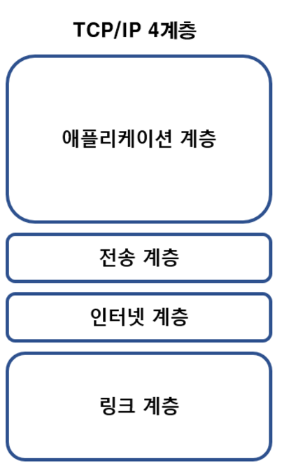
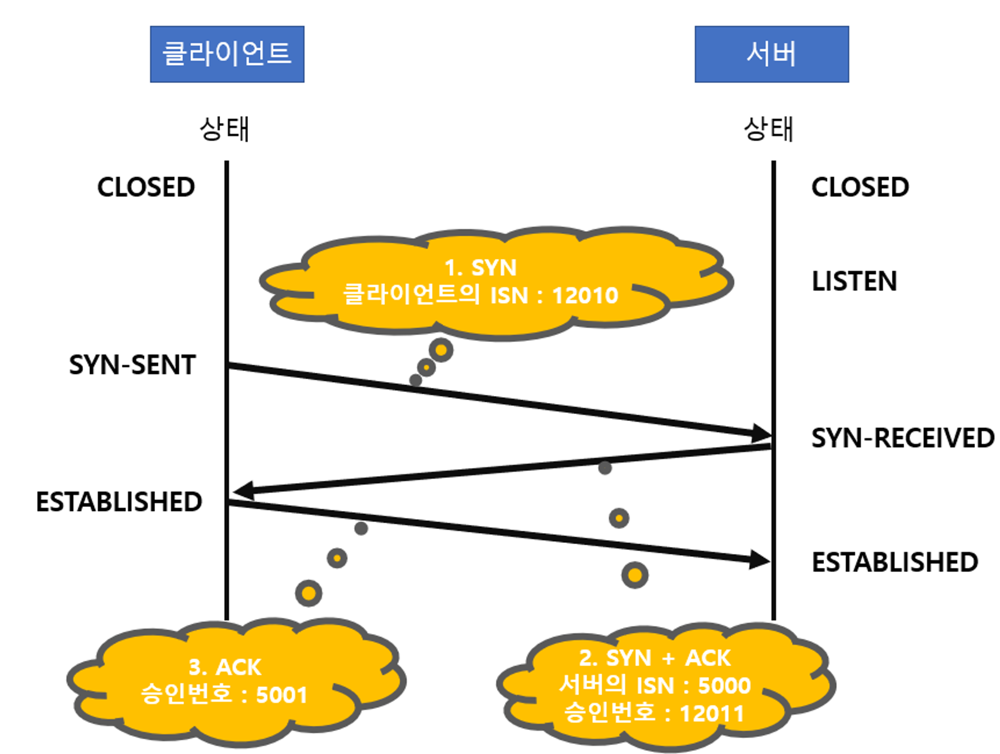
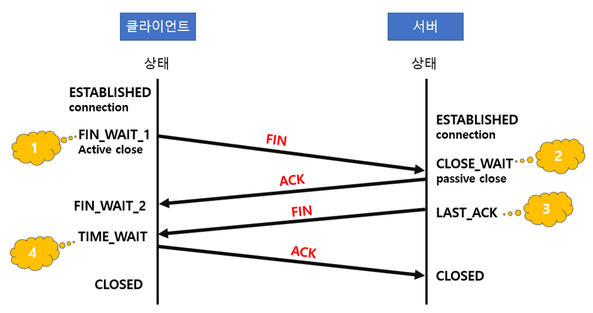

# TCP & UDP

# :books: TCP & UDP

## :bookmark_tabs: 목차

[:arrow_up: **Network**](../README.md)

1. ### TCP & UDP
   - [:page_facing_up: TCP/IP 4계층](#tcpip-4계층)
   - [:page_facing_up: TCP](#tcp-transmission-control-protocol)
   - [:page_facing_up: TCP 3 way handshake & 4 way handshake](#tcp-3-way-handshake--4-way-handshake)
   - [:page_facing_up: TCP/IP 흐름제어 & 혼잡제어](./TCP&UDP.md)
   - [:page_facing_up: UDP](#udp-user-datagram-protocol)

### TCP/IP 4계층

> IP(인터넷 프로토콜)와 TCP(전송 조절 프로토콜)의 묶음을 의미 
즉, 두 가지 프로토콜 방식을 조합하여 인터넷 통신하는 것을 TCP/IP 라고 부르는 것

- OSI와 TCP/IP 차이점
   - **`OIS`** - **개념적 모델**로 통신에는 실질적으로 사용되지 않음. 즉, 통신 모델 표준을 정할 때 주로 사용됨.
   - **`TCP/IP`** - **실질적**인 통신에 **주로 사용**됨.

#### 1. 링크 계층

- 전선, 광섬유, 무선 등 실질적으로 데이터를 전달하며 장치 간에 신호를 주고받는 규칙을 정하는 계층
- 물리적인 MAC주소가 해당됨.
- 전송 단위 : Frame
- 프로토콜 : Ethernet, Token, Ring, PPP

#### 2. 인터넷 계층

- 장치로부터 받은 네트워크 패킷을 IP 주소로 지정된 목적지로 전송하기 위해 사용되는 계층
- 패킷을 수신해야 할 상대의 **주소를 지정**하여 데이터를 전달
- **비연결형** : 상대방이 제대로 받았는지를 보장하지 않음.
- 프로토콜 : IP, ARP, ICMP

#### 3. 전송 계층

- 송신자와 수신자를 연결하는 **통신 서비스**를 제공
- **연결 지향 데이터 스트림 지원**, **신뢰성**, **흐름 제어** 제공
- 프로토콜 : [TCP](#tcp-transmission-control-protocol), [UDP](#udp-user-datagram-protocol)
- [3-way handshake](#3-way-handshake), [4-way handshake](#4-way-handshake)가 이 계층에서 이루어짐.

#### 4. 애플리케이션 계층

- 사용자가 네트워크에 접근할 수 있도록 서비스를 제공하는 계층
- 프로토콜 : FTP, HTTP, SSH, SMTP, DNS 등

### TCP Transmission Control Protocol

> 서버와 클라이언트간에 데이터를 신뢰성 있게 전달하기 위해 만들어진 프로토콜

- 데이터를 전송하기 전에 데이터 전송을 위한 연결을 만드는 연결지향 프로토콜

#### 특징

✔️ 연결형 서비스
- 3-way handshaking 과정을 통해 연결 설정
- 4-way handshaking 과정을 통해 연결 해제
- 이러한 과정 때문에 UDP보다는 속도가 느리기 때문에 연속성보다 신뢰성 있는 전송이 중요할 때 사용하는 프로토콜(ex. 파일 전송)

✔️ 신뢰성
- TCP의 가장 중요한 특징으로 연결형 프로토콜이므로 신뢰성을 보장함.

✔️ 흐름제어
- 송수신 컴퓨터는 CPU와 네트워크 대역폭의 차이 등의 이유로 서로 다른 데이터 속도로 작동하여 수신자가 처리할 수 있는 속도보다 더 빠르게 송신자가 데이터를 보낼 가능성이 있음.
- 데이터 처리 속도를 조절하여 수신자의 버퍼 오버플로우를 방지

✔️ 다중화

? 완전히 이해하고 적어두겠슴다.

✔️ 전이중(Full-Duplex), 점대점(Point to Point) 방식
- 전이중(Full-Duplex) : 전송이 양방향으로 동시에 일어날 수 있음.
- 점대점(Point to Point) : 각 연결이 정확히 2개의 종단점을 가지고 있음.

### TCP 3 way handshake & 4 way handshake

#### 3-way handshake

> **SYN** : SYNchronization의 약자, 연결 요청 플래그 
**ACK** : ACKnowledgement의 약자, 응답 플래그 
**ISN** : Initial Sequence Numbers의 약어, 새로운 TCP 연결의 첫 번째 패킷에 할당된 임의의 32비트 고유 시퀀스 번호

1. SYN 단계 : 클라이언트는 서버에 클라이언트의 ISN을 담아 SYN을 보냄
2. SYN + ACK 단계 : 서버는 클라이언트의 SYN을 수신, 서버의 ISN을 보내며 승인 번호로 클라이언트의 ISN+1를 보냄
3. ACK 단계 : 클라이언트는 서버의 ISN + 1한 값인 승인번호를 담아 ACK를 서버에 보냄.

 

#### 4-way handshake

1. 클라이언트가 연결을 닫으려고 할 때 FIN으로 설정된 세그먼트를 보내고 클라이언트는 FIN_WAIT_1 상태로 들어가고 서버의 응답을 기다림.
2. 서버는 ACK라는 승인 세그먼트를 보냄. 그리고 COLSE_WAIT 상태에 들어가고, 클라이언트는 세그먼트를 받으면 FIN_WAIT_2상태에 들어감.
3. 서버는 일정 시간 후에 FIN이라는 세그먼트를 보냄.
4. 클라이언트는 TIME_WAIT 상태가 되고 다시 서버로 ACK를 보내서 서버는 CLOSED 상태가 됨.
이후 클라이언트는 어느 정도의 시간을 대기한 후 연결이 닫히고 클라이언트와 서버의 모든 자원의 연결이 해제됨.

 

### TCP/IP 흐름제어 & 혼잡제어

> **흐름제어** : 송신측과 수신측의 데이터 처리 속도 차이를 해결하기 위해 전송되는 데이터의 양을 조절  
> **혼잡제어** : 네트워크 내에 패킷의 수가 과도하게 증가하는 현상인 혼잡 현상을 방지하고 제거하기 위한 기능, 호스트와 라우터를 포함하여 흐름제어보다 넓은 범위의 전송 문제를 다룸.

#### 흐름제어

- 수신측이 송신측보다 빠르면 문제가 없지만 송신측의 속도가 더 빠를 경우 문제가 발생할 수 있음.
- 수신측에서 제한된 저장용량을 초과한 이후에 도착하는 데이터는 손실이 될 수 있으며, 만약 손실이 된다면 불필요한 응답과 데이터 전송이 송/수신측 모두에게 발생
- 이러한 문제가 발생하지 않도록 하기 위해 송신 측의 데이터 전송량을 조절해야 함.
- Stop and wait, Sliding window 방식이 있음.
- **Stop and wait**
   - 매번 전송한 패킷에 대해 확인응답을 받아야만 그 다음 패킷을 전송하는 방법
- **Sliding window**
   - 수신측에서 설정한 윈도우 크기만큼 송신측에서 확인 응답없이 세그먼트를 전송 할 수 있게 하여 데이터 흐름을 동적으로 조절하는 제어 기법
   - 윈도우에 포함되는 모든 패킷을 전송하고, 그 패킷들의 전달이 확인되는대로 이 윈도우를 옆으로 옮김(Slide)으로써 그 다음 패킷들을 전송

#### 혼잡제어
- 한 라우터에 데이터가 몰리는 경우 등의 네트워크의 혼잡을 피하기 위해 송신측에서 보내는 데이터의 전송속도를 강제로 줄이는 작업
- 해결 방법
   - **AIMD**(Addtive Increase/Multicative Decrease, 합 증가, 곱 감소)
      - 처음에 패킷을 하나씩 보내고 문제가 발생하지 않으면 윈도우 크기를 1씩 증가하는 방법
      - 패킷 전송에 실패하거나 일정 시간을 넘으면 패킷 전송 속도를 절반으로 줄인다.
   - **Slow Start**
      - AIMD와 같이 패킷을 하나씩 보내고 문제가 발생하지 않으면 각 ACK 패킷마다 윈도우 크기를 1씩 늘려준다. 즉, 한 주기가 지나면 윈도우 크기는 2배가 됨.
      - AIMD와 달리 전송 속도를 지수 함수 꼴로 증가시켜서 윈도우 크기를 더 빠르게 증가시킨다.
   - **Fast Retransmit**(빠른 재전송)
   - **Fast Recovery**(빠른 회복)
      - 혼잡한 상태가 되면 윈도우 크기를 1이 아니라 반으로 줄이고, 선형 증가시킴.
      - 혼잡 상황을 한번 겪은 이후로는 AIMD 방식으로 동작

좀 더 공부 후에 정리하여 올리겠슴다

 

### UDP User Datagram Protocol

> 비연결형, 신뢰성이 없는 전송 프로토콜

#### 특징

✔️ 비연결형 서비스
- 데이터그램 패킷 교환 방식 사용
   - 패킷이 독립적으로 이동하며 최적의 경로를 선택하여 가는데, 하나의 메시지에서 분할된 여러 패킷은 서로 다른 경로로 전송될 수 있으며 도착한 순서가 다를 수 있는 방식을 뜻함. → 단순히 데이터만 줌.
- 데이터의 전송 순서가 바뀔 수 있음.

✔️ 데이터 수신 여부 확인하지 않음.
- TCP의 3-way handshaking과 같은 과정이 없음.
- 즉, 보내는 쪽에서 일방적으로 데이터 전송

✔️ 낮은 신뢰성
- 흐름 제어가 없기 때문에 제대로 전송되었는지, 오류가 없는지 확인할 수 없음.

✔️ TCP보다 빠른 속도
- 비연결형 이기 때문에 TCP보다는 속도가 빠름.
- 신뢰성보다는 연속성 있는 전송이 필요할 때 주로 사용하는 프로토콜(ex. 실시간 스트리밍 서비스 등)

✔️ 1:1, 1:N, N:N 통신이 가능

#### TCP와 UDP 비교
|  | TCP | UDP |
| --- | --- | --- |
| 연결 방식 | 연결형 | 비연결형 |
| 패킷 교환 방식 | 가상 회선 방식 | 데이터그램 방식 |
| 전송 순서 | 전송 순서 보장 | 전송 순서가 바뀔 수 있음. |
| 수신 여부 확인 | 수신 여부를 확인함. | 수신 여부를 확인하지 않음.|
| 통신 방식 | 1:1 통신 | 1:1 , 1:N, N:N 통신 |
| 신뢰성 | 높음 | 낮음 |
| 속도 | UDP 보다 느림. | TCP 보다 빠름.|

---

 

- 참고

   [TCP(Transmission Control Protocol)란?](https://musclebear.tistory.com/2)

   [TCP와 UDP의 특징 및 차이점 알아보기](https://dev-coco.tistory.com/144)

   [[Network] TCP/IP 와 TCP/IP 4계층이란?](https://wooono.tistory.com/507)

   [[기술면접] TCP와 UDP](https://velog.io/@ahsy92/%EA%B8%B0%EC%88%A0%EB%A9%B4%EC%A0%91-TCP%EC%99%80-UDP)

   [TCP 의 흐름 제어 / 오류 제어 / 혼잡 제어](https://benlee73.tistory.com/186)