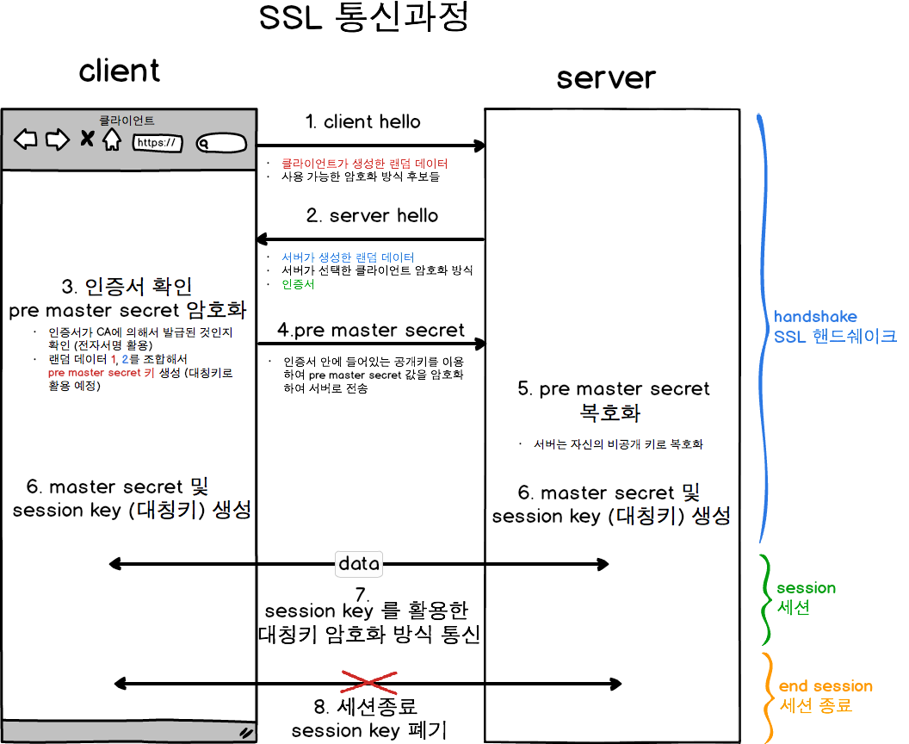

# TLS/SSL handshake TLS/SSL 핸드셰이크

## :bookmark_tabs: 목차

[:arrow_up: **Network**](../README.md)

1. ### TLS/SSL handshake
   - [:page_facing_up: SSL](#ssl-secure-sockets-layer)
   - [:page_facing_up: TLS](#tls-transport-layer-security)
   - [:page_facing_up: TLS/SSL handshake](#tlsssl-handshake-1)

# SSL Secure Sockets Layer

> 네트워크상의 두 디바이스 또는 애플리케이션 간에 보안 연결을 생성하는 통신 프로토콜

- 데이터 무결성을 제공하기 위해 데이터에 디지털 서명하여 데이터가 의도된 수신자에 도착하기 전에 조작되지 않았다는 것을 확인
- SSL 인증서(공식적으로 "TLS 인증서")가 있는 웹사이트만 실행할 수 있음.
- SSL 인증서에 포함된 가장 중요한 정보 중 하나가 **웹 사이트의 공개 키**
    - 이 공개 키 덕분에 암호화와 인증이 가능
- CA Certificate Authority : 공개키를 인증해주는 공인 기관, SSL 인증서 발급해주는 기관
    - 각 브라우저에는 CA의 목록(CA의 공개키)이 내장되어 있  음.

-  SSL 인증서 유형

    1. 단일 도메인

        단일 도메인 SSL 인증서는 단 하나의 도메인("도메인"은 www.cloudflare.com처럼 웹사이트 이름입니다)에 적용

    1. 와일드카드

        와일드카드 SSL 인증서도 단일 도메인 인증서처럼 단 하나의 도메인에 적용되지만, 도메인의 하위 도메인도 포함

        예를 들어, 와일드카드 인증서는 `www.cloudflare.com`, `blog.cloudflare.com`, `developers.cloudflare.com`을 포함할 수 있지만, 단일 도메인 인증서는 첫 번째 도메인만 포함할 수 있음.

    1. 멀티 도메인

        이름이 의미하는 것처럼 멀티 도메인 SSL 인증서는 관련되지 않은 다수의 도메인에 적용될 수 있음.

# TLS Transport Layer Security 

> 기존 SSL 취약성을 수정하는 업그레이드된 SSL 버전

- TLS 프로토콜의 3가지 기능(?)
    - 암호화: 제3자로부터 전송되는 데이터를 숨깁니다.
    - 인증: 정보를 교환하는 당사자가 요청된 당사자임을 보장합니다.
    - 무결성: 데이터가 위조되거나 변조되지 않았는지 확인합니다.

# TLS/SSL handshake
> TLS 암호화를 사용하는 통신 세션을 실행하는 프로세스

- 사용자가 HTTPS를 통해 웹 사이트를 탐색하고 브라우저가 처음 해당 웹 사이트의 원본 서버를 쿼리하기 시작할 때마다 발생
- 다른 통신이 API 호출 및 HTTPS를 통한 DNS 쿼리를 포함하는 HTTPS를 사용할 때에도 매번 TLS 핸드셰이크가 발생
- TLS 핸드셰이크는 TCP 연결이 TCP 핸드셰이크를 통해 열린 후에 발생

### 과정

1. **'클라이언트 헬로' 메시지** : 클라이언트가 서버로 "헬로" 메시지를 전송하면서 핸드셰이크를 개시합니다. 이 메시지에는 클라이언트가 지원하는 TLS 버전, 지원되는 암호 제품군, 그리고 "클라이언트 무작위"라고 하는 무작위 바이트 문자열이 포함됩니다.

1. **'서버 헬로' 메시지** : 클라이언트 헬로 메시지에 대한 응답으로 서버가 서버의 SSL 인증서, 서버에서 선택한 암호 제품군, 그리고 서버에서 생성한 또 다른 무작위 바이트 문자열인 "서버 무작위"를 포함하는 메시지를 전송합니다.

1. **인증** : 클라이언트가 서버의 SSL 인증서를 인증서 발행 기관을 통해 검증합니다. 이를 통해 서버가 인증서에 명시된 서버인지, 그리고 클라이언트가 상호작용 중인 서버가 실제 해당 도메인의 소유자인지를 확인합니다.

1. **예비 마스터 암호** : 클라이언트가 "예비 마스터 암호"라고 하는 무작위 바이트 문자열을 하나 더 전송합니다. 예비 마스터 암호는 공개 키로 암호화되어 있으며, 서버가 개인 키로만 해독할 수 있습니다. (클라이언트는 서버의 SSL 인증서를 통해 공개 키를 받습니다.)

1. **개인 키 사용** : 서버가 예비 마스터 암호를 해독합니다.

1. **세션 키 생성** : 클라이언트와 서버가 모두 클라이언트 무작위, 서버 무작위, 예비 마스터 암호를 이용해 세션 키를 생성합니다. 모두 같은 결과가 나와야 합니다.

1. **클라이언트 준비 완료** : 클라이언트가 세션 키로 암호화된 "완료" 메시지를 전송합니다.

1. **서버 준비 완료** : 서버가 세션 키로 암호화된 "완료" 메시지를 전송합니다.

1. **안전한 대칭 암호화 성공** : 핸드셰이크가 완료되고, 세션 키를 이용해 통신이 계속 진행됩니다.

 

---

- 참고

    [[네트워크] TLS & SSL Handshake](https://steady-coding.tistory.com/512)

    [SSL과 TLS의 차이점은 무엇인가요?](https://aws.amazon.com/ko/compare/the-difference-between-ssl-and-tls/)

    [SSL이란 무엇입니까? | SSL 정의](https://www.cloudflare.com/ko-kr/learning/ssl/what-is-ssl/)

    [TLS(Transport Layer Security)는 무엇입니까?](https://www.cloudflare.com/ko-kr/learning/ssl/transport-layer-security-tls/)

    [HTTPS란? (동작방식, 장단점)](https://rachel-kwak.github.io/2021/03/08/HTTPS.html)