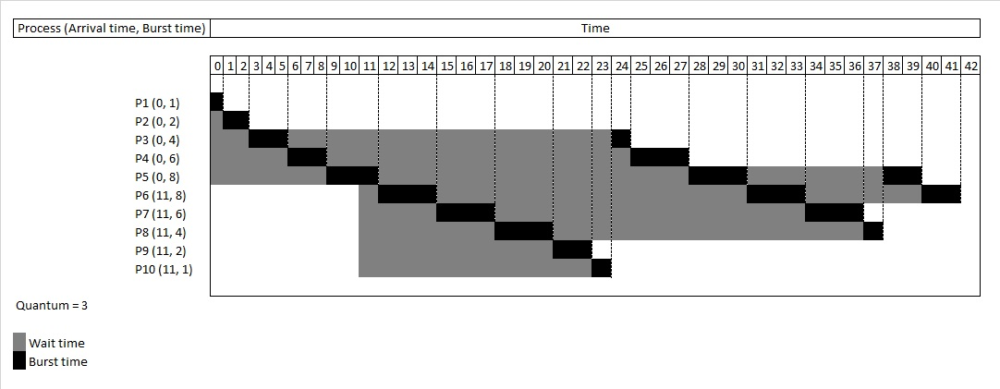
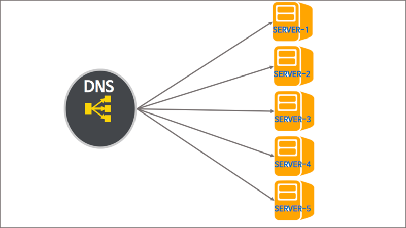

# DNS Round Robin

## :bookmark_tabs: 목차

[:arrow_up: **Network**](../README.md)

1. ### DNS Round Robin
   - [:page_facing_up: DNS Round Robin](#dns-round-robin-2)
   - [:page_facing_up: DNS Round Robin 원리](#dns-round-robin-원리)
   - [:page_facing_up: 단점](#단점)
   - [:page_facing_up: 극복 방법](#극복-방법)
   - [:page_facing_up: 유의할 점](#유의할-점)

## DNS Round Robin

> Round Robin 이란 DNS 서버 구성 방식 중 하나

- **시분할** 시스템을 위해 설계된 선점형 스케줄링의 하나로서, 프로세스들 사이에 우선순위를 두지 않고, 순서대로 시간단위(Time Quantum/Slice)로 CPU를 할당하는 방식의 CPU 스케줄링 알고리즘
- 자바에서 스레드가 운영체제의 스케쥴러에 의하여 컴퓨터 자원을 사용할 수 있는 기회를 할당 받는 것과 같은 맥락
- 각 프로세스에 일정시간을 할당하고, 할당된 시간이 지나면 그 프로세스는 잠시 보류한 뒤 다른 프로세스에게 기회를 주고, 또 그 다음 프로세스에게 하는 식으로, 돌아가며 기회를 부여하는 운영방식
- **별도의 소프트웨어 혹은 하드웨어 로드밸런싱 장비를 사용하지 않고, DNS만을 이용하여 도메인 레코드 정보를 조회하는 시점에서 트래픽을 분산하는 기법**
- DNS 서버에 대한 Round Robin 형식으로 구성할 경우 로드 벨런싱 장비가 필요 없음.
    - 자동으로 시간에 따라 스케줄링이 변환되기 때문에 부하에 대한 걱정을 할 필요가 없음.

 

### DNS Round Robin 원리

웹 서비스를 담당할 여러 대의 웹 서버는 자신의 공인 IP를 각각 가지고 있음.
웹 사이트에 접속을 원하는 사용자가 해당 도메인 주소를 브라우저에 입력하면, DNS는 도메인의 정보를 조회하는 데, 이때 IP 주소를 여러 대의 서버 IP 리스트 중에서 라운드 로빈 형태로 랜덤하게 하나 혹은 여러개를 선택하여 다시 사용자에게 알려줌.

결과적으로 웹 사이트에 접속하는 다수의 사용자는 실제로는 복수의 웹 서버에 나뉘어 접속하게 되면서 자연스럽게 서버의 부하가 분산되는 방식

- 라운드 로빈 DNS는 여러 개의 IP주소를 결과로 돌려줌.

    - 사용자의 OS 애플리케이션에 따라 동작이 다름.
    - 여러 개의 IP 중 제일먼저 조회된 IP를 선택, 무작위로 IP를 선택함.
    - 또는 선택 IP 접속이 안되면 그다음 조회된 IP접속하도록 로직을 추가할 수 있음.

### 단점

- **서버의 수 만큼 공인 IP 주소가 필요**
    - 부하 분산을 위해 서버의 대수를 늘리기 위해서는 그만큼의 공인 IP 가 필요함.

- **균등하게 분산되지 않음.**
    - 모바일 사이트 등에서 문제가 될 수 있는데, 스마트폰의 접속은 캐리어 게이트웨이 라고 하는 프록시 서버를 경유함.
    - 프록시 서버에서는 이름변환 결과가 일정 시간 동안 캐싱되므로 같은 프록시 서버를 경유 하는 접속은 항상 같은 서버로 접속됨.
    - 또한 PC 용 웹 브라우저도 DNS 질의 결과를 캐싱하기 때문에 균등하게 부하분산 되지 않음.
    - DNS 레코드의 TTL 값을 짧게 설정함으로써 어느 정도 해소가 되지만, TTL 에 따라 캐시를 해제하는 것은 아니므로 반드시 주의가 필요함.

- **서버가 다운되도 확인이 불가능**
    - DNS 서버는 웹 서버의 부하나 접속 수 등의 상황에 따라 질의결과를 제어할 수 없음.
    - 웹 서버의 부하가 높아서 응답이 느려지거나 접속수가 꽉 차서 접속을 처리할 수 없는 상황인 지를 전혀 감지할 수가 없기 때문에 어떤 원인으로 다운되더라도 이를 검출하지 못하고 유저들에게 제공됨.
    - 이 때문에 유저들은 간혹 다운된 서버로 연결이 되기도 함.
    - DNS 라운드 로빈은 어디까지나 부하 분산을 위한 방법이지 다중화 방법은 아니므로 다른 S/W 와 조합해서 관리할 필요가 있음.

### 극복 방법

- 다중화 구성 방식 (Synchronous Time-Division Multiplexing)
    - AP 서버에 VIP(Virtual IP)를 부여해서 다중화를 구성
    - 각 AP 서버를 Health Check후 이상이 감지되면 VIP를 정상 AP 서버로 인계하는 방식을 사용
    - 즉 DNS Server Table 에 실시간으로 AP 서버의 상태를 확인할 수 있는 칼럼 및 함수를 추가하여 요청될 경우 서버 상태를 확인하여 우회루트를 제공하거나 에러를 전송하는 방식을 말함.

- 가중치 편성 방식 (Weighted round robin)
    - 각각의 웹 서버에 가중치를 가미해서 분산 비율을 변경
    - 물론 가중치가 큰 서버일수록 빈번하게 선택되므로 처리능력이 높은 서버는 가중치를 높게 설정하는 것이 좋음.

- 로드 밸런서의 도입을 통하여 다음과 같은 구성도 가능

    - 최소 연결 방식 (Least connection)
        - 접속 클라이언트 수가 가장 적은 서버를 선택
        - 로드밸런서에서 실시간으로 connection 수를 관리하거나 각 서버에서 주기적으로 알려주는 것이 필요

### 유의할 점

- DNS Round Robin은 가용성1을 제공하지 않기 때문에, 무중단 서비스가 필요한 시스템에는 어울리지 않으며, 단순히 여러 대의 웹 서버로 트래픽을 부하 분산할 때 가장 편리하게 사용할 수 있는 옵션

1가용성 : 가동률과 비슷한 의미로, 서비스가 다운되지 않고 정상적으로 유지된 시간을 의미

 

---

- 참고

    [[네트워크] DNS round robin의 방식](https://velog.io/@eu_nzi/%EB%84%A4%ED%8A%B8%EC%9B%8C%ED%81%AC-DNS-round-robin%EC%9D%98-%EB%B0%A9%EC%8B%9D)

    [라운드 로빈(Round Robin) DNS를 활용한 로드 밸런싱(Load Balancing)](https://m.blog.naver.com/techtrip/221691155719)

    [[네트워크] DNS round robin 방식](https://yaelimeee.tistory.com/46)
    
    [[Network] DNS 서비스와 동작 원리, DNS 캐싱](https://howudong.tistory.com/363)

    [[Network] DNS란?](https://one10004.tistory.com/120)

    [도메인(Domain)과 네임서버, DNS 정리](https://velog.io/@kkj53051000/%EB%8F%84%EB%A9%94%EC%9D%B8Domain%EA%B3%BC-DNS-%EC%A0%95%EB%A6%AC)