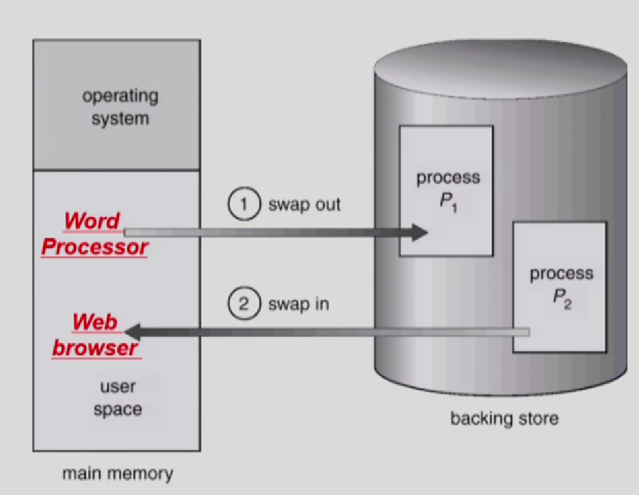
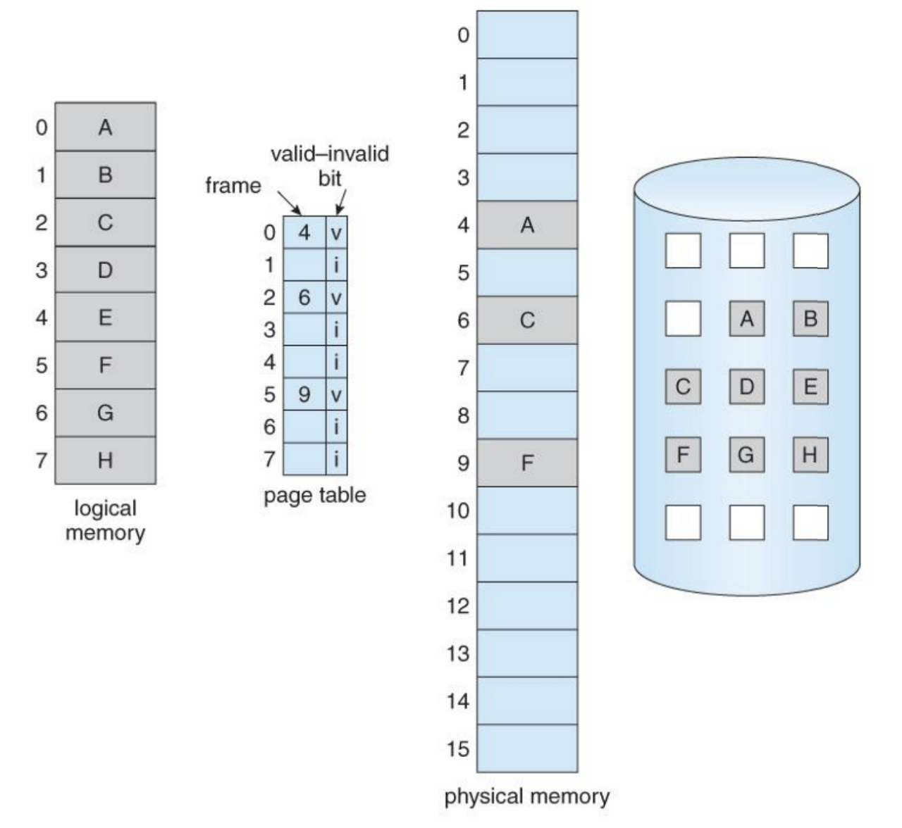
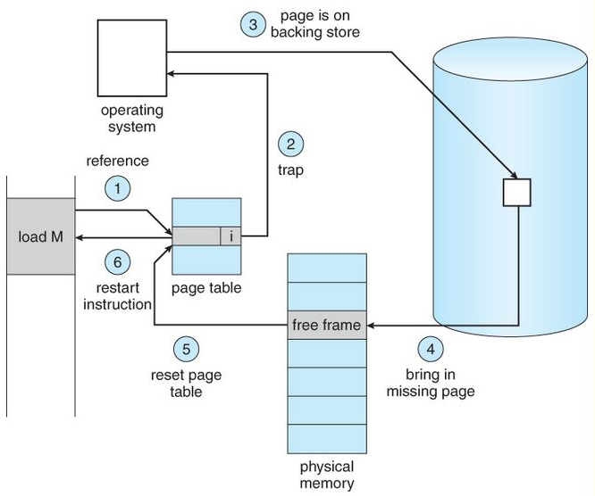

# Memory 메모리

## :bookmark_tabs: 목차

[:arrow_up: **OS**](../README.md)

1. ### Memory
   - [:page_facing_up: Memory](#memory-eba994ebaaa8eba6ac-1)
   - [:page_facing_up: Memory 할당](#pcb-process-control-block-프로세스-제어-블록)
   - [:page_facing_up: Swapping](#swapping-스와핑)
   - [:page_facing_up: 가상 메모리](#multi-process--multi-thread)
   - [:page_facing_up: 메모리 압축](#multi-process--multi-thread)

## Memory 메모리

> 운영체제에서 memory는 메인 메모리, RAMRandom Access Memory을 뜻함.   프로그램 실행 시 필요한 주소, 정보들을 저장하고 가져다 사용할 수 있게 만드는 공간   즉, 작업을 위해 사용되는 공간.

- RAM : 프로세서가 프로그램과 정보를 효과적으로 활용할 때 프로그램과 정보가 보관되는 장소
    - 휘발성
    - 전원 중단이 발생하면 데이터를 잃음.

#### Memory 관리, 왜 필요할까?
- 멀티 프로그래밍 환경에서 한정된 메모리를 효율적으로 사용해야 했고, 운영체제가 이를 어떻게 관리하는지에 대한 관리방법이 중요해짐.

 

## Memory Allocation 메모리 할당

메모리 상에 연속적으로 할당하는 방법과 비연속적으로 할당하는 방법으로 나눌 수 있음.

- 연속 할당 Contiguous Allocation
    - 고정 분할 방식 Fixed partition
    - 가변 분할 방식 Variable partition
- 불연속 할당 Noncontiguous Allocation
    - 페이징 Paging
    - 세그멘테이션 Segmentation

 

## Swapping 스와핑

> 스와핑(Swapping)이란 주기억장치에 적재한 하나의 프로세스를 보조기억장치Backing store1에 잠시 적재했다가 필요할 때 다시 꺼내서 사용하는 메모리를 교체하는 기법

1 Backing store : 디스크(보조기억장치, ex.HDD or SSD), 많은 사용자의 프로세스 이미지를 담을 만큼 충분히 빠르고 큰 저장 공간

- 메모리 크기가 다 찼을 때, 프로세스를 실행시킬 수 있도록 도와주는 방법
- `swap in` : 보조기억장치secondary storage, Backing store에서 메모리로 올리는 작업
- `swap out` : 프로세스를 메모리에서 backing sotre로 빼는 작업
- 일반적으로 중기 스케줄러swapper에 의해 swap out 시킬 프로세스 선정
- priority-based CPU scheduling algorithm
    - priority가 낮은 프로세스를 swapped out 시킴.
    - priority가 높은 프로세스를 메모리에 올려 놓음.
    - 어떤 페이지를 우선적으로 swap out 해야할지 결정하기 위해 페이지 교체 정책, 페이지 교체 알고리즘이 등장
- Compile time 혹은 load time binding 에서는 원래 메모리 위치로 swap in 해야 함.
- Execution time binding에서는 추후 빈 메모리 영역 아무 곳에나 올릴 수 있음.
- swap time은 대부분 transfer time(swap 되는 양에 비례하는 시간)임.
- 프로세스 단위로 스와핑을 하면 외부 단편화와 같은 문제로 비효율적이기 때문에 현재 사용하지 않음.

 

## Virtual Memory 가상 메모리

> 메인 메모리 보다 더 큰 메모리가 필요한 프로세스를 실행할 때 도와주는 역할을 하는 방법

- 메인 메모리의 크기가 한정되어 있으므로 물리적인 메모리 크기보다 큰 프로세스를 실행시키기 위해 나온 방법
- **페이징 단위**로 스와핑을 실행함.
- 프로세스의 모든 코드가 항상 필요한 것은 아니기 때문에 필요한 부분만 메모리에 올려서 실제로 메모리에 올라가는 프로세스의 크기를 최소화 시킴.
- 가상 메모리를 구현하는 방법 : Demand Paging 디멘드 페이징

### Demand Paging 디멘드 페이징

> 필요한 부분의 페이지 영역만 물리적 메모리에 할당하는 방법

- 여기서 스와핑의 개념은 프로세스 단위가 아니라 **페이지 단위**로 이루어짐.
- 자주 사용하는 페이지만 물리적 메모리에 적재하여 사용
- 과정
    - 프로세스가 실행되면 MMUMemory Management Unit가 실시간으로 페이지 테이블 확인
    - 필요한 메모리가 물리적 메모리에 적재되어 있는지 확인 
        - valid-invalid bit로 확인
- Page fault 페이지 부재 : 지금 사용하려는 페이지가 메모리에 적재되어 있지 않다는 의미

### Page fault handling

 ❓발생 이유

 모든 페이지가 RAM에 존재하는 게 아니기 때문.

#### 페이지 부재 발생 시

1. 먼저 물리 메모리에 있는 실행될 프로세스는 자신이 사용하고자 하는 페이지가 페이지 테이블에 있는지 확인

2. 만약 물리 메모리에서 사용하려는 페이지가 없으면 Page fault exception을 발생시키고 커널 모드로 진입

3. OS는 페이지 테이블 엔트리 정보 속에서 Backing store 어느 위치에 페이지가 있는지 확인

4. 확인한 없었던 페이지를 물리 메모리에 로드

5. 페이지 테이블을 업데이트

6. 원래 실행하려고 했던 작업을 실행

- 이때, 3번 과정에서부터 페이지를 찾아서 가져오는 과정은 시간이 꽤 걸려 결과적으로 CPU의 효율성을 낮추게 됨.
- 그러나 Locality 1 지역성 덕분에 page fault는 예상보다 많이 일어나지 않음.
    - 지역성 덕분에 한 번 사용하려는 페이지를 페이지 테이블에 넣어놓으면 계속 사용하다가 해당 코드 구역을 넘어가면 swap out 함.

1 Locality 지역성 : 사용하는 코드만 재사용해서 실행한다는 개념.

 

---

- 참고

    운영체제 - 이화여자대학교, 반효경 교수님 강의

    [[운영체제 OS] 메모리 관리란? - 이유, 방법](https://technote-mezza.tistory.com/92)

    [메모리와, 연속 메모리 할당(contiguous memory allocation)](https://matdongsane.tistory.com/29)

    [[운영체제(OS)] 스와핑(swapping), 가상메모리(virtual memory) 란?](https://resilient-923.tistory.com/397)
    
    