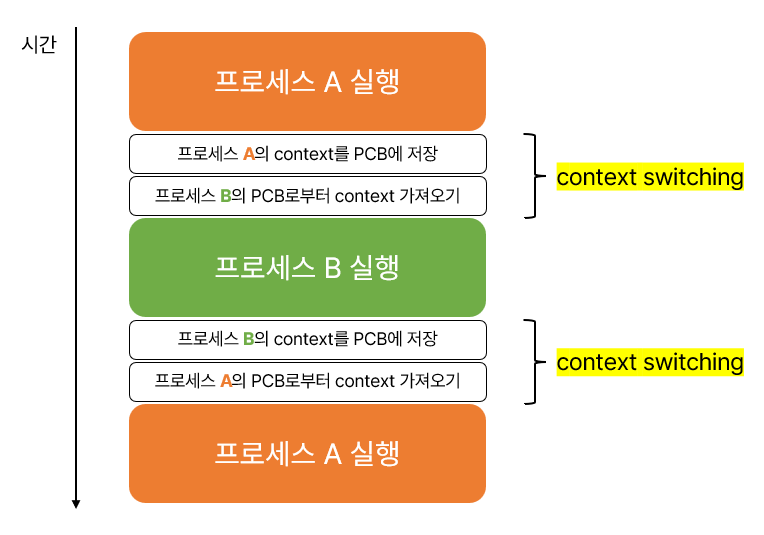
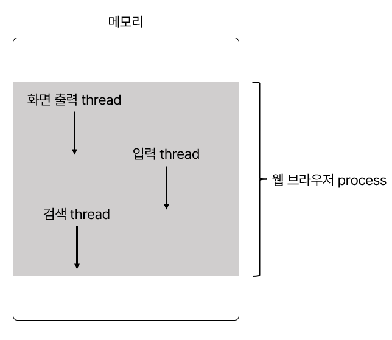
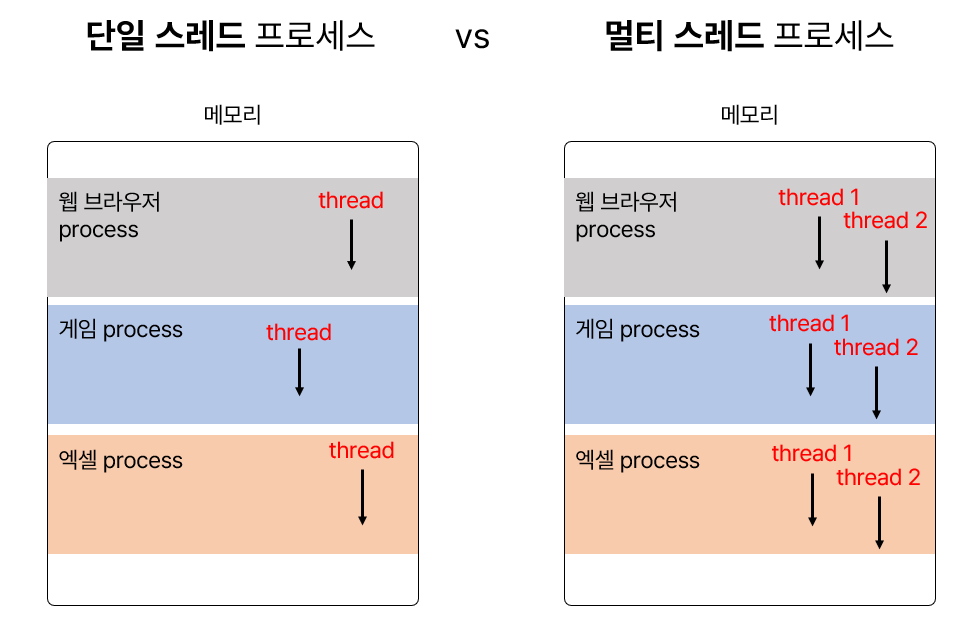
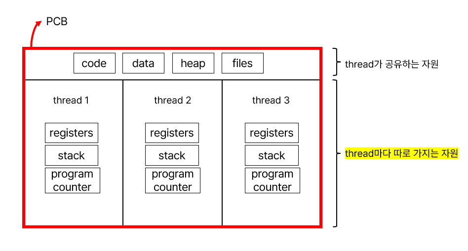
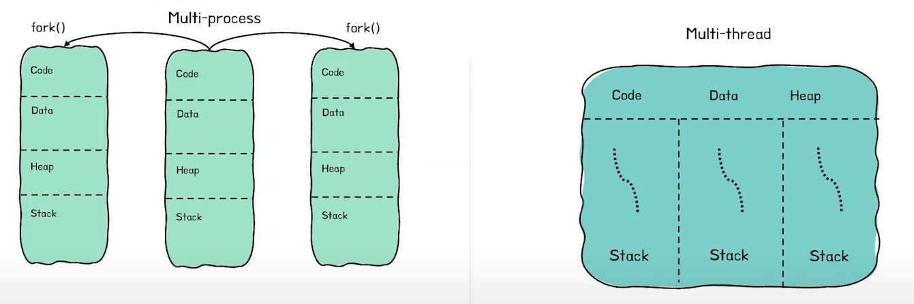

# Process & Thread 프로세스 & 스레드

## :bookmark_tabs: 목차

[:arrow_up: **OS**](../README.md)

1. ### Process & Thread
   - [:page_facing_up: Process](#cors-cross-origin-resource-sharing-1)
   - [:page_facing_up: PCB](#pcb-process-control-block-프로세스-제어-블록)
   - [:page_facing_up: context switching](#context-switching-문맥-교환)
   - [:page_facing_up: Thread](#thread-스레드)
   - [:page_facing_up: Multi-process & Multi-thread](#multi-process--multi-thread)
   - [:page_facing_up: 다중 코어 프로그래밍](#multi-process--multi-thread)

## Process 프로세스

> 실행 중인 프로그램을 말함.

- 프로세스 내부에는 최소 하나의 스레드 thread를 가지고 있음.
- 스레드 : 프로세스 내의 실행 흐름 단위
- 프로세스끼리는 기본적으로 자원공유하지 않음.
- 프로세스 내 스레드끼리는 같은 프로세스 내의 자원을 공유함.

### 프로그램이 프로세스가 되면?

1. 먼저 프로세스가 필요로 하는 재료(코드)들이 메모리에 올라가야 함.
    
    - 메모리는 위 그림과 같이 4가지 영역으로 구분되어 있음.

2. 해당 프로세스에 대한 정보를 담고 있는 PCB 블럭이 프로세스 생성 시 함께 만들어짐.

## PCB Process Control Block, 프로세스 제어 블록

- 프로세스에 대한 정보를 저장하는 자료 구조
- <u>커널 영역</u>에 생성됨.
- **PCB 생성** : 프로세스 생성 시
    - '새로운 프로세스가 생성되었다.' == '운영체제가 PCB를 생성했다.'
- **PCB 폐기** : 프로세스 실행 종료 시
    - '프로스세가 종료되었다.' == '운영체제가 해당 PCB를 폐기했다.'
- PCB에 담기는 정보
    - 아래 정보들을 [문맥](#context-switching-문맥-교환)이라고 할 수 있음.
    - `PID` Process ID, 프로세스 ID
        - 특정 프로세스를 식별하기 위해 부여하는 고유 번호
    - `레지스터 값`
        - 레지스터: CPU 내부의 작은 임시 저장 장치로 프로그램을 실행하는 데 필요한 program counter와 같은 값들을 임시로 저장함.
        - 프로세스는 자신의 차례가 돌아오면 이전에 실행하며 사용했던 레지스터의 중간값들을 모두 복원함.
        - program counter : 다음 명령어를 가리킴.
    - `process state` 프로세스 상태
        - 현재 프로세스가 어떤 상태인지 기록해야 함.(입출력 장치 사용을 기다리고 있는지, CPU를 사용하기 위해 기다리고 있는지, CPU를 이용하고 있는 상태인지 등)
    - `CPU 스케줄링 정보`
        - 프로세스가 언제, 어떤 순서로 CPU를 할당받을지에 대한 정보도 PCB에 기록함.
    - `메모리 관리 정보`
        - 프로세스가 어느 주소에 저장되어 있는지, 페이지 테이블 정보가 담겨 있음. 
        - 왜냐하면 프로세스마다 메모리에 저장된 위치가 다르기 때문에 주소를 저장해야 함.
    - `사용한 파일과 입출력장치 목록`
        - 어떤 입출력장치가 이 프로세스에 할당되었는지, 어떤 파일들을 열었는지에 대한 정보들이 기록됨.

 

## context switching 문맥 교환

> 프로세스 간에 실행을 전환하는 것

- context 문맥
    - 하나의 프로세스 수행을 재개하기 위해 기억해야 할 정보
    - 하나의 프로세스 문맥은 해당 프로세스의 PCB에 표현되어 있음.

 

- 두 프로세스의 context switching이 아니라 수많은 프로세스의 context switching이 일어난다고 생각하면 큰 일임.
    - 캐시 메모리 초기화 등 무거운 작업이 진행되고 시간이 소모되는 등 오버헤드가 발생하기 때문
- 그래서 프로세스 내부에서 자원을 공유하는 thread가 생김.

## Thread 스레드

> 프로세스 내의 실행 흐름 단위

 

- 각 스레드는 각기 다른 스레드 ID, 프로그램 카운터를 포함한 레지스터 값, 스택을 각자 가지고 나머지 프로세스의 자원을 공유함.
    - 프로세스 내부의 코드, 데이터, 힙 영역과 열린 파일과 같은 자원을 공유함.
    - 공유되는 자원이 있기 때문에 효율적이고, context switching이 일어날 때 캐싱 적중률이 올라감. (즉, 모조리 다 빼고 다시 넣을 필요가 없음.)

#### process 자원 공유로 인해 발생할 수 있는 문제점

- 하나의 스레드에 문제가 생기면 프로세스 전체에 문제가 생길 수도 있음.
- 왜냐하면 모든 스레드는 프로세스의 자원을 공유하기 때문
- scale out보다 scale up이 시스템 전면 장애의 가능성이 큰 것과 비슷한 느낌

 

✔️ Internet Explorer VS Chrome

| Internet Explorer | Chrome|
| --- | --- |
| multi-thread | multi-process |
| 프로세스의 자원을 공유하기 때문에 많은 탭을 생성하여 작업을 하게 되면 아래와 같은 문제가 생기는 경우가 많음. | multi-process 이기 때문에 multi-thread 보다는 조금 무거울 수 있으나 많은 탭을 생성해도 Internet Explorer처럼 아예 브라우저가 종료가 되는 것 같은 전면적인 문제가 생길 확률이 적음 |

 

 

## Multi-process & Multi-thread

### Multi-process

> 여러 프로세스를 동시에 실행하는 것

- 예를 들어 로그인을 한다고 가정해보자.
    - 한 프로세스는 매번 하나의 로그인만 처리할 수 있음.
    - 여러 사용자의 로그인을 처리해야 하면 부모 프로세스를 fork()하여 자식 프로세스를 생성 후 일을 처리하도록 함.

- 장점
    - 각 프로세스는 독립적인 메모리 공간을 가지고 있음.
        - 따라서 안정성이 높음.
        - 한 프로세스에 문제가 생겨도 다른 프로세스에 영향을 주지 않음.
- 단점
    - 독립된 메모리 영역이기 때문에 작업량이 많을수록( Context Switching이 자주 일어나서 주소 공간의 공유가 잦을 경우) 오버헤드가 발생하여 성능저하가 발생 할 수 있음.
    - context switching 과정에서 캐시 메모리 초기화 등 무거운 작업이 진행되고 시간이 소모되는 등 오버헤드가 발생

#### 프로세스 간 통신, IPC Inter-Process Communication 

> IPC : 프로세스 간의 자원을 공유하고 데이터를 주고받는 것

- 프로세스끼리는 기본적으로 자원을 공유하지 않지만 프로세스 간의 자원을 공유하고 데이터를 주고받는 경우가 생김.
- 여러 프로세스가 동일한 데이터를 사용하는 경우 공유 메모리에 두고 공유하면 비용적으로 저렴함.
- **공유 메모리** : 프로세스들이 공유할 수 있는 메모리 영역

 

### Multi-thread

> 여러 스레드로 프로세스를 실행하는 것

- 장점
    - 시스템 자원의 효율성 증대
        - 프로세스 생성하여 자원을 할당하는 시스템 콜이 줄어 자원을 효율적으로 관리할 수 있음.
    - 시스템 처리율 향상
        - 스레드 사이 작업량이 적기 때문에 context switching이 빠름.(캐시 메모리를 비울 필요가 없음.)
- 단점
    - 자원을 공유하기 때문에 동기화 문제가 발생할 수 있음.
    - 하나의 스레드에 문제가 생기면 전체 프로세스가 영향을 받음.

 

## 다중 코어 프로그래밍

> 다중 코어 : 단일 컴퓨팅 칩에 여러 컴퓨팅 코어를 배치하는 것

- 각 코어는 OS에 별도의 CPU를 가지고 있음.

 

---

- 참고

    혼자 공부하는 컴퓨터 구조 + 운영체제

    [[운영체제] 프로세스란? (스케줄링, 메모리구조, 상태변화)](https://blockdmask.tistory.com/22)

    [[10분 테코톡] 🌷 코다의 Process vs Thread](https://www.youtube.com/watch?v=1grtWKqTn50)

    [[OS] 스레드(Thread)의 기본 개념과 다중 코어 프로그래밍](https://howudong.tistory.com/262)
    
    