# 계수 정렬<sub> Counting Sort</sub>


### ❓정의
- 이름 그대로 배열 내에 특정한 값이 몇 번 등장했는지에 따라 정렬을 수행

### 특징
- 비교 연산이 사용되지 않음.
- 안정 정렬

### 장점
- 알고리즘에서 데이터 간 비교를 수행하지 않기 때문에 O(N)의 시간 복잡도의 성능을 보여줌.
    - 기존에 우수한 정렬 알고리즘으로 평가받는 퀵 정렬, 병합 정렬 O(NlogN) 보다 더 빠름.
- 데이터가 정수 표현이 가능하고, 데이터 간 차이가 크지 않을 때 유리


### 단점
- 최댓값(k)에 영향을 받는 알고리즘
    - k가 작은 수면 $O(N)$ 이겠지만,
    - k가 무한으로 커지면 $O(무한)$이 될 수 있음.
    - 우리가 입력받은 배열의 값들이 (1, 100000) 이라고 한다면, 이 배열은 두 개의 값만을 가지고 있음에도 불구하고 카운팅 배열의 크기는 100000으로 설정되어야 함.


### 동작 원리
1. A, B, C 배열을 준비함.
    - A : 입력 받은 배열
    - B : 배열 A의 각 원소 값이 등장하는 횟수를 저장할 배열 
        - B의 길이 : `k (배열 A의 원소 값 중 최댓값) + 1`
    - C : 정렬된 값을 담을 배열
1. A의 각 원소 값을 B의 인덱스로 사용해서 해당 위치의 값을 하나 증가 시킴 `B[A[i]]++`
1. A의 모든 원소 값의 등장 횟수를 B에 반영했으면 B의 각 요소들을 누적합으로 갱신 `B[i] = B[i] + B[i-1]`
1. A의 가장 뒤에 있는 값부터 아래 과정을 시작
    ```
    for(int i=A.length; i>=0; i--)
        - A[i]의 값을 B의 인덱스로 활용하여 값을 가져옴.
        - B에서 가져온 값을 C의 인덱스로 활용하고 C의 인덱스 그 위치에 A[i] 값을 넣어줌.
        - 사용된 B의 값을 하나 감소시킴

    ```


<details>
<summary><b>동작 과정 이미지</b></summary>
<div markdown="1">
<p align="center">  
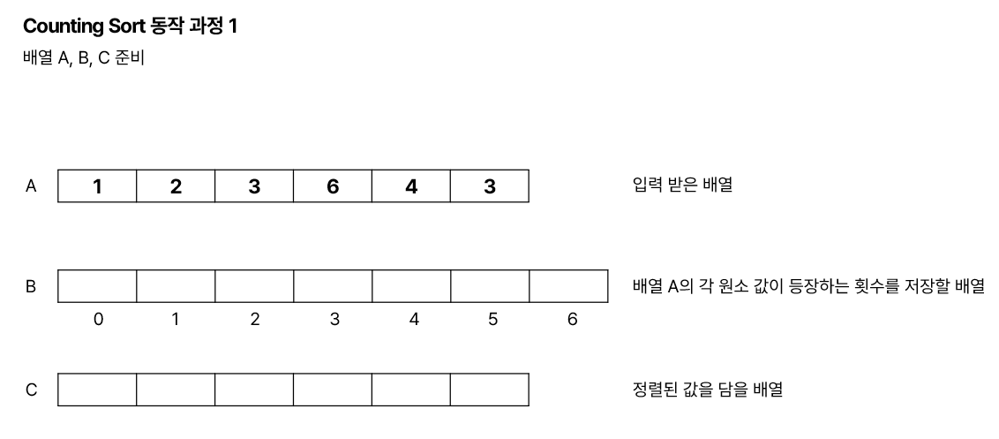  

</p>

-------


<p align="center">  
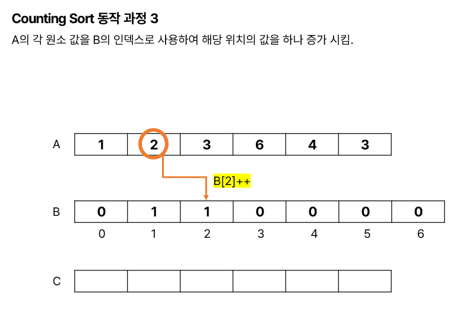  

</p>

-------


<p align="center">  
  

</p>

-------


<p align="center">  
  

</p>

-------


<p align="center">  
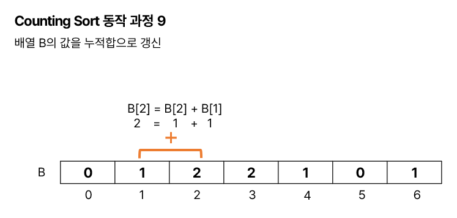  
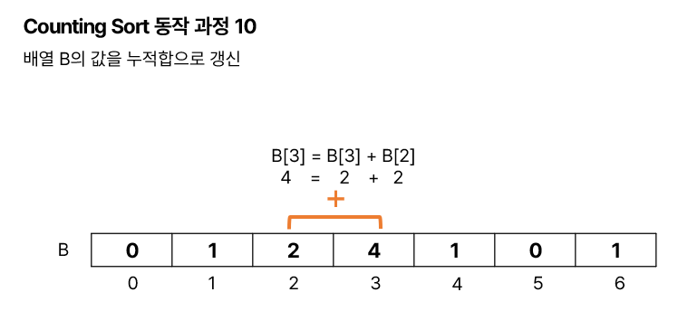
</p>

-------


<p align="center">  
  
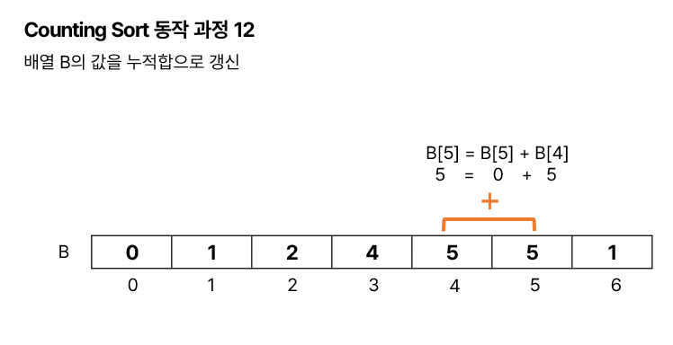
</p>

-------


<p align="center">  
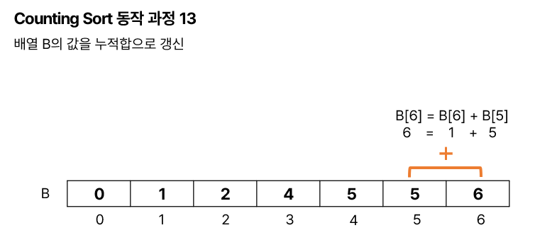  
</p>

-------


<p align="center">  
  
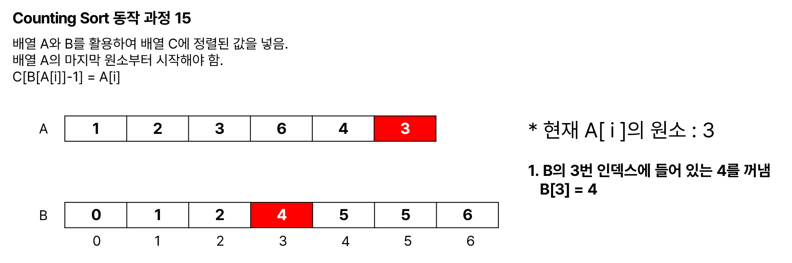
</p>

-------

<p align="center">  
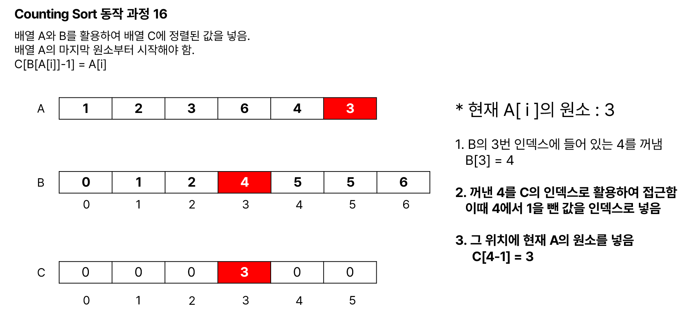  
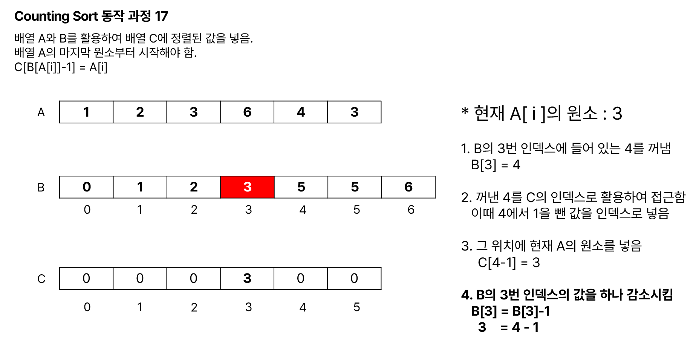
</p>

-------


<p align="center">  
  

</p>

-------

<p align="center">  
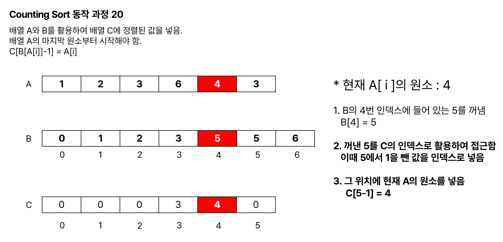  
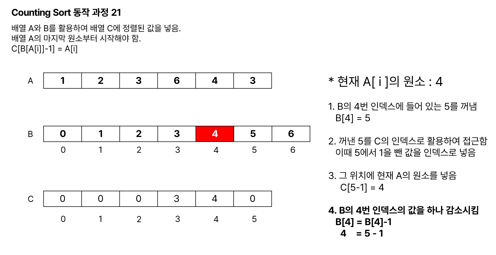
</p>

-------

<p align="center">  
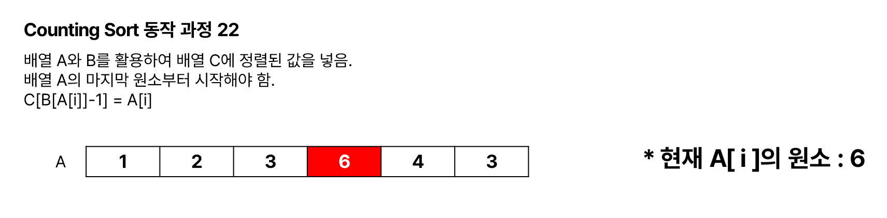  
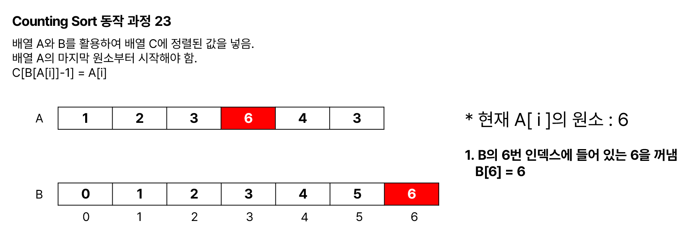
</p>

-------

<p align="center">  
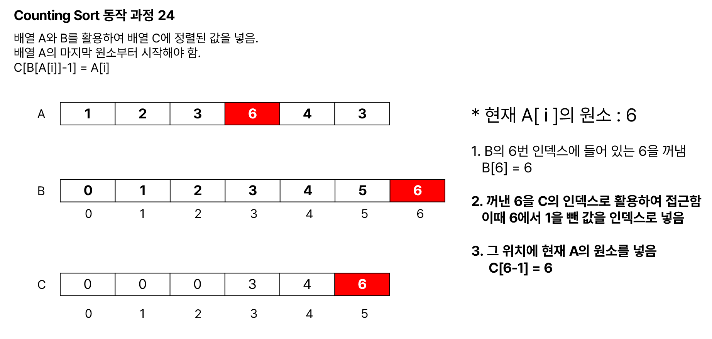  
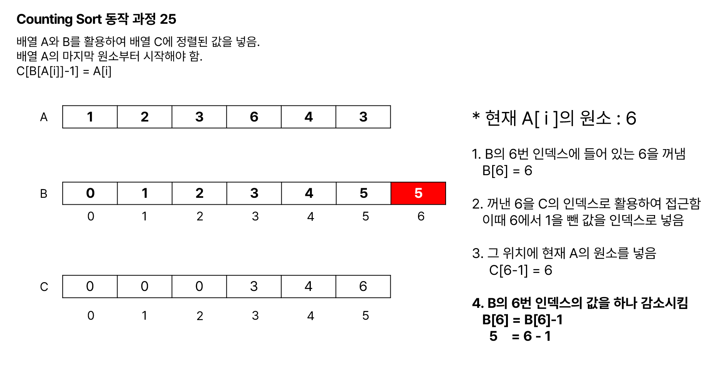
</p>

-------

<p align="center">  
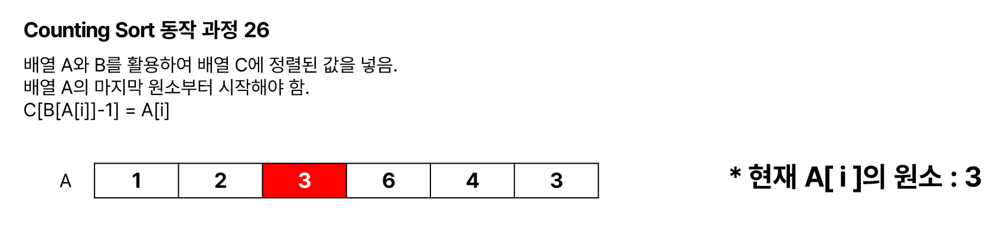  
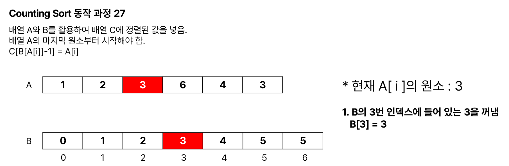
</p>

-------

<p align="center">  
  
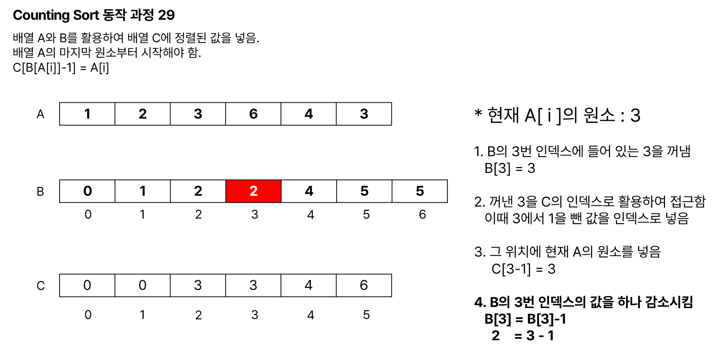
</p>

-------

<p align="center">  
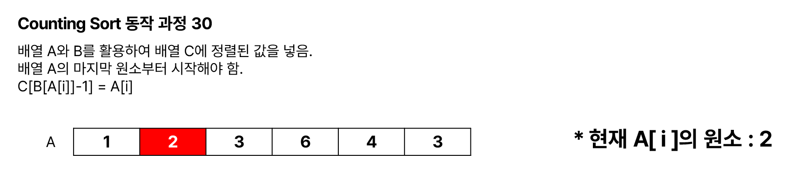  

</p>

-------

<p align="center">  
  

</p>

-------

<p align="center">  
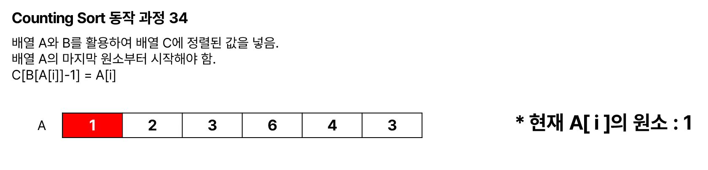  

</p>

-------

<p align="center">  
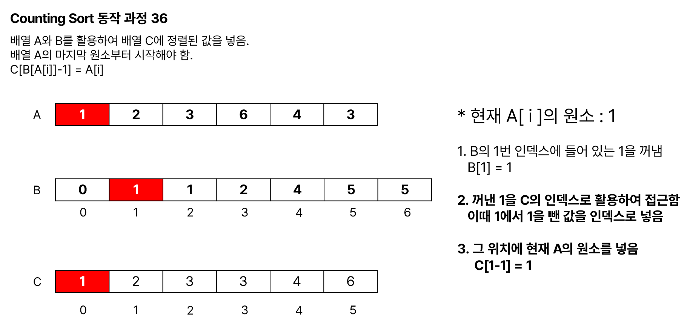

</p>

-------


<p align="center"> 

</p>

</div>
</details>

</br>

### Counting Sort 구현
<details>
<summary>java 코드</summary>
<div markdown="1">

```java
import java.util.Arrays;

public class CountingSort {

	public static void main(String[] args) {

		int[] A = { 1, 2, 3, 6, 4, 3 }; // 입력 받은 배열

		int n = A.length; // 배열 A의 길이
		int k = 0; // 배열 A의 원소 중 최댓값

		for (int i = 0; i < n; i++) {
			if (k < A[i])
				k = A[i];
		}

		int[] B = new int[k + 1]; // 배열 A의 각 원소 값이 등장하는 횟수를 저장할 배열

		int[] C = new int[n]; // 정렬된 값을 담을 배열
		
		System.out.println("Before Counting Sort");
		System.out.println(Arrays.toString(A));
		
		countingSort(A, B, C, n, k);
		
		System.out.println("After Counting Sort");
		System.out.println(Arrays.toString(C));
	}

	private static void countingSort(int[] A, int[] B, int[] C, int n, int k) {

		// 배열 A의 각 원소들이 등장하는 횟수 카운팅
		for (int i = 0; i < n; i++) {
			B[A[i]]++;
		}

		// 배열 B 누적합 계산
		for (int i = 1; i <= k; i++) {
			B[i] = B[i] + B[i - 1];
		}

		// C에 정렬된 결과 넣기
		for (int i = n - 1; i >= 0; i--) {
			// 현재 선택된 A의 원소
			int a = A[i];

			// B에서 뽑은 수
			int b = B[a];

			// C에 입력
			C[b - 1] = a;

			// B에서 뽑았으니 하나 감소시킴
			B[a]--;

		}

	}

}
```

</div>
</details>

</br>

### 복잡도<sub>Complexity</sub>

* k : 최댓값

<table style="text-align:center">
  <tr>
    <td ></td>
    <td colspan="3">시간 복잡도</td>
    <td rowspan="2">공간 복잡도</td>
  </tr>
  <tr>
    <td></td>
    <td >최선</td>
    <td>평균</td>
    <td>최악</td>
  </tr>
  <tr>
    <td><b>Counting Sort</b></td>
    <td>O(N+k)</td>
    <td>O(N+k)</td>
    <td>O(N+k)</td>
    <td>O(N+k)</td>
  </tr>
</table>


</br>
</br>

- 참고


[정렬의 뜻, 정렬 알고리즘 분류 방법](https://hellowoori.tistory.com/48)

[[Algorithm] 정렬 : Counting sort(계수 정렬), Radix sort(기수 정렬)](https://velog.io/@wjdqls9362/Algorithm-%EC%A0%95%EB%A0%AC-Radix-sort-Counting-sort)

[[정렬 알고리즘] 05 계수 및 기수 정렬(Counting Sort / Radix Sort) 이론 및 구현](https://rninche01.tistory.com/entry/%EC%A0%95%EB%A0%AC-%EC%95%8C%EA%B3%A0%EB%A6%AC%EC%A6%98-05-%EA%B3%84%EC%88%98-%EB%B0%8F-%EA%B8%B0%EC%88%98-%EC%A0%95%EB%A0%ACCounting-Sort-Radix-Sort)

[[알고리즘 정리] 계수정렬(Counting Sort)](https://jeonyeohun.tistory.com/103)