# :books: 정렬 <sub>Sorting</sub>

## :bookmark_tabs: 목차

[:arrow_up: **Algorithm**](./README.md)

1. ### 정렬 <sub>Sorting</sub>

   - [정의](#❓정의)
   - [거품 정렬](#거품-정렬-bubble-sort)
   - [선택 정렬](#선택-정렬-selection-sort)
   - [삽입 정렬](#삽입-정렬-insertion-sort)
   - [퀵 정렬](#퀵-정렬-quick-sort)
   - [병합 정렬](#병합-정렬-merge-sort)
   - [힙 정렬](#힙-정렬-heap-sort)
   - [기수 정렬](#기수-정렬-radix-sort)
   - [계수 정렬](#계수-정렬-counting-sort)

# ❓정의
> 데이터의 집합을 특정한 기준에 따라 순서대로 나열하는 것.

```
> 내부 정렬(Internal sort)
 - 정렬하고자 하는 모든 데이터가 메모리에 올라와 정렬이 수행되는 방식
 - 데이터 양이 적을 때 메인 메모리 내에서 정렬하는 방법
 - 속도는 빠르나 정렬할 자료의 양이 많을 경우 부적합

> 외부 정렬(External sort) : 정렬하고자 하는 데이터가 너무 크기 때문에 일부만 올려놓은 상태에서 정렬한 것을 다시 합하는 방식

> 제자리 정렬(In-place sort) : 주어진 공간 외에 추가적인 공간을 사용하지 않는 정렬

> 안정 정렬(Stable sort) : 동일한 값에 대해 기존의 순서가 유지되는 정렬 방식

> 불안정 정렬(Not stable sort) : 동일한 값에 대해 기존의 순서가 뒤바뀔 수 있는 정렬 방식
```


# 거품 정렬<sub> Bubble Sort</sub>


- **서로 인접한 두 원소**를 검사하여 정렬하는 알고리즘   
- 내부 정렬 알고리즘
- 선택 정렬과 유사함.

### 동작 원리

1. 가장 왼쪽 원소부터 인접한 원소와 비교 시작
1. 오른쪽 원소가 왼쪽 원소보다 작은 경우 두 원소를 교환
    
    2-1. (마지막-1)번째와 마지막 원소까지 비교
1. 1번~2번 과정을 모든 원소가 정렬될 때까지 반복
- 정렬을 1회전 수행할 때마다 정렬에서 제외되는 데이터가 하나씩 늘어남.
     - 1회전을 수행하고 나면 가장 큰 원소가 가장 오른쪽으로 이동하기 때문에 2회전에서 맨 뒤(오른쪽)에 있는 원소는 정렬에서 제외
- 시간 복잡도
    - 아마도 평균, 최악의 경우 O(N<sup>2</sup>)
    - 최선의 경우 O(N)
- 공간 복잡도
    - 제자리 정렬(sorted in place)로 추가 공간을 사용하지 않음

### Bubble Sort 구현

<details>
<summary>java 코드</summary>
<div markdown="1">

```java
class sorting {
    
    public static void bubbleSort(int [] sort_arr, int len){
        
        for (int i=0;i<len-1;++i){

            for(int j=0;j<len-i-1; ++j){

                if(sort_arr[j+1]<sort_arr[j]){

                    int swap = sort_arr[j];
                    sort_arr[j] = sort_arr[j+1];
                    sort_arr[j+1] = swap;

                }
            }
        }
    }
    
    public static void main( String args[] ) {
        int [] array = {10,5,3,1,24,12};
        int len = array.length;
        bubbleSort(array,len);

        for(int i = 0; i<len; ++i){
            System.out.print(array[i] + " ");
        }
    }
}
```

</div>
</details>

</br>
</br>

# 선택 정렬<sub> Selection Sort</sub>
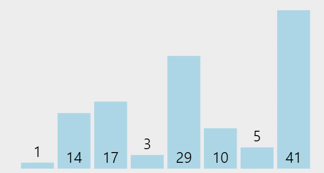

- 해당 순서에 원소를 넣을 위치는 이미 정해져 있고, 어떤 원소를 넣을지 선택하는 알고리즘
- 내부 정렬 알고리즘
- 전체 모든 원소를 스캔하기 때문에 삽입 정렬<sub>Insertion Sort</sub>보다 느림
- 시간 복잡도
    - 평균, 최선, 최악의 경우 모두 O(N<sup>2</sup>)
- 공간 복잡도
    - 제자리 정렬(sorted in place)로 추가 공간을 사용하지 않음

### 동작 원리
1. 가장 왼쪽에 있는 원소부터 기준 원소가 됨.
1. 기준 원소보다 오른쪽에 있는 원소 중 가장 작은 값을 찾음.
1. 가장 작은 원소와 기준 원소를 교환.
1. 기준 원소를 인접한 오른쪽 원소로 변경하고 위 과정을 기준 원소가 마지막 원소가 될 때까지 반복

### Selection Sort 구현

<details>
<summary>java 코드</summary>
<div markdown="1">

```java
class SelectionSort{
 
  static void Selection_Sort(int arr[], int n)  
  {
    for(int i = 0; i < n - 1; ++i)  
    {
      int min_index = i;  
      for(int j = i + 1; j < n; ++j)  
      {
        if(arr[j] < arr[min_index])  
          min_index = j;
      }
      int temp = arr[i];
      arr[i] = arr[min_index];
      arr[min_index] = temp;
    }
  }
 
  // Driver code
  public static void main(String[] args)
  {
    int n = 5;
    int arr[] = {2, 0, 1, 4, 3};
    Selection_Sort(arr, n);
    System.out.print("The Sorted Array by using Selection Sort is : ");
    for(int i = 0; i < n; ++i)
      System.out.print(arr[i] + " ");
  }
}
```

</div>
</details>

</br>
</br>

# 삽입 정렬<sub> Insertion Sort</sub>
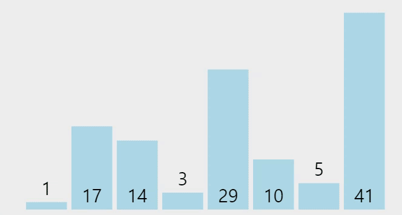

- 새로운 원소를 이전까지 정렬된 원소 사이에 올바르게 삽입시키는 알고리즘
- 내부 정렬 알고리즘
    - 정렬 시 추가 공간이 필요하지 않으며 배열 자체가 수정됨.
- 선택 정렬<sub>Selection Sort</sub>보다 빠름
    - 필요한 데이터만 스캔하기 때문
- 시간 복잡도
    - 평균, 최악의 경우 O(N<sup>2</sup>)
    - 최선의 경우 O(N)
- 공간 복잡도
    - 제자리 정렬(sorted in place)로 추가 공간을 사용하지 않음

### 동작원리
1. 2번째 원소부터 시작
1. 이전까지 정렬된 원소들(왼쪽에 있는 원소들)과 비교하여 삽입할 위치를 찾음.
1. 해당 위치로 옮기고 그 다음 원소도 2번 과정을 통해 위치를 찾아서 옮겨줌.

### Insertion Sort 구현

<details>
<summary>java 코드</summary>
<div markdown="1">

```java
class InsertionSort {

    public static void sortInsertion(int [] sort_arr){

      for(int i=0;i<sort_arr.length;++i){

        int j = i;
        
        while(j > 0 && sort_arr[j-1]>sort_arr[j]){

          int key = sort_arr[j];
          sort_arr[j] = sort_arr[j-1];
          sort_arr[j-1] = key;
          j = j-1; 

        }
      }
    }

    public static void main( String args[] ) {
        int [] arr = {5,2,12,12,1};
        sortInsertion(arr);

        for(int i=0;i<arr.length;++i){
          System.out.print(arr[i] + " ");
        }
    }
}
```

</div>
</details>

</br>
</br>

# 퀵 정렬<sub> Quick Sort</sub>
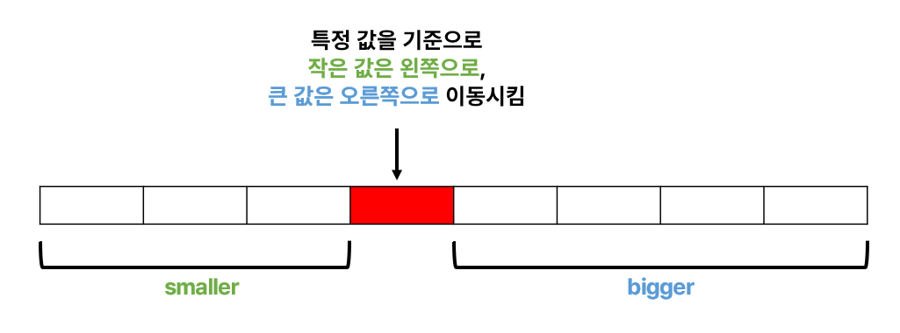

- 기준 값(피벗)을 기준으로 작은 값을 갖는 데이터와 큰 값을 갖는 데이터로 분리해가며 정렬하는 방법
- 대표적인 **분할 정복** 알고리즘
    - 하나의 큰 문제를 두 개의 작은 문제로 분할하는 식으로 빠르게 정렬
    - 즉, 특정한 값을 기준으로 큰 숫자와 작은 숫자를 서로 교환한 뒤에 배열을 반으로 나눔.
- 선택, 버블, 삽입 정렬보다 빠른 정렬 알고리즘을 필요로 할 때 주로 사용하는 알고리즘.
- 분할 정복 방식을 사용한다는 점에서 merge sort와 개념적으로 유사
- 차이점은 파티셔닝이 수행되는 방식과 하위 리스트가 적절한 상대적 순서로 유지되므로 병합이 필요하지 않다는 것
- 내부 정렬, 제자리 정렬 알고리즘
- 시간 복잡도 
    - 평균 시간 복잡도 : O(NlogN)
    - 최악의 경우 : O(N<sup>2</sup>) -> 피벗 값에 따라 편향되게 분할하는 경우
- 공간 복잡도
    - 평균 : O(log N)
    - 최악 : O(N)

### 동작원리
1. 기준 값(피벗)을 기준으로 작거나 같은 값을 지닌 데이터는 앞으로, 큰 값을 지닌 데이터는 뒤로 가도록 함.
1. 이렇게 나눠진 데이터들을 또 피벗을 정하여 작은값, 큰값을 이동시킴.
1. 모두 정렬될 때까지 1, 2번을 반복

#### 피벗<sub>pivot</sub>을 기준으로 데이터 이동시키는 과정
```
* 기본 규칙
 start는 항상 end보다 왼쪽에 있어야 함.
 start가 가리키는 값이 pivot보다 작은 경우 그냥 다음으로 넘어 감.
 end가 가리키는 값이 pivot보다 큰 경우 그냥 다음으로 넘어 감.
```
<details>
<summary><b>동작 과정 이미지</b></summary>
<div markdown="1">
<p align="center">  
  
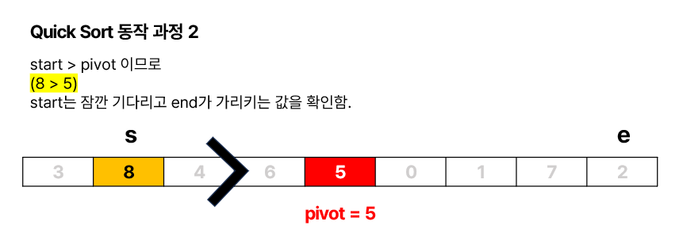
</p>

-------


<p align="center">  
  

</p>

-------


<p align="center">  
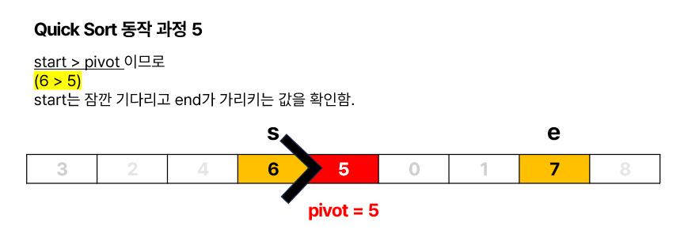  
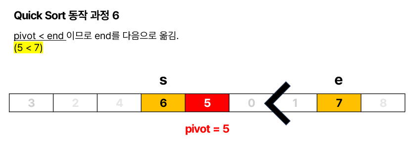
</p>

-------


<p align="center">  
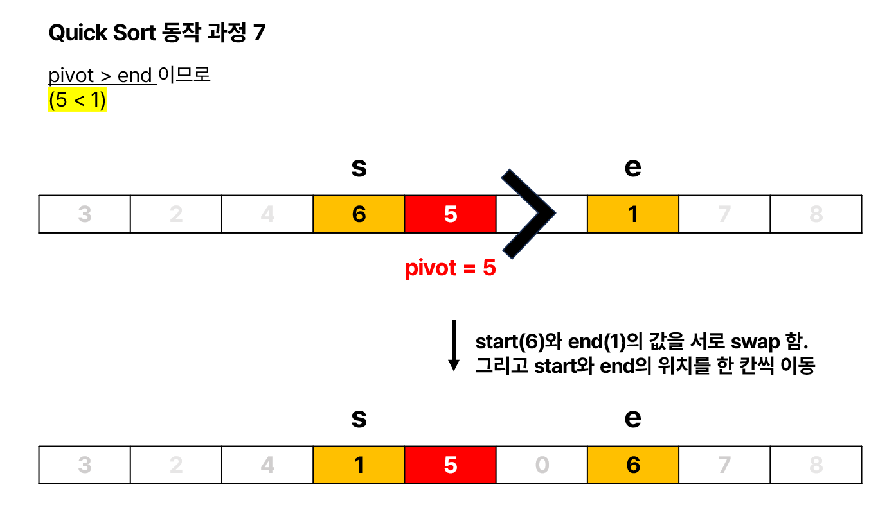  

</p>

-------


<p align="center">  
  
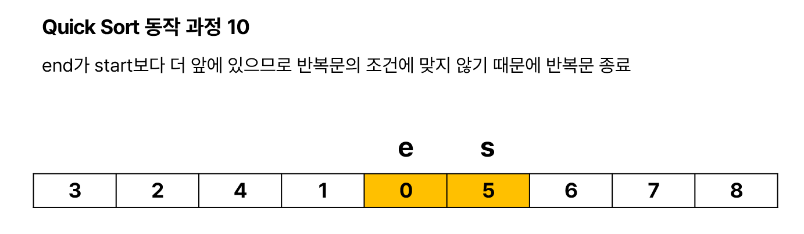
</p>

-------


<p align="center"> 

</p>

</div>
</details>

</br>

### Quick Sort 구현

<details>
<summary>java 코드</summary>
<div markdown="1">

```java
import java.util.Arrays;

public class QuickSort {

	public static void main(String[] args) {

		int[] arr = { 3, 8, 4, 6, 5, 0, 1, 7, 2 };
		printArray(arr);
		quickSort(arr);
		printArray(arr);

	}

	private static void quickSort(int[] arr) {
		quickSort(arr, 0, arr.length - 1);
	}

	private static void quickSort(int[] arr, int start, int end) {
		
		// pivot을 기준으로 데이터를 이동시켜줌.
		int part2 = partition(arr, start, end);

		// 왼쪽에 정렬할 게 남으면 분할해서 정렬
		if (start < part2 - 1) {
			quickSort(arr, start, part2 - 1);
		}
		// 오른쪽에 정렬할 게 남으면 분할해서 정렬
		if (part2 < end) {
			quickSort(arr, part2, end);
		}
	}

	private static int partition(int[] arr, int start, int end) {
		int pivot = arr[(start + end) / 2];

		while (start <= end) {
			while (arr[start] < pivot)
				start++;
			while (arr[end] > pivot)
				end--;
			if (start <= end) {
				swap(arr, start, end);
				start++;
				end--;
			}
		}

		return start;
	}

	private static void swap(int[] arr, int start, int end) {

		int tmp = arr[start];
		arr[start] = arr[end];
		arr[end] = tmp;

	}

	private static void printArray(int[] arr) {
		System.out.println(Arrays.toString(arr));
	}

}
```

</div>
</details>

</br>
</br>

# 병합 정렬<sub> Merge Sort</sub>


- 주어진 데이터들을 몇 부분으로 분할한 다음 각각을 재귀적으로 정렬하고, 두 부분을 합쳐서 하나로 만드는 방법
- 주로 외부 정렬에 활용
- 퀵 정렬과 마찬가지로 '분할 정복' 방법을 채택
- 실행 시에 저장 공간을 필요로 함. 따라서 추가 공간이 없는 경우 quick sort를 하는 것이 좋음.
- 시간 복잡도
    - 최선 : O(log N)
    - 최악 : O(Nlog N)
- 공간 복잡도
    - O(N)


### 동작 원리

1. 분할(divide) - 정렬되지 않은 초기 리스트를 길이가 1이 될 때까지 계속 둘로 쪼갬.
1. 정복(conquer) - 분할한 부분 리스트를 정렬
1. 병합(combine) - 정렬된 부분 리스트들을 하나의 리스트에 병합(merge)

<details>
<summary><b>동작 과정 이미지</b></summary>
<div markdown="1">
<p align="center">  
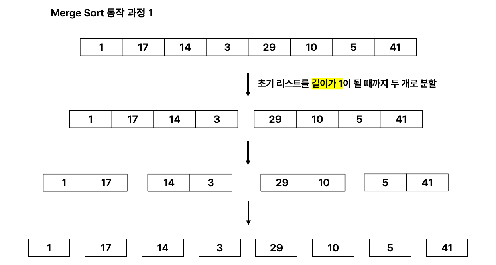  

</p>

-------


<p align="center">  
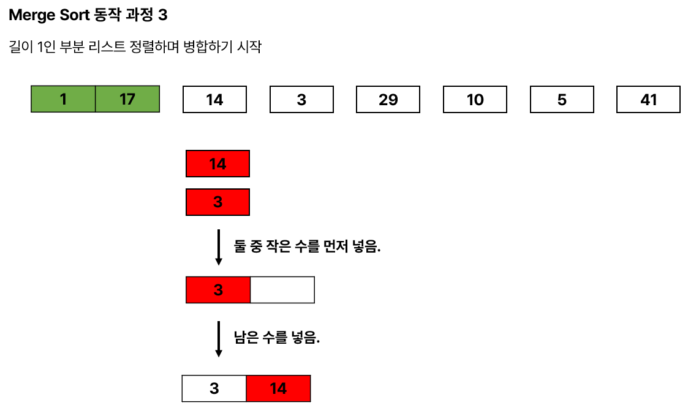  
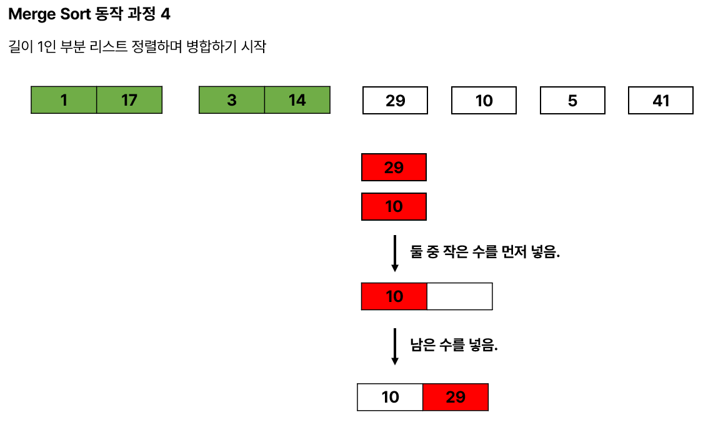
</p>

-------


<p align="center">  
  
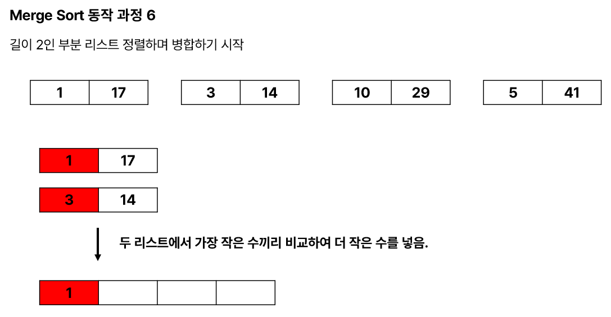
</p>

-------


<p align="center">  
  
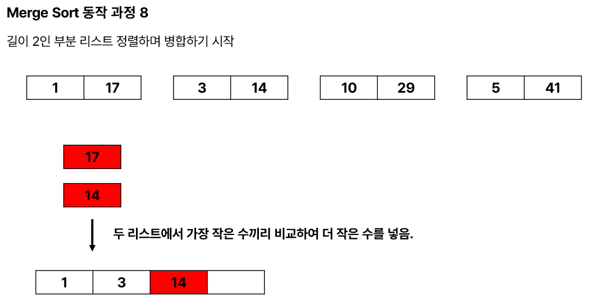
</p>

-------


<p align="center">  
  
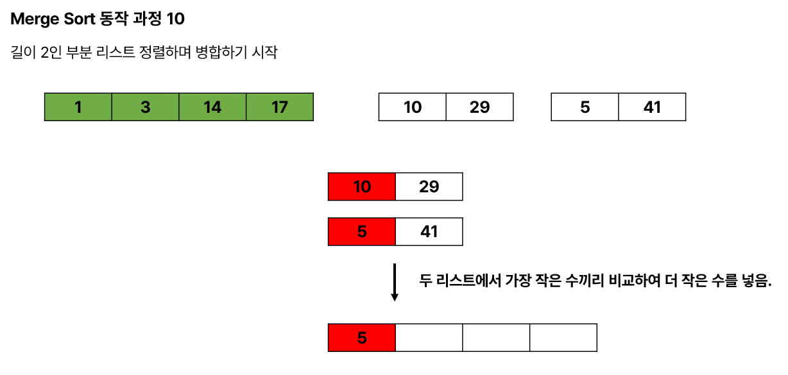
</p>

-------


<p align="center">  
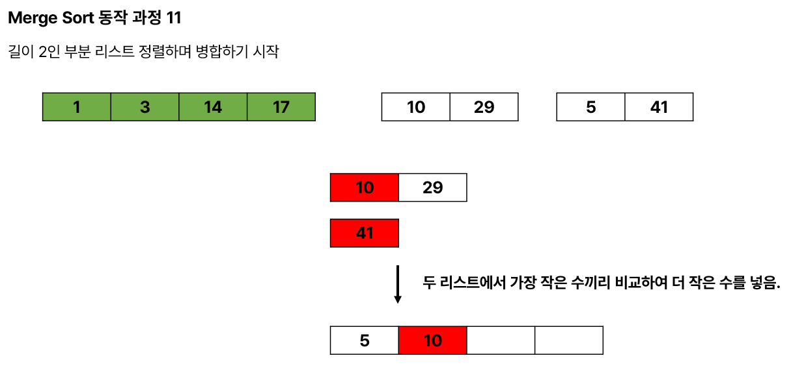  
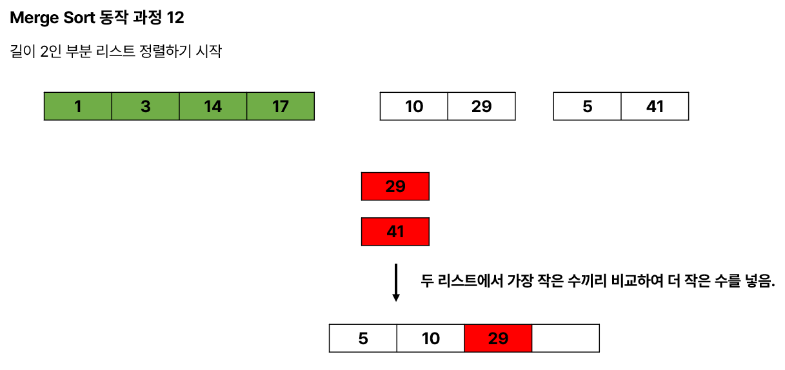
</p>

-------


<p align="center">  
  
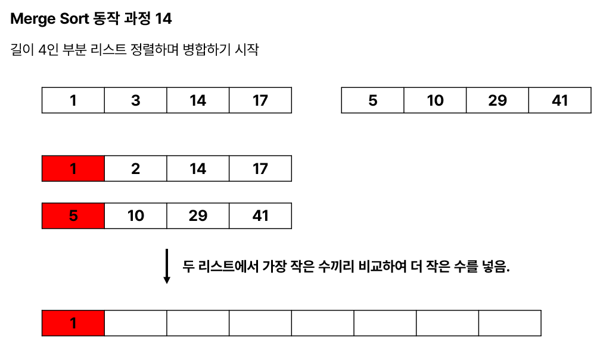
</p>

-------


<p align="center">  
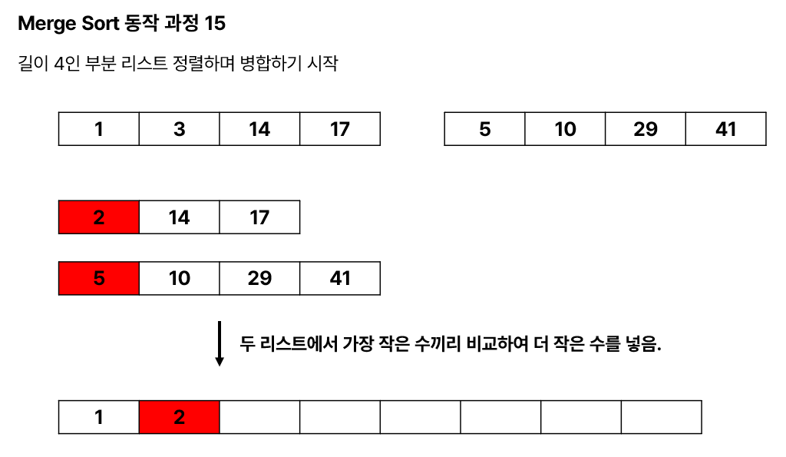  

</p>

-------

<p align="center">  
  

</p>

-------


<p align="center">  
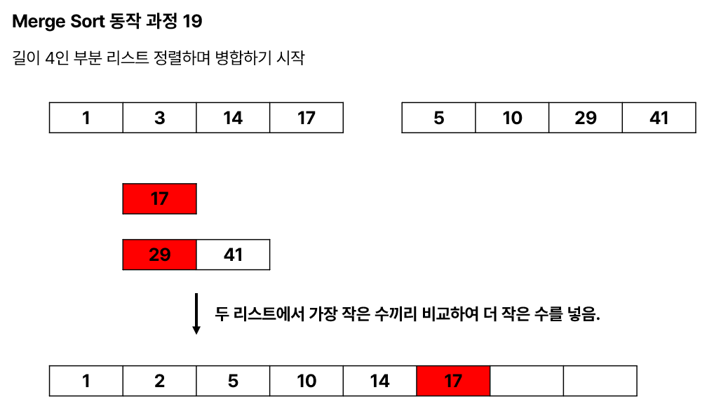  

</p>

-------


<p align="center"> 
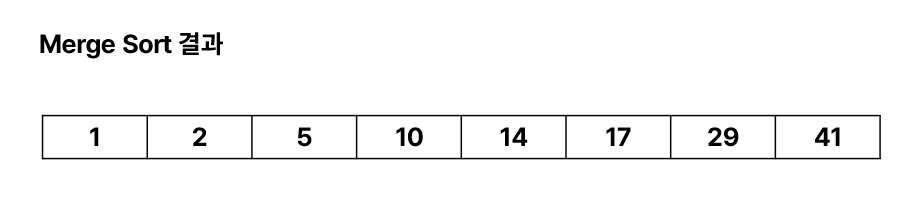
</p>

</div>
</details>

</br>

### Merge Sort 구현

<details>
<summary>java 코드</summary>
<div markdown="1">

```java
import java.util.Arrays;

public class MergeSort {

	private static void mergeSort(int[] arr) {
		int[] tmp = new int[arr.length]; // 임시 저장소

		// 재귀 호출 시작
		mergeSort(arr, tmp, 0, arr.length - 1);
	}

	private static void mergeSort(int[] arr, int[] tmp, int start, int end) {

		if (start < end) {
			int mid = (start + end) / 2;
			
			// 둘로 쪼갬.
			mergeSort(arr, tmp, start, mid);
			mergeSort(arr, tmp, mid + 1, end);
			
			// 둘로 나뉜 배열을 병합
			merge(arr, tmp, start, mid, end);
		}

	}

	private static void merge(int[] arr, int[] tmp, int start, int mid, int end) {

		for (int i = start; i <= end; i++) {
			tmp[i] = arr[i];
		}

		// 두 부분 배열이 mid 값을 기준으로 위치가 맞붙어 있음.
		int part1 = start;
		int part2 = mid + 1;
		int index = start;
		
		// 두 부분 배열 중 하나라도 끝까지 간다면 더 이상 볼 필요가 없음.
		while(part1<=mid && part2<=end) {
			
			// 두 부분 배열의 가장 작은 수끼리 비교하여 더 적은 수를 넣어줌.
			
			if(tmp[part1] <= tmp[part2]) {
				arr[index] = tmp[part1];
				part1++;
			}
			else {
				arr[index] = tmp[part2];
				part2++;
			}
			index++;
		}
		for(int i=0; i<=mid-part1; i++) {
			arr[index+i] = tmp[part1+i];
		}
	}

	public static void main(String[] args) {
		
		int[] arr = {1, 17, 14, 3, 29, 10, 5, 41};
		
		System.out.println("Before Merge Sort");
		System.out.println(Arrays.toString(arr));
		
		mergeSort(arr);
		
		System.out.println("After Merge Sort");
		System.out.println(Arrays.toString(arr));

	}

}
```

</div>
</details>

</br>
</br>

# 힙 정렬<sub> Heap Sort</sub>

- 완전 이진트리의 최대 힙 재구성 시 트리 깊이만큼 수행하므로 O(logn)만큼의 수행시간이 소요되며, 최악 시간복잡도와 최선 시간복잡도 및 평균 시간복잡도가 모두 동일


# 기수 정렬<sub> Radix Sort</sub>
- 자릿수를 기준으로 정렬하는 방식
- 장점
    - 비교 연산을 하지 않으며 안정성을 가지는 정렬
    - 이론상 시간 복잡도가 $O(N log N)$ 을 넘을 수 없음.
- 단점
    - 부동 소수점 실수처럼 특수한 비교 연산이 필요한 데이터에는 적용할 수 없음(데이터 타입이 한정적)
- k(원소 중 최댓값)가 작을 때는 counting sort(계수 정렬)를, k가 클 때는 quick sort를 사용하는 것이 좋음.
    - counting sort는 과정 중에 사용하는 누적 count 배열의 길이가 k이기 때문에 k가 큰 경우엔 비효율적일 수도 있음.
    - quick sort는 분할해서 정렬하기 때문에 k가 큰 경우 quick sort가 더 나을수도 있음.
- 시간 복잡도 
    - d : 자릿수
    - 평균, 최선, 최악 모두 : $O(dN)$

### 동작 원리
1. 주어진 원소 중에서 최댓값의 자릿수까지를 기준으로 정렬

    - 1의 자리부터 d번째 자리까지를 기준으로 정렬

<p align="center">

</p>

</br>

### Radix Sort 구현
<details>
<summary>java 코드</summary>
<div markdown="1">

```java
import java.util.ArrayDeque;
import java.util.Arrays;

public class RadixSort {
	
	static ArrayDeque<Integer>[] buckets = new ArrayDeque[10];
	
	static void radixSort(int[] arr) {
		int div = 10;
		while(div < 100000) {
			for(int i=0;i<arr.length;i++) 
				buckets[(arr[i]/div)%10].offer(arr[i]);

	
			for(int i=0, bi=0;i<10;i++) {
				while(buckets[bi].isEmpty())
					bi++;
				arr[i]=buckets[bi].poll();
			}
			div *= 10;
		}	
	}

	public static void main(String[] args) {
		for(int i=0;i<10;i++)
			buckets[i] = new ArrayDeque<>();
		
		int[] arr = {48081, 97342, 90287, 90583, 53202, 65215, 78397, 48001, 972, 65315};
		
		System.out.print("정렬 전 arr : ");
		System.out.println(Arrays.toString(arr));	
		// [48081, 97342, 90287, 90583, 53202, 65215, 78397, 48001, 972, 65315]
        
		radixSort(arr);
		
		System.out.print("정렬 후 arr : ");
		System.out.println(Arrays.toString(arr));	
		// [972, 48001, 48081, 53202, 65215, 65315, 78397, 90287, 90583, 97342]
	}
}
```

</div>
</details>

</br>
</br>

# 계수 정렬<sub> Counting Sort</sub>
- 이름 그대로 배열 내에 특정한 값이 몇 번 등장했는지에 따라 정렬을 수행
    - 따라서 비교연산이 사용되지 않음.
- 단점
    - 최댓값(k)에 영향을 받는 알고리즘
        - k가 작은 수면 $O(N)$ 이겠지만,
        - k가 무한으로 커지면 $O(무한)$이 될 수 있음.
        - 우리가 입력받은 배열의 값들이 (1, 100000) 이라고 한다면, 이 배열은 두 개의 값만을 가지고 있음에도 불구하고 카운팅 배열의 크기는 100000으로 설정되어야 함.
- 시간 복잡도
    - k : input 데이터 중 최댓값
    - 평균, 최선, 최악 모두 $O(N+k)$
- 공간 복잡도
    - 모두 $O(N+K)$


### 동작 원리
1. A, B, C 배열을 준비함.
    - A : 입력 받은 배열
    - B : 배열 A의 각 원소 값이 등장하는 횟수를 저장할 배열 
        - B의 길이 : `k (배열 A의 원소 값 중 최댓값) + 1`
    - C : 정렬된 값을 담을 배열
1. A의 각 원소 값을 B의 인덱스로 사용해서 해당 위치의 값을 하나 증가 시킴 `B[A[i]]++`
1. A의 모든 원소 값의 등장 횟수를 B에 반영했으면 B의 각 요소들을 누적합으로 갱신 `B[i] = B[i] + B[i-1]`
1. A의 가장 뒤에 있는 값부터 아래 과정을 시작
```
for(int i=A.length; i>=0; i--)
    - A[i]의 값을 B의 인덱스로 활용하여 값을 가져옴.
    - B에서 가져온 값을 C의 인덱스로 활용하고 C의 인덱스 그 위치에 A[i] 값을 넣어줌.
    - 사용된 B의 값을 하나 감소시킴

```


<details>
<summary><b>동작 과정 이미지</b></summary>
<div markdown="1">
<p align="center">  
  

</p>

-------


<p align="center">  
  

</p>

-------


<p align="center">  
  

</p>

-------


<p align="center">  
  

</p>

-------


<p align="center">  
  

</p>

-------


<p align="center">  
  

</p>

-------


<p align="center">  
  
</p>

-------


<p align="center">  
  

</p>

-------

<p align="center">  
  

</p>

-------


<p align="center">  
  

</p>

-------

<p align="center">  
  

</p>

-------

<p align="center">  
  

</p>

-------

<p align="center">  
  

</p>

-------

<p align="center">  
  

</p>

-------

<p align="center">  
  

</p>

-------

<p align="center">  
  

</p>

-------

<p align="center">  
  

</p>

-------

<p align="center">  
  

</p>

-------

<p align="center">  


</p>

-------


<p align="center"> 

</p>

</div>
</details>

</br>

### Counting Sort 구현
<details>
<summary>java 코드</summary>
<div markdown="1">

```java
import java.util.Arrays;

public class CountingSort {

	public static void main(String[] args) {

		int[] A = { 1, 2, 3, 6, 4, 3 }; // 입력 받은 배열

		int n = A.length; // 배열 A의 길이
		int k = 0; // 배열 A의 원소 중 최댓값

		for (int i = 0; i < n; i++) {
			if (k < A[i])
				k = A[i];
		}

		int[] B = new int[k + 1]; // 배열 A의 각 원소 값이 등장하는 횟수를 저장할 배열

		int[] C = new int[n]; // 정렬된 값을 담을 배열
		
		System.out.println("Before Counting Sort");
		System.out.println(Arrays.toString(A));
		
		countingSort(A, B, C, n, k);
		
		System.out.println("After Counting Sort");
		System.out.println(Arrays.toString(C));
	}

	private static void countingSort(int[] A, int[] B, int[] C, int n, int k) {

		// 배열 A의 각 원소들이 등장하는 횟수 카운팅
		for (int i = 0; i < n; i++) {
			B[A[i]]++;
		}

		// 배열 B 누적합 계산
		for (int i = 1; i <= k; i++) {
			B[i] = B[i] + B[i - 1];
		}

		// C에 정렬된 결과 넣기
		for (int i = n - 1; i >= 0; i--) {
			// 현재 선택된 A의 원소
			int a = A[i];

			// B에서 뽑은 수
			int b = B[a];

			// C에 입력
			C[b - 1] = a;

			// B에서 뽑았으니 하나 감소시킴
			B[a]--;

		}

	}

}
```

</div>
</details>

</br>
</br>

- 참고

[Bubble Sort](https://medium.com/jungletronics/bubble-sort-ascendant-algorithm-5a3cf7b530f7)

[what is bubble sort in java](https://www.educative.io/answers/what-is-a-bubble-sort-in-java)

[정렬 알고리즘](https://devjourney7.tistory.com/132)

[[자료구조 알고리즘] 퀵정렬(Quicksort)에 대해 알아보고 자바로 구현하기](https://www.youtube.com/watch?v=7BDzle2n47c)

[정렬의 뜻, 정렬 알고리즘 분류 방법](https://hellowoori.tistory.com/48)

[[Algorithm] 정렬 : Counting sort(계수 정렬), Radix sort(기수 정렬)](https://velog.io/@wjdqls9362/Algorithm-%EC%A0%95%EB%A0%AC-Radix-sort-Counting-sort)

[[정렬 알고리즘] 05 계수 및 기수 정렬(Counting Sort / Radix Sort) 이론 및 구현](https://rninche01.tistory.com/entry/%EC%A0%95%EB%A0%AC-%EC%95%8C%EA%B3%A0%EB%A6%AC%EC%A6%98-05-%EA%B3%84%EC%88%98-%EB%B0%8F-%EA%B8%B0%EC%88%98-%EC%A0%95%EB%A0%ACCounting-Sort-Radix-Sort)

[[알고리즘 정리] 계수정렬(Counting Sort)](https://jeonyeohun.tistory.com/103)