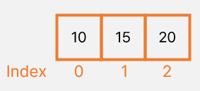
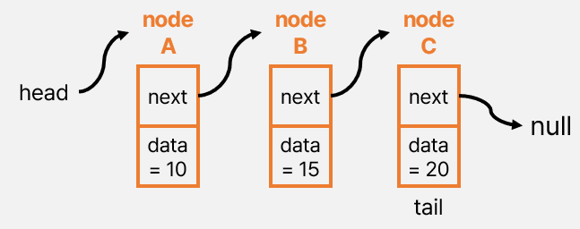

# Array
### ❓연속된 메모리 공간에 순차적으로 데이터를 저장하는 선형 자료구조

- 하나의 변수에 같은 타입의 값을 여러 개 저장할 때 사용됨.
- 논리적 저장 순서와 물리적 저장 순서가 일치함.
- 따라서 `index`로 해당 원소에 접근할 수 있음.

### 장점
- 찾고자 하는 원소의 인덱스의 값을 알고 있으면 O(1)의 시간복잡도로 접근할 수 있음. 즉, random access가 가능해 속도가 빠름.

### 단점
- 필요한 요소보다 매우 크게 만들거나 매우 작게 만들어 배열의 크기를 조정해야 하는 경우가 있을 수 있음. ➡️ 이 문제점을 해결하기 위한 자료구조가 linkedlist이다.
- 데이터 삭제 시 시간 복잡도가 증가할 수 있음.  ➡️ 삭제 후 배열의 빈 공간이 생기기 때문에 원소들을 이동시키는 과정에서 비용이 발생함.
    - 따라서 삭제 시 최악의 경우 시간 복잡도는 O(N) 
- 삽입의 경우에도 시간 복잡도가 증가할 수 있음.
    - 만약 첫번째 자리에 새로운 원소를 추가하고자 한다면 모든 원소들의 인덱스를 1씩 이동해야 하므로 이 경우도 O(N)의 시간을 요구하게 됨.

 

# ArrayList
### ❓한번 생성하면 크기가 고정되는 배열과 다르게 부족한 공간을 자동으로 조정해주는 선형 자료구조

- ArrayList 클래스는 내부적으로 Object[] 배열을 이용하여 요소를 저장
- 리스트 길이가 가변적임. 즉, 동적 할당임.
- 크기를 가변적으로 늘리거나 줄이는 과정에서 지연이 발생할 수 있으므로 조회를 많이 하는 경우에 사용하는 것이 좋음.
- 객체로 데이터를 다루기 때문에 적은 양의 데이터를 쓸 경우 배열에 비해 차지하는 메모리가 커짐.
- List 인터페이스를 구현하기 때문에 데이터의 저장 순서 유지, 데이터 중복 허용

### 장점
- 동적 배열을 기반으로 한 구조 덕분에 크키가 동적으로 조절되기 때문에 배열과 비교했을 때 용량 관리를 유연하게 할 수 있음.
- List 인터페이스를 구현하기 때문에, List 인터페이스에 정의된 메서드들을 모두 사용할 수 있음. 따라서 데이터 추가, 조회, 수정, 삭제 등의 연산을 쉽게 수행할 수 있게 함.
- Java의 Generic을 사용하여 선언할 수 있기 때문에 특정 타입의 객체만을 저장할 수 있게 되어 타입 안전성이 강화됨.

### 단점
- 배열의 공간이 꽉 차거나, 중간에 데이터를 삽입할 때 기존 배열을 복사해서 뒤로 한칸씩 이동시켜야 하기 때문에 O(N)의 시간 복잡도를 가질 수 있음. ➡️ 이런 경우 LinkedList보다 덜 효율적임.

 

# Linked List

### ❓ 연속적이지 않은 메모리 공간에 따로 따로 저장된 노드를 포인터로 연결하여 저장하는 선형 자료구조

- LinkedList의 기본 구성 요소 : `노드`
- 노드 구성
    - **`next`** : 인접한 노드를 가리키는 포인터
    - **`data`** : 노드에 넣는 데이터를 가리키는 포인터
- head 라는 포인터에서 시작
- Linked List 는 Tree 구조의 근간이 되는 자료구조이며, Tree 에서 사용되었을 때 그 유용성이 드러남.(why?)
- [LinkedList 내부 클래스에서 Node를 정의한 코드](./algorithm/LinkedListNode.java)

### 장점
- 각각의 원소들은 자기 자신 다음에 어떤 원소인지만을 기억하고 있기 때문에 이 부분만 다른 값으로 바꿔주면 삽입과 삭제를 O(1)로 해결할 수 있음.

### 단점
- 원하는 위치에 한 번에 접근할 수 없음.
- 원하는 위치에 삽입을 하고자 하면 원하는 위치를 Search 과정에 있어서 첫번째 원소부터 다 확인해봐야 함.
    - Array 와는 달리 논리적 저장 순서와 물리적 저장 순서가 일치하지 않기 때문임.

 

### Array와 LinkedList의 공통점
- input 순서대로 여러 데이터를 저장 (이거 약간 말이 애매할 수 있음.)
- <u>Java</u>에서 Array와 LinkedList 둘 다 **힙 메모리 영역**에 할당.
    - Java에서는 모든 객체가 힙 영역에 생성되기 때문.
    - Array, LinkedList 객체 자체에 대한 참조는 스택 영역에 있지만, 실제 데이터, 노드는 힙에 저장됨.
- 메모리 할당 타이밍
    - 다른 언어와 달리 <u>Java</u>에서는 둘 다 **런타임 시에 메모리 할당**됨.
    - Java에서 Array는 런타임 시에 크기가 결정되면서 메모리도 할당됨. 즉, 생성 시 크기가 결정됨.
    - LinkedList도 Java에서는 런타임 시에 동적으로 메모리를 할당받음.

### Array와 LinkedList의 차이점
|  | Array | LinkedList |
| --- | --- | --- |
| 사이즈 | 초기화시 고정(정적 할당), 따라서 필요한 요소의 크기보다 매우 크거나 작게 만드는 경우 배열의 크기를 조정해야 하는 경우가 있을 수 있음. | 초기화시 사이즈를 표시하지 않음. 사이즈가 동적임(동적 할당). 미리 크기를 지정하지 않고 항상 맞는 크기로 만들어짐.  |
| 접근 | Random Access 를 지원함. 인덱스를 통해 직접 접근할 수 있기 때문에 특정 요소에 접근하는 시간 복잡도는 O(1) | Sequential Access를 지원함. 특정 요소에 접근할 때 순차적으로 검색하며 찾아야하기 때문에 시간 복잡도는 O(N)|
| 저장방식 | 인접한 메모리 위치에 연달아 저장 | 새로운 노드에 할당된 메모리 위치 주소가 LinkedList의 이전 노드에 저장

### ArrayList와 LinkedList의 차이점
|  | ArrayList | LinkedList |
| --- | --- | --- |
| 사이즈 | 리스트의 크기가 제한되어 있으며, 리스트의 크기를 재조정하는 것은 많은 연산이 필요 | 사이즈가 동적이기 때문에 리스트의 크기에 영향 없이 데이터를 추가할 수 있음.  |
| 접근 | 원하는 데이터에 무작위로 접근할 수 있음. | 무작위 접근이 불가능하며, 순차 접근만이 가능|
| 추가, 삭제 | 임시 배열을 생성하여 복제해야 하므로 O(N) | 새로운 노드를 생성하여 주소만 연결하므로 head나 tail에서 연산이 이루어질 때 시간 복잡도는 O(1) |
| 저장방식 | 데이터들이 순서대로 늘어선 배열의 형식 | 자료의 주소값으로 서로 연결된 형식 |

### Array와 ArrayList 차이점

|  | Array | ArrayList |
| --- | --- | --- |
| 사이즈 | 초기화시 고정 | 초기화시 사이즈를 표시하지 않음. 사이즈가 동적임. |
| 속도 | 초기화 시 메모리에 할당되어 속도 빠름 | 추가시 메모리를 재할당하여 속도가 느림 |
| 변경 | 사이즈 변경 불가 | 추가, 삭제 가능 |
| 다차원 | 가능 | 불가 |
| 타입 | primitive type(int,byte, char etc), object | object element만 가능 |
| Generic(제네릭) | 사용 불가능 | 사용 가능(타입 안정성 보장) |
| 길이 | length 변수 | size() 메소드 |
| 변수 추가 | assignment 연산자 사용 | add() 메소드 사용 |

  

**간단히 정리하면,**

**Array는 검색이 빠르지만, 삽입, 삭제가 느리다.**

**LinkedList는 삽입, 삭제가 빠르지만, 검색이 느리다.**

 

### 특징
|  | Array | ArrayList | LinkedList |
| --- | --- | --- | --- |
| 데이터들의 input 순서 보장 여부 | yes | yes | yes |
| 중복된 데이터 허용 여부 | yes | yes | yes |
| 데이터 정렬 여부 | no | no |no |

### ⏰ 시간 복잡도

| 연산 | Array | ArrayList | LinkedList |
| --- | --- | --- | --- |
| 삽입 | O(N) | O(1) : 맨 뒤에 삽입하는 경우   O(N) : 중간이나 앞부분에 삽입하거나, 배열의 크기를 늘려야 하는 경우 | O(1) : 맨 앞, 맨 뒤   O(N) : 탐색을 통한 중간 삽입 |
| 검색 | O(1) | O(1)  | O(N) |
| 삭제 | O(N) | O(1) : 리스트의 맨 뒤   O(N) : 중간이나 앞부분을 삭제하는 경우 | O(1) : 맨 앞, 맨 뒤  O(N) : 탐색을 통한 중간 삭제 |

 

- 참고

[[Java] Queue가 ArrayList 대신 LinkedList를 사용하는 이유](https://devlog-wjdrbs96.tistory.com/246)

[LinkedList in Java](https://www.geeksforgeeks.org/linked-list-in-java/)