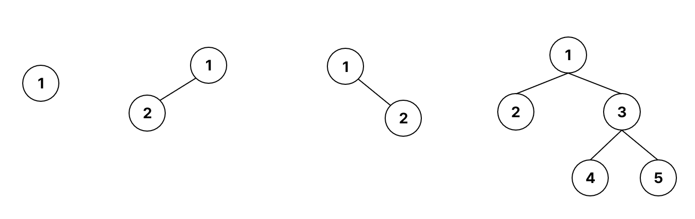
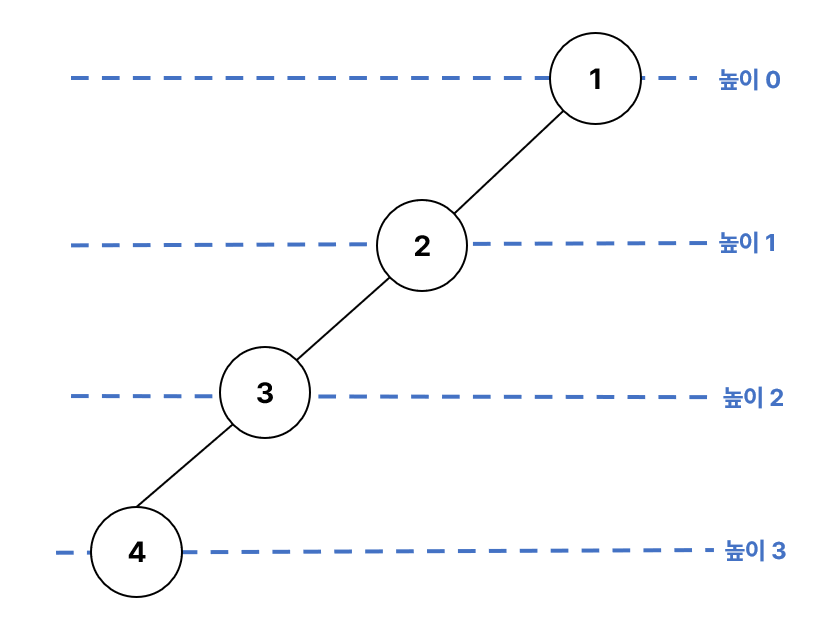
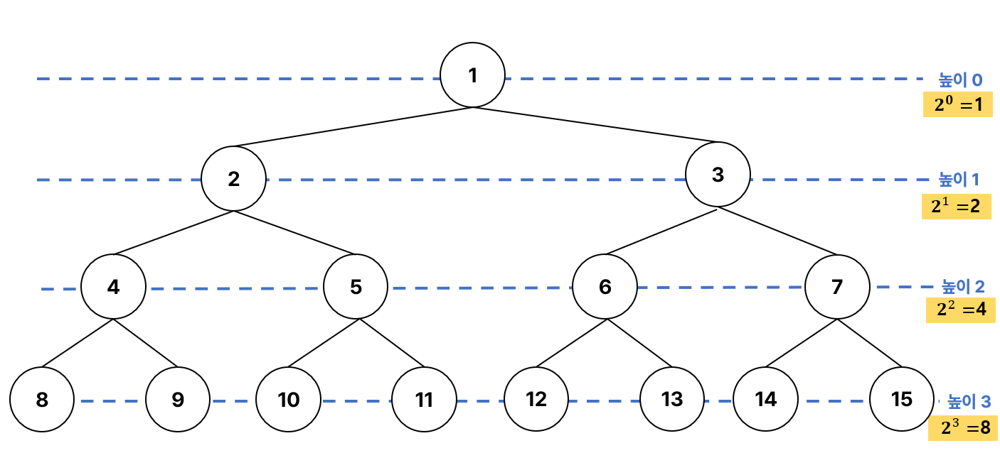

# Binary Tree(이진 트리)
### ❓**자식 노드**를 <u>**최대 2개**</u> 갖는 트리
- 모든 노드의 <u>차수가 2이하</u>임.

 
*이진 트리 예시*
 
 

| | |
| --- | --- |
|  | |
- 높이 i(레벨 i)에서 노드의 최대 개수 **2i** 개
- 높이가 h인 이진 트리가 가질 수 있는 노드의   최소 개수 :  **h+1** 개, 최대 개수 : **2(h+1)-1** 개

 

### 이진 트리 종류

- **`포화 이진 트리(Perfect Binary Tree)`**
    - 모든 레벨에 노드가 포화 상태로 차 있는 이진 트리(모든 단말 노드에서의 높이가 동일)
    - 높이가 h일 때, 이진트리가 가질 수 있는 최대 노드의 개수를 가진 이진 트리
        - 높이가 3일 때, **2(3+1)-1=15** 개의 노드
    - 루트를 1번으로 하여 2h+1-1까지 정해진 위치에 대한 노드 번호를 가짐
- **`완전 이진 트리(Complete Binary Tree)`**
    - 높이가 h이고 노드 수가 n개 일 때, 노드 번호 1번부터 n번까지 빈 자리가 없는 이진 트리
    - 트리의 높이를 결정하는 마지막 레벨의 단말노드를 제외한 그 위 레벨은 전부 꽉 차(포화 이진 트리) 있어야 함.
    - 모든 포화 이진 트리는 완전 이진 트리임.
- **`편향 이진 트리(Skewed Binary Tree)`**
    - 높이 h에 대한 최소 개수의 노드를 가지면서 한쪽 방향의 자식 노드만을 가진 이진 트리
        - 왼쪽 편향 이진 트리, 오른쪽 편향 이진 트리가 있음.

### 배열을 이용한 이진 트리 표현

- 노드 번호를 배열의 인덱스로 사용
- 높이가 h인 이진 트리를 위한 배열의 크기
    - 0번 인덱스를 사용하지 않기 때문에 **2h+1**

- 노드 번호의 성질
    - 노드 번호가 i 인 노드의 <u>부모</u> 노드 번호 : **i/2**
    - 노드 번호가 i 인 노드의 <u>왼쪽 자식</u> 노드 번호 : **2 * i**
    - 노드 번호가 i 인 노드의 <u>오른쪽 자식</u> 노드 번호 : **2 * i + 1**
    - 레벨 n의 노드 번호 시작 번호 : **2n**
- 편향 이진 트리와 같은 형태일 경우 배열로 구현 시 필요한 크기보다 큰 공간을 차지할 수 있어 저장공간을 효율적으로 사용하지 못함. -> 이런 경우 LinkedList로 해결

 

### [BinaryTree 구현](./algorithm/BinaryTree.java) Java

 

### 특징
|  | Binary Tree | 
| --- | --- | 
| 데이터들의 input 순서 보장 여부 | no |
| 중복된 데이터 허용 여부 | no |
| 데이터 정렬 여부 | 저장된 데이터가 완전히 정렬되어 있다기 보다 순회를 할 때 정렬된 상태로 뽑히게 됨. |

 

### ⏰ 시간 복잡도
| 연산 | 최악의 경우 |
| --- | --- |
| 삽입 | O(N) |
| 검색 | O(N) |
| 삭제 | O(N) |

### 장점
- **효율적인 검색**
    - 각 노드에 최대 두 개의 하위 노드가 있기 때문에 특히 검색할 때 효율적 - O(logN)
- **정렬된 탐색 가능**
    - 순회 방법에 따라 특정 순서로 탐색 가능
- **메모리 효율적**
    - 노드당 두 개의 자식 포인터만 필요하기 때문에 다른 트리 구조에 비해 메모리 효율이 좋음.
    - 따라서 효율적인 검색 작업을 유지하면서 많은 양의 데이터를 메모리에 저장하는 데 사용 가능
- **빠른 삽입 및 삭제**
    - 삽입과 삭제 수행 시 시간 복잡도는 O(logN)
    - 따라서 DB 시스템과 같이 동적 데이터 구조가 필요 시에 적합
- **구현이 쉬움**
    - 구현과 이해하기 비교적 쉬워 다양한 애플리케이션에 사용됨.
- **정렬에 유용**
    - 효율적인 정렬 알고리즘(힙 정렬, 이진 검색 트리) 구현에 사용 가능
### 단점
- **제한된 구조**
    - 노드당 자식이 2개로 제한되므로 2개 이상의 자식 노드가 필요한 경우 다른 트리 구조가 더 적합할 수 있음.
- **불균형 트리**
    - 불균형 트리인 경우 검색 시에 비효율적임.
- **공간 비효율성**
    - 트리의 크기가 매우 커지는 경우 2개의 자식 포인터가 필요하기 때문에 메모리 오버헤드가 발생할 수 있음.
- **최악의 경우 느린 성능**
    - 각 노드의 자식이 하나만 있는 경우 검색 시 시간 복잡도는 O(N)이 될 수 있음.
- **복잡한 밸런싱 알고리즘**
    - 이진 트리의 균형을 유지하기 위해 AVL 트리, 레드-블랙 트리와 같은 다양한 밸런싱 알고리즘을 사용할 수 있음.
    - 이런 알고리즘은 구현이 복잡하고 추가 오버헤드가 발생할 수 있음.

### 활용
- **이진 탐색 트리**BST, Binary Search Tree에 활용
- **정렬 알고리즘**
    - BST 정렬 및 힙 정렬과 같은 알고리즘 구현
- **DB 시스템**
    - 데이터 저장 시 사용할 수 있으며 각 노드는 레코드를 나타냄.
    - 이를 통해 효율적인 검색 작업 가능하고 DB 시스템에서 대량의 데이터를 처리할 수 있음.
- **파일 시스템**
    - 효율적인 탐색 가능

 
- 참고

[Applications, Advantages and Disadvantages of Binary Tree](https://www.geeksforgeeks.org/applications-advantages-and-disadvantages-of-binary-tree/)    
[이진트리 Binary Tree의 세 가지 종류와 특징](https://velog.io/@vermonter/Data-Structure-%EC%9D%B4%EC%A7%84-%ED%8A%B8%EB%A6%ACBinary-Tree%EC%9D%98-%EC%84%B8-%EA%B0%80%EC%A7%80-%EC%A2%85%EB%A5%98%EC%99%80-%ED%8A%B9%EC%A7%95)