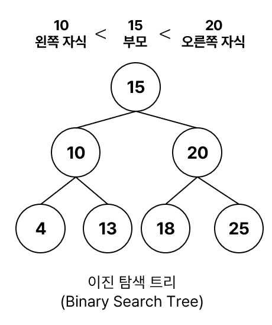
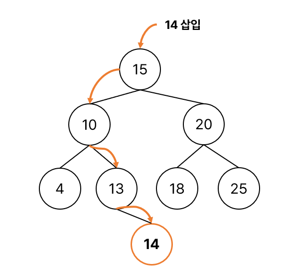
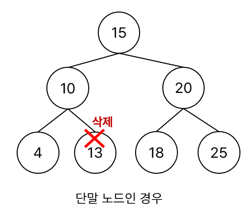
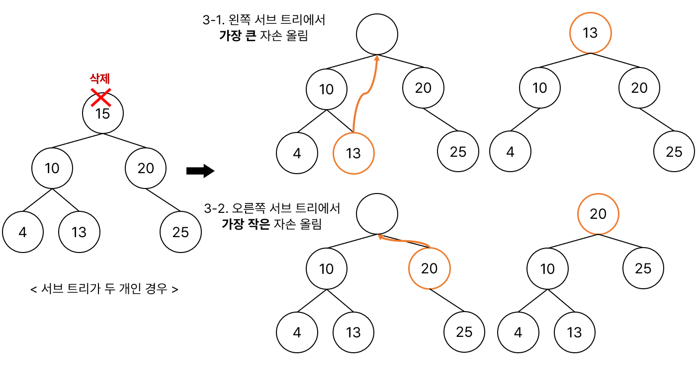

# Tree
### ❓노드들이 나뭇가지처럼 연결된 계층적 자료구조

- 원소들 간에 계층관계를 가지는 비선형 자료구조
- 원소들 간에 1:n 관계를 가지는 자료구조
- 상위 원소에서 하위 원소로 내려가면서 확장되는 트리 모양의 구조
- 루프를 갖지 않고 연결된 무방향 그래프 구조
- 노드가 n개인 트리는 항상 n-1개의 간선을 보유
- 간선은 부모 노드와 자식 노드만을 연결하기 때문에 싸이클이 없는 그래프라고 볼 수 있음.

### Tree 용어


- **노드** : 트리를 구성하는 각각의 요소
- **간선(Edge)** : 노드와 노드를 연결하는 선, 부모 노드와 자식 노드를 연결
- **루트 노드** : 트리에서 가장 최상위에 있는 노드, 부모 노드가 없는 노드
- **부모 노드(Parent node)** : 자식 노드를 가진 노드(C = G의 부모 노드)
- **자식 노드(Child node)** : 부모 노드를 가진 노드(G = C의 자식 노드)
- **형제 노드(Sibling node)** : 같은 부모를 가지는 노드(H, I, J)
- **리프 노드(Leaf node)** : 자식 노드가 없는 노드(External node, 단말노드 라고도 부름), 차수가 0인 노드
- **비단말 노드(Internal node)** : 자식 노드가 있는 노드
- **조상 노드(Ancestor node)** : 간선을 따라 루트 노드까지 가는 경로상에 있는 모든 노드(E의 조상 노드는 B, A)
- **자손 노드(Descendent node)** : 서브 트리에 있는 하위 레벨의 노드들, B의 자손은 E, F, K
- **서브트리(Subtree)** : 부모 노드와 연결된 간선을 끊었을 때 생성되는 트리
    - 큰 트리는 작은 트리들의 모음으로 구성
    - 노드가 한 개여도 트리라고 할 수 있음.
- **높이(height, level)**
    - 노드의 높이(레벨) : 루트에서 노드에 이르는 간선의 수(B의 높이 = 1, F의 높이 = 2)
    - 트리의 높이 : 트리에 있는 노드의 높이 중에서 가장 큰 값, 최대 레벨(트리 T의 높이 = 3)
- **차수(degree)**
    - 노드의 차수 : 노드에 연결된 자식 노드의 수 (B의 차수 = 2, C의 차수 = 1)
    - 트리의 차수 : 트리에 있는 노드의 차수 중에서 가장 큰 값(트리 T의 차수 = 3)

</br>

### Tree 유형의 자료구조
- 이진 트리(Binary Tree)
    - 완전 이진 트리(Complete Binary Tree)
    - 포화 이진 트리(Perfect Binary Tree)
    - 편향 이진 트리(Skewed Binary Tree)
- Binary Search Tree(BST, 이진 탐색 트리)
- Ternary Tree : 자식 노드가 최대 3개까지 존재하는 트리
- Red-Black Tree
- B Tree
- Trie

</br>

## Binary Tree(이진 트리)
❓**자식 노드**를 <u>**최대 2개**</u> 갖는 트리
- 모든 노드의 <u>차수가 2이하</u>임.

 
*이진 트리 예시*

| | |
| --- | --- |
|  | |
- 높이 i(레벨 i)에서 노드의 최대 개수 **2<sup>i** 개
- 높이가 h인 이진 트리가 가질 수 있는 노드의 </br> 최소 개수 :  **h+1** 개, 최대 개수 : **2<sup>(h+1)</sup>-1** 개 

### 이진 트리 종류


- **`포화 이진 트리(Perfect Binary Tree)`**
    - 모든 레벨에 노드가 포화 상태로 차 있는 이진 트리(모든 단말 노드에서의 높이가 동일)
    - 높이가 h일 때, 이진트리가 가질 수 있는 최대 노드의 개수를 가진 이진 트리
        - 높이가 3일 때, **2<sup>(3+1)</sup>-1=15** 개의 노드
    - 루트를 1번으로 하여 2<sup>h+1</sup>-1까지 정해진 위치에 대한 노드 번호를 가짐
- **`완전 이진 트리(Complete Binary Tree)`**
    - 높이가 h이고 노드 수가 n개 일 때, 노드 번호 1번부터 n번까지 빈 자리가 없는 이진 트리
    - 트리의 높이를 결정하는 마지막 레벨의 단말노드를 제외한 그 위 레벨은 전부 꽉 차(포화 이진 트리) 있어야 함.
    - 모든 포화 이진 트리는 완전 이진 트리임.
- **`편향 이진 트리(Skewed Binary Tree)`**
    - 높이 h에 대한 최소 개수의 노드를 가지면서 한쪽 방향의 자식 노드만을 가진 이진 트리
        - 왼쪽 편향 이진 트리, 오른쪽 편향 이진 트리가 있음.

### Tree의 순회 방법
1. 중위순회(Inorder) : **왼쪽자식 -> 부모 -> 오른쪽 자식** 순서로 방문
2. 전위순회(Preorder) : **부모 -> 왼쪽자식, 오른쪽 자식** 순서로 방문
3. 후위순회(Postorder) : **왼쪽자식 -> 오른쪽 자식 -> 부모** 순서로 방문

### 배열을 이용한 이진 트리 표현


- 노드 번호를 배열의 인덱스로 사용
- 높이가 h인 이진 트리를 위한 배열의 크기
    - 0번 인덱스를 사용하지 않기 때문에 **2<sup>h+1**

- 노드 번호의 성질
    - 노드 번호가 i 인 노드의 <u>부모</u> 노드 번호 : **i/2**
    - 노드 번호가 i 인 노드의 <u>왼쪽 자식</u> 노드 번호 : **2 * i**
    - 노드 번호가 i 인 노드의 <u>오른쪽 자식</u> 노드 번호 : **2 * i + 1**
    - 레벨 n의 노드 번호 시작 번호 : **2<sup>n**
- 편향 이진 트리와 같은 형태일 경우 배열로 구현 시 필요한 크기보다 큰 공간을 차지할 수 있어 저장공간을 효율적으로 사용하지 못함. -> 이런 경우 LinkedList로 해결


</br>

## Binary Search Tree(BST, 이진 탐색 트리)
❓이진 트리 기반의 탐색을 위한 자료구조, 이진 탐색과 연결 리스트를 결합한 자료 구조

<p align="center"></p>

- 항상 왼쪽 자식 노드의 키값은 부모노드보다 작고, 오른쪽 자식 노드의 키값은 부모노드보다 큼.
- 각 노드에 중복되지 않는 키가 존재.
- 트리의 높이에 영향을 받기 때문에 높이가 h일 때 시간 복잡도 : O(h)
- 트리의 균형이 한쪽으로 치우쳐진 경우(최악의 경우) 시간 복잡도 : O(N)
    - 이 경우를 막기 위해 나온 기법이 Red-Black Tree(RBT)

### 장점
- 이진 탐색의 효율적인 탐색 능력을 유지하면서, 빈번한 자료 삽입, 삭제가 가능

### BST 탐색

- 찾고자 하는 값을 num이라고 하자.

```text
1. 루트 노드의 키와 num을 비교하고, 찾는 값이면 탐색 종료
 1-1. if( num < 루트 노드의 키 )
        왼쪽 서브 트리 탐색
 1-2. if( num > 루트 노드의 키 ) 
        오른쪽 서브 트리 탐색
```
위 과정을 num을 찾을 때까지 반복.

### BST 삽입



```text
1. 루트 노드와 비교하여 같으면 오류 발생(중복 값 허용 X)
 1-1. if(삽입할 노드 < 루트 노드의 키)
        왼쪽 서브 트리를 탐색하여 비어있으면 추가 후 삽입 과정 종료, 비어있지 않으면 값 비교
 1-2. if(삽입할 노드 > 루트 노드의 키)
        오른쪽 서브 트리를 탐색하여 비어있으면 추가 후 삽입 과정 종료, 비어있지 않으면 값 비교
```

위 과정을 빈 공간이 나올 때까지 반복한다.


### BST 삭제

- 3가지 경우가 존재

1. 삭제하려는 노드가 단말 노드인 경우
2. 삭제하려는 노드의 서브 트리가 하나인 경우
3. 삭제하려는 노드의 서브 트리가 두 개인 경우

#### 1. 단말 노드인 경우
- 삭제할 노드의 부모 노드가 있다면 부모 노드의 자식 노드를 NULL로 만들고 삭제하면 됨.

<p align="center"></p>

#### 2. 서브 트리가 하나인 경우

- 삭제할 노드의 자식 노드를 부모 노드가 가리키게 하고 삭제하면 됨.

<p align="center"></p>

#### 3. 서브 트리가 두 개인 경우

- 3-1 삭제할 노드의 <u>왼쪽 서브 트리의 가장 큰 자손</u>을 삭제할 노드의 자리로 올림.
- 3-2 삭제할 노드의 <u>오른쪽 서브 트리의 가장 작은 자손</u>을 삭제할 노드의 자리로 올림.

<p align="cencter"></p>


</br>

- 참고

[tree](https://www.javatpoint.com/tree)   
[What is Tree Data Structure?](https://www.geeksforgeeks.org/tree-data-structure/)   
[이진트리 Binary Tree의 세 가지 종류와 특징](https://velog.io/@vermonter/Data-Structure-%EC%9D%B4%EC%A7%84-%ED%8A%B8%EB%A6%ACBinary-Tree%EC%9D%98-%EC%84%B8-%EA%B0%80%EC%A7%80-%EC%A2%85%EB%A5%98%EC%99%80-%ED%8A%B9%EC%A7%95)