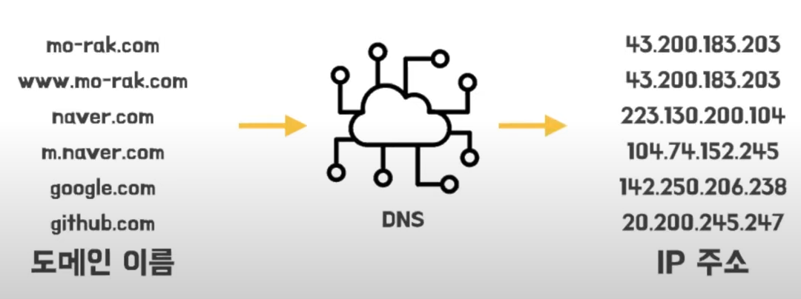

# DNS Domain Name System

## :bookmark_tabs: 목차

[:arrow_up: **Network**](../README.md)

1. ### DNS
   - [:page_facing_up: DNS](#dns-domain-name-system-1)
   - [:page_facing_up: DNS 기초적인 동작 흐름](#dns의-기초적인-동작-흐름)
   - [:page_facing_up: DNS 서버 분리](#dns-서버-분리)
   - [:page_facing_up: DNS 자세한 동작 과정](#dns-자세한-동작-과정)
   - [:page_facing_up: DNS 쿼리 유형](#dns-쿼리-유형)

## DNS Domain Name System

> 도메인 이름과 IP 주소에 대한 정보를 관리하는 시스템

||
|---:|
|출처 : [10분 테코톡] 엘리의 DNS |

- 인터넷에 연결된 각 기기에는 다른 컴퓨터가 기기를 찾는 데 사용하는 고유한 IP 주소가 있음.
- 도메인 이름을 IP 주소로 변환해줌.
- 사용자는 DNS가 있으면 IP 주소를 몰라도 도메인 이름을 통해 접근할 수 있음.

### DNS의 기초적인 동작 흐름

||
|---:|
|출처 : [10분 테코톡] 엘리의 DNS |

0. 사용자가 'www.google.com'을 브라우저에 입력
1. 브라우저의 캐시에 해당 도메인의 IP 주소가 있나 확인
    
    1-1. 있으면 IP 주소 반환
2. 컴퓨터에 저장된 hosts 파일과 캐시에서 IP 주소가 있나 확인

    2-1. 있으면 IP 주소 반환
3. DNS 서버에게 www.google.com의 IP 주소를 달라고 요청
4. DNS 서버가 도메인의 IP 주소를 반환

 

⛔ 하나의 DNS 서버에서 전 세계의 모든 DNS 정보를 관리할 때 문제점

- **서버의 고장** 
    - 네임 서버가 고장나면, 전체 인터넷이 작동되지 않음.
- **트래픽의 양**
    - 단일 DNS 서버가 전세계의 모든 엄청난 양의 DNS 질의를 처리해야 함.
- **먼 거리의 중앙 집중 데이터베이스**
    - 단일 DNS 서버는 모든 클라이언트로부터 가까울 수 없기 때문에 심각한 지연 발생 가능
- **유지 관리**
    - 단일 DNS 서버는 모든 인터넷 호스트에 대한 레코드를 유지해야 하기 때문에 새로운 호스트를 반영하기 위해 자주 갱신을 해야 하고 데이터베이스가 점점 거대해짐.

### DNS 서버 분리

- 트래픽과 데이터 분산
    - 위에서 말한 문제점들을 보완하기 위해 DNS는 분산되도록 설계

- `네임 서버` NS, Name Server
    - 도메인에 매핑되는 IP 주소로 변환해주는 서버
    - 계층화된 DNS 서버 각각이 하나의 네임 서버임.
- 상위 서버는 하위 서버의 위치를 알고 있음.

- 권한이 있는 NS 네임서버
    - DNS 정보가 있어서 요청된 IP 주소를 응답
    - 종류
        - **Root NS**
            - Root Domain을 관리
            - 국제인터넷주소관리기구 : ICANN
            - 전 세계에 루트 NS는 13개만 있음.
        - **TLD Top-Level Domain NS**
            - TLD Top-Level Domain를 관리
            - 도메인 등록 기관(Registry)
        - **Sub Domain NS**
            - Sub Domain 관리
            - TLD 하위 모든 Domain이 여기에 해당 (Second-Level Domain, Third-Level Domain 등)
            - <u>Authoritative DNS 서버</u>라고도 함.
                - 실제 개인 도메인과 IP 주소의 관계가 기록/저장/변경되는 서버. 그래서 권한의 의미인 Authoritative가 붙음.
            - 도메인 판매 업체(Registar)
            - ex) 가비아, Route53
- 권한이 없는 NS 네임서버
    - DNS 정보가 없음.
    - **Local DNS 서버**나 **Recursive(재귀) DNS 서버**라고 부름.
    - 캐시 정보 확인, 전달자로 이용되고, 루트 힌트를 이용함.
    - 인터넷 사용자가 가장 먼저 접근하는 DNS 서버로 특정 도메인에 대한 IP정보를 캐시 형태로 저장해놓음.
    - 통신사(SK, KT 등)에서 제공
    - 클라이언트와 통신을 하고 Root NS, TLD NS, Sub Domain NS와 통신을 하기 위해 존재

### DNS 자세한 동작 과정

||
|---:|
|출처 : [10분 테코톡] 엘리의 DNS |

0. 사용자가 'www.google.com'을 브라우저에 입력
1. 브라우저의 캐시에 해당 도메인의 IP 주소가 있나 확인
    
    1-1. 있으면 IP 주소 반환
2. 컴퓨터에 저장된 hosts 파일과 캐시에서 IP 주소가 있나 확인

    2-1. 있으면 IP 주소 반환
3. Local DNS 서버 (Recursive DNS 서버)에게 www.google.com의 IP 주소를 달라고 요청
4. Local DNS 서버 (Recursive DNS 서버)에서 캐시 데이터가 있는지 확인
    
    4-1. 있으면 IP 주소 반환
5. Root 네임 서버로 IP 주소 요청
6. '.com'에 매칭되는 TLD 네임 서버의 주소를 Recursive DNS 서버로 반환
7. TLD 네임 서버에게 IP 주소 요청
8. 'google.com'에 매칭되는 Sub Domain 네임 서버의 주소를 Recursive DNS 서버로 반환
9. Sub Domain 네임 서버에게 'www.google.com'에 대한 IP 주소 요청
10. 도메인 이름의 IP 주소를 Recursive DNS 서버로 반환
11. Recursive DNS 서버는 IP 주소를 캐싱하고 웹 브라우저에 IP 주소를 제공
12. 웹 브라우저는 응답받은 IP 주소를 HTTP 요청을 처리

### DNS 쿼리 유형

||
|---:|
|출처 : [10분 테코톡] 엘리의 DNS |

- 재귀적 질의 Recursive Query
    - 사용자 호스트가 Recursive 네임서버로 질의할 때 사용되는 방식으로 Recursive 네임서버로 대상 도메인의 리소스 레코드 정보를 조회해어 응답해 달라는 질의를 의미
    - DNS 서버에게 질의를 던지는데 질문에 대한 응답을 찾을 때까지 계속해서 전달
    - 그렇기 때문에 처리 시간이 길어지는 단점이 있음.

- 반복적 질의 Iterative Query
    - 루트 네임서버부터 도메인의 트리형태 계층 구조를 따라 순차적으로 반복적으로 진행하는 질의

 

---

- 참고

    [DNS(Domain Name System)란 무엇인가요?](https://www.ibm.com/kr-ko/topics/dns)

    [[10분 테코톡] 엘리의 DNS](https://www.youtube.com/watch?v=sDXcLyrn6gU)

    [주소창에 'naver.com'을 치면 어떤 일이 일어날까?](https://velog.io/@gusdh2/%EC%A3%BC%EC%86%8C%EC%B0%BD%EC%97%90-naver.com%EC%9D%84-%EC%B9%98%EB%A9%B4-%EC%96%B4%EB%96%A4-%EC%9D%BC%EC%9D%B4-%EC%9D%BC%EC%96%B4%EB%82%A0%EA%B9%8C)
    
    [[Network] DNS 서비스와 동작 원리, DNS 캐싱](https://howudong.tistory.com/363)

    [[Network] DNS란?](https://one10004.tistory.com/120)

    [도메인(Domain)과 네임서버, DNS 정리](https://velog.io/@kkj53051000/%EB%8F%84%EB%A9%94%EC%9D%B8Domain%EA%B3%BC-DNS-%EC%A0%95%EB%A6%AC)