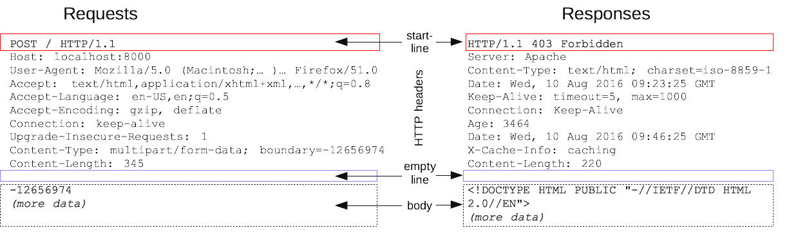
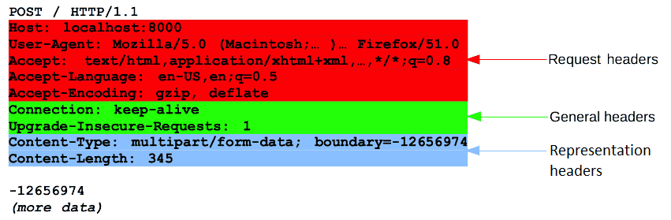

# HTTP & HTTPS Hypertext Transfer Protocol & Hypertext Transfer Protocol Secure

## :bookmark_tabs: 목차

[:arrow_up: **Network**](../README.md)

1. ### HTTP & HTTPS
   - [:page_facing_up: HTTP](#http)
   - [:page_facing_up: HTTP 요청](#http-request-요청)
   - [:page_facing_up: HTTP 응답](#http-response-응답)
   - [:page_facing_up: HTTP 동작 과정](#http-동작-과정)
   - [:page_facing_up: HTTPS](#https)
   - [:page_facing_up: HTTPS 동작 과정](#https-동작-과정)

## HTTP Hypertext Transfer Protocol

> 네트워크 장치 간에 정보를 전송하도록 설계된 애플리케이션 계층 프로토콜

- HTTP는 "상태 비저장" 프로토콜 - stateless한 특징
- 따라서 각 명령은 다른 명령과 독립적으로 실행됨.
- 기본 TCP/IP port : 80
- HTTP Reqeust 요청와 Response 응답의 구조는 비슷함.
    
- HTTP Request 구성
    - 시작줄
        -   HTTP 버전 유형
        - URL Uniform Resource Locator
        - HTTP Method HTTP 메서드
    - HTTP Request Header 요청 헤더
    - HTTP Request Body 요청 본문 - (선택 사항)
- HTTP Response 구성
    - 시작줄
        - HTTP 상태 코드
    - HTTP Response Header 응답 헤더
    - HTTP Response Body 응답 본문

### HTTP Request 요청

✔️ **HTTP Method HTTP 메서드**
- 클라언트가 특정 자원에 대해 서버가 수행해줬으면 하는 작업(행위)를 나타내는 데 사용됨.
- 종류 : 자원 생성(POST), 읽기(GET), 업데이트(PUT/PATCH), 삭제(DELETE)와 같은 작업을 나타냄.
- REST API에게 하는 모든 요청에는 HTTP Method가 포함되어야 함.

✔️ **HTTP Request Header 요청 헤더**

'이름-값(Name-Value)' 쌍에 저장된 텍스트 정보가 포함되어 있으며, 클라이언트가 사용하는 브라우저 및 요청되는 데이터와 같은 핵심 정보를 전달

자세한 설명은 [여기](https://goddaehee.tistory.com/169)를 참고하자.

✔️ **HTTP Request Body 요청 본문**

- POST와 같이 업데이트하는 요청에서 업데이트할 데이터를 담는 부분
- 모든 request에 본문이 필요하진 않음.
- GET, DELTE와 같이 자원을 읽어오는 요청은 이 부분이 필요없음.

### HTTP Response 응답

✔️ **HTTP Response Status Code 상태 코드**

HTTP Request가 성공적으로 완료되었는지 여부를 나타내는 3자리 코드

- `1XX` : Informational - 요청을 받았으며 프로세스를 계속함.

- `2XX` : 요청 성공

- `3XX` : Redirection - 요청 완료를 위해 추가 작업 조치가 필요함.

- `4XX` : 클라이언트 에러 - request 문법이 잘못되었거나 요청을 처리할 수 없음.

- `5XX` : 서버 에러 - 서버에서 request를 제대로 수행하지 못했음.

✔️ **HTTP Response Header 응답 헤더**

자세한 설명은 [여기](https://goddaehee.tistory.com/169)를 참고하자.

✔️ **HTTP Response Body 응답 본문**

- 'GET'요청과 같이 자원을 읽어오는 요청에 대한 응답의 경우 요청된 정보가 포함
- 모든 response에 본문이 필요하진 않음.

 

### HTTP 동작 과정

서버 접속(연결) -> 클라이언트 요청 -> 서버 응답 -> 연결 종료

1. 사용자가 웹 브라우저에 URL 주소를 입력
1. DNS 서버에 웹 서버의 호스트 이름을 IP 주소로 변경 요청
1. 웹서버와 TCP 연결을 시도
1. 클라이언트가 서버에게 요청
1. 서버가 응답
1. 서버-클라이언트 간 연결 종료 (stateless 한 특징)
1. 웹 브라우저가 웹 문서 출력

 

## HTTPS Hypertext Transfer Protocol Secure

> 텍스트로 주고받는 HTTP의 보안 취약점을 해결하기 위해 Secure Soket을 추가한 프로토콜

- HTTP는 정보를 텍스트로 주고 받기 때문에 네트워크에서 전송 신호를 인터셉트 하는 경우 원하지 않는 데이터 유출이 발생할 수 있음.
- 이러한 보안 취약점을 해결하기 위한 프로토콜이 HTTP에 S(Secure Socket)가 추가한 것이 HTTPS
- 서버와 클라이언트 사이의 모든 통신 내용이 암호화됨.
    - **SSL**Secure Sockets Layer이나 **TLS**Transport Layer Security 프로토콜을 통해 세션 데이터를 암호화
- 기본 TCP/IP port : 443
- SSL 프로토콜 위에서 HTTPS 프로토콜이 동작
- 네이버, 다음은 물론이고 구글 역시 검색 엔진 최적화(SEO: Search Engine Optimization) 관련 내용을 HTTPS 웹사이트에 대해서 적용하고 있다. 즉, 키워드 검색 시 상위 노출되는 기준 중 하나가 보안 요소
- HTTPS를 지원한다고 해서 무조건 안전한 것은 아니다. 신뢰할 수 있는 CACertificate Authority 기업이 아니라 자체적으로 인증서를 발급할 수도 있고, 신뢰할 수 없는 CA 기업을 통해서 인증서를 발급받을 수도 있기 때문이다.
- 웹사이트의 무결성을 보호해준다. 웹 사이트와 사용자 브라우저 사이의 통신을 침입자가 건드리지 못하도록 함.

#### HTTP 보다 안전한 이유
1. 사용자가 사이트에 보내는 정보들을 제 3자가 못 보게 함.
1. 사용자가 접속한 사이트가 신뢰할만한 사이트인지 확인해줌.

### HTTPS 동작 과정

- 대칭키 암호화 방식과 공개키 암호화 방식을 합쳐서 사용
- 공개키 방식으로 대칭키 전달 후 데이터 송수신은 대칭키 방식을 사용

1. 클라이언트가 서버 접속하여 Handshaking 과정에서 서로 탐색

    1.1. Client Hello

    - 클라이언트가 서버에게 전송할 데이터
        - 클라이언트 측에서 생성한 랜덤 데이터
        - 클-서 암호화 방식 통일을 위해 클라이언트가 사용할 수 있는 암호화 방식
        - 이전에 이미 Handshaking 기록이 있다면 자원 절약을 위해 기존 세션을 재활용하기 위한 세션 아이디

    1.2. Server Hello

    - Client Hello에 대한 응답으로 전송할 데이터
        - 서버 측에서 생성한 랜덤 데이터
        - 서버가 선택한 클라이언트의 암호화 방식
        - SSL 인증서

    1.3. Client 인증 확인

    - 서버로부터 받은 인증서가 CA에 의해 발급되었는지 본인이 가지고 있는 목록에서 확인하고, 목록에 있다면 CA 공개키로 인증서 복호화
    - 클-서 각각의 랜덤 데이터를 조합하여 pre master secret 값 생성(데이터 송수신 시 대칭키 암호화에 사용할 키)
    - pre master secret 값을 공개키 방식으로 서버 전달(공개키는 서버로부터 받은 인증서에 포함)
    - 일련의 과정을 거쳐 session key 생성
    
    1.4. Server 인증 확인

    - 서버는 비공개키로 복호화하여 pre master secret 값 취득(대칭키 공유 완료)
    - 일련의 과정을 거쳐 session key 생성

    1.5. Handshaking 종료

2. 데이터 전송

    서버와 클라이언트는 session key를 활용해 데이터를 암복호화하여 데이터 송수신

3. 연결 종료 및 session key 폐기

 

---

- 참고

    [HTTP란 무엇입니까?](https://www.cloudflare.com/ko-kr/learning/ddos/glossary/hypertext-transfer-protocol-http/)

    [What are HTTP methods?](https://blog.postman.com/what-are-http-methods/)

    [자원을 수정하는 HTTP 메서드 - PUT vs PATCH](https://tecoble.techcourse.co.kr/post/2020-08-17-put-vs-patch/)
    
    [HTTP 메시지](https://developer.mozilla.org/ko/docs/Web/HTTP/Messages)

    [HTTP 기초 헤더 응답, 요청](https://goddaehee.tistory.com/169)

    [HTTP 동작 과정](https://jess-m.tistory.com/17)

    [[네트워크] HTTP와 HTTPS 동작 과정](https://velog.io/@averycode/%EB%84%A4%ED%8A%B8%EC%9B%8C%ED%81%AC-HTTP%EC%99%80-HTTPS-%EB%8F%99%EC%9E%91-%EA%B3%BC%EC%A0%95)

    [HTTPS란? (동작방식, 장단점)](https://rachel-kwak.github.io/2021/03/08/HTTPS.html)

    [SSL과 TLS의 차이점은 무엇인가요?](https://aws.amazon.com/ko/compare/the-difference-between-ssl-and-tls/)