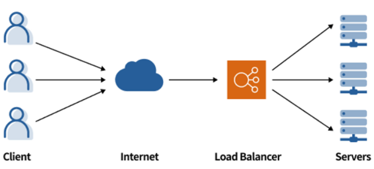
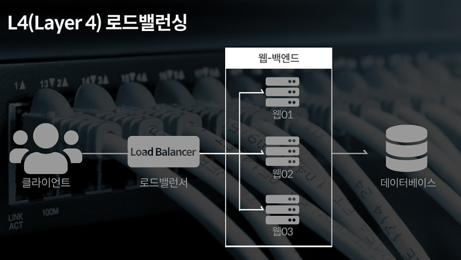

# Load Balancing

## :bookmark_tabs: 목차

[:arrow_up: **Network**](../README.md)

1. ### Load Balancing

   - [:page_facing_up: DNS](#dns-domain-name-system-1)
   - [:page_facing_up: DNS 레코드 유형](#dns-레코드-유형)
   - [:page_facing_up: DNS 기초적인 동작 흐름](#dns의-기초적인-동작-흐름)
   - [:page_facing_up: DNS 서버 분리](#dns-서버-분리)
   - [:page_facing_up: DNS 자세한 동작 과정](#dns-자세한-동작-과정)
   - [:page_facing_up: DNS 쿼리 유형](#dns-쿼리-유형)

### Load Balancer 로드 밸런서

> 서버에 가해지는 부하(=로드)를 분산(=밸런싱)해주는 장치 또는 기술을 통칭

- 로드 밸런서는 클라이언트와 서버풀1Server Pool 사이에 위치하며, 한 대의 서버로 부하가 집중되지 않도록 트래픽을 관리해 각각의 서버가 최적의 퍼포먼스를 보일 수 있도록 함.
- 서버가 하나인데 많은 트래픽이 몰릴 경우 부하를 감당하지 못하고, 서버가 다운되어 서비스가 작동을 멈출 수 있음.
- 이런 문제를 해결하기 위해서 **Scale up(스케일업)**과 **Scale out(스케일아웃)** 방식 중 한 가지를 사용해 해결

1서버풀 : 분산 네트워크를 구성하는 서버들의 그룹

### 증가한 트래픽에 대처할 수 있는 두 가지 방법

**Scale-up**
- 기존 서버의 성능을 향상시키는 방법
- CPU나 메모리를 업그레이드하는 것과 같은 작업을 포함

**Scale-out**
- 서버를 추가하여 시스템을 확장하는 방법
- 트래픽이나 작업을 여러 대의 컴퓨터나 서버에 분산시켜 처리하는 방법
- 서버가 여러 대가 되기 때문에 각 서버에 걸리는 부하를 고르게 나누기 위해서는 로드밸런싱이 필수적으로 동반되어야 함.

| | Scale-up | Scale-out|
|---|---|---|
|확장성|성능 확장에 한계 존재 | 지속적 확장 가능|
|서버 비용 | 성능 증가에 따른 비용 증가 폭이 큼   일반적으로 비용 부담이 큰 편 | 비교적 저렴한 서버를 사용하므로, 일반적으로 비용 부담이 적음|
|관리 편의성 | 스케일 업에 따른 큰 변화 없음. | 서버 대수가 늘어날수록 관리 편의성이 떨어짐.|
|운영 비용 | 스케일 업에 따른 큰 변화 없음. | 서버 대수가 늘어날수록 운영 비용 증가 |
|장애 영향 | 한 대의 서버에 부하가 집중되므로 장애 시 다운 타임 발생 | 부하가 여러 서버에 분산되어 처리됨으로 장애시 전면 장애 가능성 적음.|

 

### Load Balancing 로드 밸런싱

> 여러 대의 서버를 두고 서비스를 제공하는 분산 처리 시스템에서 필요한 기술

- 목적
    - 웹사이트에 들어오는 트래픽을 여러 서버에 분산시켜 하나의 서버에 부담이 가지 않도록 하는 것 -> 서버의 성능과 안정성을 높일 수 있음.
- 트래픽이 과도하게 몰려 서비스가 중단되는 일을 막고 지연 없이 작업을 처리

#### 장점

1. 애플리케이션 가용성

    - 서버 장애 또는 유지 관리로 인해 애플리케이션 가동 중지 시간이 늘어 방문자가 애플리케이션을 사용할 수 없게 될 수 있음.
    - 로드 밸런서는 서버 문제를 자동으로 감지하고 클라이언트 트래픽을 사용 가능한 서버로 리다이렉션하여 시스템의 내결함성을 높임.
    - 로드 밸런싱을 사용하여 다음 태스크를 더 쉽게 수행할 수 있음.

        - 애플리케이션 가동 중지 없이 애플리케이션 서버 유지 관리 또는 업그레이드 실행

        - 백업 사이트에 자동 재해 복구 제공

        - 상태 확인을 수행하고 가동 중지를 유발할 수 있는 문제 방지

2. 애플리케이션 확장성

    - 로드 밸런서를 사용하여 여러 서버 간에 네트워크 트래픽을 지능적으로 전달할 수 있음. 
    - 로드 밸런싱이 다음을 수행하므로 애플리케이션에서 수천 개의 클라이언트 요청을 처리할 수 있음.

        - 한 서버에서 트래픽 병목 현상 방지

        - 필요한 경우 다른 서버를 추가하거나 제거할 수 있도록 애플리케이션 트래픽을 예측

        - 안심하고 조정할 수 있도록 시스템에 중복성을 추가

3.  애플리케이션 보안

    - 로드 밸런서에는 인터넷 애플리케이션에 또 다른 보안 계층을 추가할 수 있는 보안 기능이 내장되어 있음. 
    - 이는 공격자가 서버 장애를 일으키는 수백만 개의 동시 요청으로 애플리케이션 서버를 가득 채우는 분산 서비스 거부 공격을 처리하는 데 유용한 도구 
    - 로드 밸런서는 다음을 수행할 수도 있음.

        - 트래픽 모니터링 및 악성 콘텐츠 차단

        - 공격 트래픽을 여러 백엔드 서버로 자동으로 리다이렉션하여 영향 최소화

        - 추가 보안을 위해 네트워크 방화벽 그룹을 통해 트래픽 라우팅

4. 애플리케이션 성능

    - 로드 밸런서는 응답 시간을 늘리고 네트워크 지연 시간을 줄여 애플리케이션 성능을 향상시킴.
    - 다음과 같은 몇 가지 중요한 태스크를 수행

        - 서버 간에 로드를 균등하게 배포하여 애플리케이션 성능 향상

        - 클라이언트 요청을 지리적으로 더 가까운 서버로 리다이렉션하여 지연 시간 단축

        - 물리적 및 가상 컴퓨팅 리소스의 신뢰성 및 성능 보장

 

### 로드 밸런싱 알고리즘

- 가장 흔히 사용되는 알고리즘 : **라운드 로빈(Round Robin)**,  **가중치 분배(Weighted Ditribution)**, **최소 연결(Least Connections)**
- 각 알고리즘은 서로 다른 목적과 케이스에 적합하므로 사용할 로드밸런서의 유형을 잘 선택해야 함.

#### 1. 정적 로드 밸런싱

✔️ 라운드 로빈 방식(Round Robin Method)

- 클라이언트의 요청을 여러 대의 서버에 순차적으로 분배하는 방식
- 클라이언트의 요청을 순서대로 분배하기 때문에 서버들이 동일 스펙을 가지고 있고, 서버와의 연결(세션)이 오래 지속되지 않는 경우 활용하기 적합
    - A, B, C의 서버를 가지고 있을 경우 A → B → C → A 순서대로 순회

✔️ 가중치 기반 라운드 로빈 방식(Weighted Round Robin Method)

- 각각의 서버마다 가중치(Weight)를 매기고 가중치가 높은 서버에 클라이언트의 요청을 먼저 배분
- 여러 서버가 같은 사양이 아니고, 특정 서버의 스펙이 더 좋은 경우 해당 서버의 가중치를 높게 매겨 트래픽 처리량을 늘릴 수 있음.
    - 서버 A의 가중치=8, 서버 B의 가중치=2, 서버 C의 가중치=3 → 서버 A에 8개, 서버 B에 2개, 서버 C에 3개의 Request를 할당

✔️ IP 해시 방식(IP Hash Method)

- IP 해시 방식에서 로드밸런서는 클라이언트 IP 주소에 대해 해싱이라고 하는 수학적인 계산을 수행
- 클라이언트 IP 주소를 숫자로 변환한 다음 개별 서버에 매핑
- 사용자 IP를 해싱하여 부하를 분산하기 때문에 사용자가 항상 동일한 서버로 연결되는 것을 보장

#### 2. 동적 로드 밸런싱

✔️ 최소 연결 방법(Least Connection Method)

- 최소 연결 방법에서 로드 밸런서는 활성 연결이 가장 적은 서버를 확인하고 해당 서버로 트래픽을 전송
- 이 방법에서는 모든 연결에 모든 서버에 대해 동일한 처리 능력이 필요하다고 가정

✔️ 최소 응답 시간 방법(Least Response Time Method)

- 서버의 현재 연결 상태와 응답 시간을 모두 고려하여, 가장 짧은 응답 시간을 보내는 서버로 트래픽을 할당
- 각 서버의 가용 가능한 리소스와 성능, 처리 중인 데이터양 등이 상이할 경우 적합
- 조건에 잘 들어맞는 서버가 있을 시 여유 있는 서버보다 먼저 할당
- 로드 밸런서는 이 알고리즘을 사용하여 모든 사용자에게 더 빠른 서비스를 보장

 

### 로드 밸런싱 2가지 작동 방식

- L4, L7 로드 밸런싱을 가장 많이 활용
    - L4 로드 밸런싱부터 포트 정보를 바탕으로 로드(부하)를 분산하는 것이 가능하기 때문
- 한 대의 서버에 각기 다른 포트 번호를 부여하여 다수의 서버 프로그램을 운영하는 경우 최소 L4 로드 밸런싱 이상을 사용해야만 함.

#### Layer 4 로드 밸런싱

- 네트워크 계층(IP, IPX)이나 전송 계층(TCP, UDP)의 정보를 바탕으로 로드를 분산
    - TCP/UDP 포트 정보를 바탕으로 함.
    - IP 주소나 **포트번호**, MAC 주소, 전송 프로토콜에 따라 트래픽 나누는 것이 가능

#### Layer 7 로드 밸런싱

- 응용 계층(HTTP, FTP, SMTP)에서 로드를 분산
    - TCP/UDP 정보는 물론 HTTP의 **URI**, FTP의 파일명, 쿠키 정보 등 사용자의 요청을 기준으로 특정 서버에 트래픽을 분산하는 것이 가능
- 클라이언트의 요청을 보다 세분화해서 서버에 전달할 수 있음.
- 패킷의 내용을 확인하고 그 내용에 따라 로드를 특정 서버에 분배하는 것이 가능
- 특정한 패턴을 지닌 바이러스를 감지해 네트워크 보호 가능
- DoS/DDoS와 같은 비정상적인 트래픽을 필터링할 수 있기 때문에 네트워크 보안 분야에서도 활용되고 있음.

| | L4 로드 밸런싱 | L7 로드 밸런싱|
|---|---|---|
|네트워크 계층 | Layer 4 전송계층 | Layer 7 응용계층 |
|특징 | TCP/UDP 포트 정보를 바탕으로 함. | TCP/UDP 정보는 물론 HTTP의 URI, FTP의 파일명, 쿠키 정보 등을 바탕으로 함.|
| 장점 | - 데이터 안을 들여다보지 않고 패킷 레벨에서만 로드를 분산하기 때문에 속도가 빠르고 효율이 높음.   - 데이터의 내용을 복호화할 필요가 없기에 안전   - L7 로드 밸런서보다 가격이 저렴 | - 상위 계층에서 로드를 분산하기 때문에 훨씬 더 섬세한 라우팅이 가능   - 캐싱 기능을 제공   - 비정상적인 트래픽을 사전에 필터링할 수 있어 서비스 안정성이 높음. |
|단점| - 패킷의 내용을 살펴볼 수 없기 때문에 섬세한 라우팅이 불가능함.   - 사용자의 IP가 수시로 바뀌는 경우라면 연속적인 서비스를 제공하기 어려움. | - 패킷의 내용을 복호화해야 하기에 더 높은 비용을 지불해야 함.   - 클라이언트가 로드밸러서와 인증서를 공유해야하기 때문에 공격자가 로드밸런서를 통해서 클라이언트의 데이터에 접근할 보안 상의 위험성이 존재 |

 

---

- 참고

    [로드 밸런서(Load Balancer)란? : AWS와 로드 밸런싱 개념 정리](https://www.smileshark.kr/post/what-is-a-load-balancer-a-comprehensive-guide-to-aws-load-balancer)

    [로드밸런서(Load Balancer)의 개념과 특징](https://m.post.naver.com/viewer/postView.naver?volumeNo=27046347&memberNo=2521903)