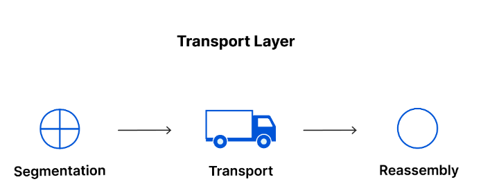

# OSI 7계층

# :books: OSI 7계층

## :bookmark_tabs: 목차

[:arrow_up: **Network**](./README.md)

1. ### OSI 7계층
   - [:page_facing_up: 1. 물리계층](#1-물리계층)
   - [:page_facing_up: 2. 데이터 링크 계층](#2-데이터-링크-계층)
   - [:page_facing_up: 3. 네트워크 계층](#3-네트워크-계층)
   - [:page_facing_up: 4. 전송 계층](#4-전송-계층)
   - [:page_facing_up: 5. 세션 계층](#5-세션-계층)
   - [:page_facing_up: 6. 프레젠테이션 계층](#6-프레젠테이션-계층표현-계층)
   - [:page_facing_up: 7. 애플리케이션 계층](#7-애플리케이션-계층응용-계층)

> ISO(국제 표준화 기구)가 제안한 **7계층의 모델**로서, 표준 프로토콜을 사용하여 다양한 통신 시스템이 통신할 수 있도록 국제표준화기구에서 만든 개념 모델

- 쉽게 표현하자면 OSI는 상이한 컴퓨터 시스템이 서로 통신할 수 있는 표준을 제공

- 네트워크 통신을 7개의 추상적 계층으로 나누며 각 계층은 특정 작업을 처리하고 그 위와 아래의 계층과 통신함.

### 1. 물리계층

- **물리적 매체**를 통한 비트 전송에 요구되는 기능을 담당
- 데이터 전송과 관련된 물리적 장비가 포함
- 1과 0의 문자열인 비트 스트림으로 변환되는 계층
- 통신 단위 : 비트(bit)
- 장치 : 통신 케이블, 허브
- 프로토콜 : Ethernet, USB, Bluetooth 등
 

### 2. 데이터 링크 계층

- **노드 대 노드(node-to-node)** 전달의 책임을 가지는 계층
- 네트워크 계층과 매우 비슷하지만, 데이터 연결 계층은 <u>동일한 네트워크</u>에 있는 두 개의 장치 간 데이터 전송을 용이하게 함.
- 네트워크 계층에서 패킷을 가져와서 프레임이라고 불리는 더 작은 조각으로 세분화
- 네트워크 계층과 마찬가지로 데이터 연결 계층도 인트라 네트워크 통신에서 흐름 제어 및 오류 제어를 담당
- 서로 다른 네트워크 간 통신의 흐름 제어 및 오류 제어 담당은 전송 계층, 동일한 네트워크 내부 통신의 흐름 제어 및 오류 제어 담당은 데이터 링크 계층
- 송신자와 수신자의 **MAC address** 를 **헤더에 추가**하며, **오류 제어 및 흐름 제어**를 수행
- 통신 단위 : 프레임(Frame)
- 장치 : 브릿지, 스위치
- 프로토콜 : Ethernet, PPP, ARP 등
 

### 3. 네트워크 계층

- **발신지 대 목적지** 전달에 대한 책임을 가지는 계층
- <u>서로 다른 두 네트워크</u> 간 데이터 전송을 용이하게 하는 역할
- 서로 통신하는 두 장치가 동일한 네트워크에 있는 경우에는 네트워크 계층이 필요하지 않음.
- 전송 계층의 세그먼트를 송신자의 장치에서 패킷이라고 불리는 더 작은 단위로 세분화하여 수신 장치에서 이러한 패킷을 다시 조립
- 전송 계층에서 받은 패킷에 발신지와 목적지의 **IP address** 를 헤더에 추가
- 패킷이 최종 목적지에 전달될 수 있도록 경로를 지정하거나 교환하는 **라우팅 기능**을 수행
- 라우터
- 프로토콜 : IP, ICMP, ARP 등

 

### 4. 전송 계층

- 개별적인 패킷의 **종단 대 종단(End-to-End)** 전송을 담당하는 계층
- 포트 주소를 지정하며, 세그먼트로의 캡슐화를 수행
- 세션 계층에서 데이터를 가져와서 네트워크 계층으로 보내기 전에 세그먼트라고하는 조각으로 분할하는 일이 포함
- 흐름 제어 및 오류 제어 기능
    - 흐름 제어는 연결 속도가 빠른 송신자가 연결 속도가 느린 수신자를 압도하지 않도록 최적의 전송 속도를 결정
    - 수신된 데이터가 완료되었는지 확인하고 수신되지 않은 경우 재전송을 요청하여 최종 수신자에 대해 오류 제어를 수행
- 프로토콜 : TCP, UDP

 

### 5. 세션 계층
> 세션 : 통신이 시작될 때부터 종료될 때까지의 시간

- 두 기기 사이의 통신을 시작하고 종료하는 일을 담당하는 계층
- 교환되고 있는 모든 데이터를 전송할 수 있도록 충분히 오랫동안 세션을 개방한 다음 리소스를 낭비하지 않기 위해 세션을 즉시 닫을 수 있도록 보장
- 동기화, 대화 제어, 세션 관리
- **동기화**
    - 데이터 전송을 체크포인트와 동기화함.
    - 예를 들어, 100MB의 파일이 전송되는 경우 세션 계층이 5MB마다 체크포인트를 설정할 수 있음.
    - 52MB가 전송 된 후 연결이 끊어 지거나 충돌이 발생하면 마지막 체크 포인트에서 세션을 재개하는 것이 가능
    - 즉, 50MB의 데이터만 더 전송하면 됨.
    - 체크 포인트가 없으면 전체 전송을 처음부터 다시 시작해야 함.
- 프로토콜 : PPTP

 

### 6. 프레젠테이션 계층(표현 계층)

- 주로 데이터를 준비하는 역할을 하여 애플리케이션 계층이 이를 사용할 수 있게 함.
- 통신 장치 간의 상호 운용성을 보장
- 보안 목적을 위한 데이터 암호화 및 복호화
- 데이터의 변환, 암호화, 압축을 담당
- **변환**
    - 서로 통신하는 두 개의 통신 장치는 서로 다른 인코딩 방법을 사용하고 있을 수 있으므로, 수신 장치의 애플리케이션 계층이 이해할 수 있는 구문으로 수신 데이터를 변환하는 일을 담당
- **암호화**
    - 장치가 암호화된 연결을 통해 통신하는 경우, 최종 송신자에게 암호화를 추가할 뿐만 아니라 최종 수신자에게 암호화를 디코딩하여 암호화되지 않은 읽기 쉬운 데이저를 제공하는 역할
- **압축**
    - 애플리케이션 계층에서 수신한 데이터를 세션 계층으로 전송하기 전에 압축하는 일도 담당
    - 전송할 데이터의 양을 최소화함으로써 통신의 속도와 효율을 높임.
- 프로토콜 : SSL, TLS

 

### 7. 애플리케이션 계층(응용 계층)

- **가장 유저와 가까운 층**으로서, 사용자가 네트워크에 접근할 수 있도록 서비스를 제공하는 계층
- 사용자의 데이터와 직접 상호 작용하는 유일한 계층
- **사용자 인터페이스 제공**
- 파일 전송, 우편 서비스, 웹 접근
- 프로토콜 : HTTP, SMTP, FTP, DNS, SSH 등

### OSI 모델을 통해 데이터가 전송되는 방법
네트워크를 통해 사람이 읽을 수 있는 정보를 장치 간에 전송하려면 데이터가 송신 장치에서 OSI 모델의 7가지 계층 아래로 이동한 다음 최종 수신자에서 7가지 계층 위로 이동해야 함.

#### A가 B에게 이메일을 보내는 상황

1. A는 자신의 노트북에 있는 이메일 애플리케이션에서 메시지를 작성하고 '발송'을 누르면 A의 이메일 애플리케이션이 이메일 메시지를 애플리케이션 계층으로 넘김.

1. 애플리케이션 레이어는 프로토콜(SMTP)을 선택하고, 데이터를 프레젠테이션 계층으로 전달
1. 프리젠테이션 계층이 압축한 데이터는 세션 계층에 도달
1. 세션 계층은 세션을 시작

1. 전송 계층에서 데이터는 세그먼트로 나눔.
1. 네트워크 계층에서 세그먼트는 패킷으로 다시 나눠짐.
1. 데이터 링크 계층에서 프레임으로 나눔.
1. 물리 계층은 1과 0의 비트스트림으로 변환하고 물리 매체(예: 케이블)를 통해 전송

1. B의 컴퓨터가 물리적 매체(예: 와이파이)를 통해 비트스트림을 수신하면, 데이터는 반대 순서로 계층을 지나감.
1. 먼저 물리 계층은 비트 스트림을 1과 0에서 프레임으로 변환해 데이터 링크 계층으로 넘깁니다. 
1. 데이터 링크 계층은 프레임을 패킷으로 재조립해 네트워크 계층으로 넘김.
1. 네트워크 계층은 패킷으로 세그먼트를 만들어 전송 계층으로 넘김.
1. 전송 계층은 세그먼트를 재조립해 하나의 데이터를 만듭니다.

1. 세션 계층이 데이터를 프리젠테이션 계층으로 넘기면, 통신 세션이 종료
1. 프레젠테이션 계층은 압축을 제거하고 원본 데이터를 애플리케이션 계층으로 넘김.
1. 애플리케이션 계층은 사람이 읽을 수 있는 데이터를 B의 이메일 소프트웨어에 제공
1. B는 자기 노트북 화면에서 이메일 소프트웨어를 통해 A의 이메일을 읽을 수 있게 됨.

 

---

- 참고

    [OSI 모델이란](https://www.cloudflare.com/ko-kr/learning/ddos/glossary/open-systems-interconnection-model-osi/)