# 알고리즘 BFS & DFS part

## ☀️ 목표
* 그래프 탐색방법 중 하나인 BFS와 DFS에 대해 알아본다.
* 커스텀 문제를 풀이하며 실전경험을 키워본다.

## 📖: DFS란?

- 깊이 우선 탐색이라고 부르기도 하며 그래프에서 깊이 부터 우선적으로 탐색하는 방법을 말합니다.
- stack과 reclusive(재귀)함수를 사용하여 동작하고 구체적인 동작 과정으로는
  1. 탐색 시작 노드를 스택에 삽입하고 방문 처리합니다.
  2. 스택의 최상단 노드에 방문하지 않은 인접한 노드가 하나라도 있으면 그 노드를 스택에 넣고 방문 처리합니다. (방문하지 않은 인접 노드가 없으면 스택에서 최상단 노드를 꺼냅니다.)
  3. 더 이상 2번의 과정을 수행할 수 없을 때까지 반복합니다.
 

## 작동 방식 
그림으로 설명
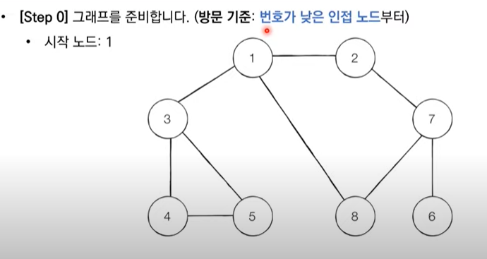
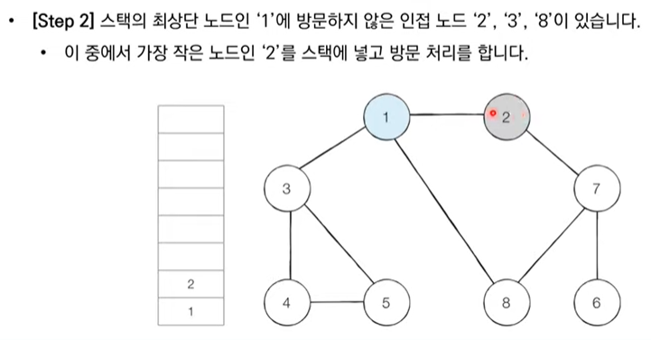
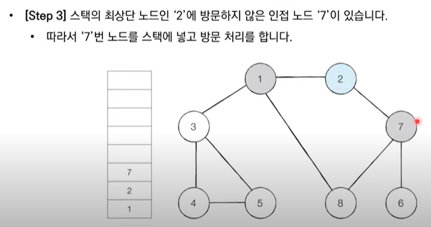
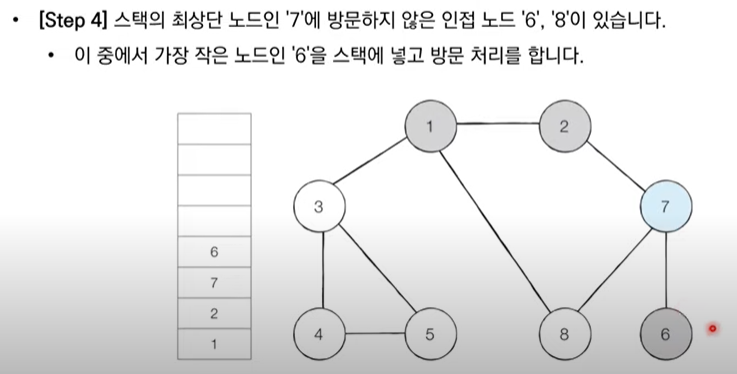
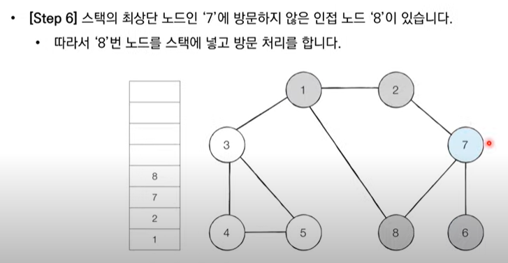
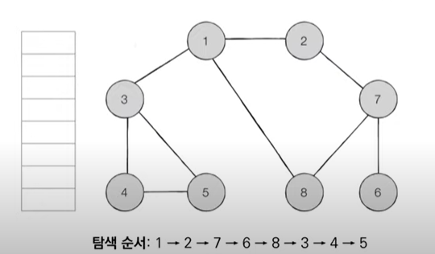
```
// 재귀 함수 버전
static int N=5;
static visit[] = new boolean[N];
static graph = {
[0,1,0],
[0,0,1],
[0,0,0]};
public static void DFS(int node, int r)// 현재 진행 카운터 , 기저조건(종료조건)
{

if (r==R){
// operation if you need something
return;
}
if(visit[node]== true){
continue;
}

for(int s=0;s<graph[0].size();s++){
if(graph[node][s]==1){
visit[s] = true;
DFS(s,r);
visit[s]=false;// backtracking 필요하면 쓸 장소? 
}

}


}

```
-----
## 📖 BFS : 너비 우선 탐색 이란?
- BFS는 너비 우선 탐색이라고도 부르며, 그래프에서 가까운 노드부터 우선적으로 탐색하는 알고리즘입니다.

- BFS는 큐 자료구조를 이용하며, 구체적인 동작 과정은 다음과 같습니다.

1. 탐색 시작 노드를 큐에 삽입하고 방문 처리를 합니다.
2. 큐에서 노드를 꺼낸 뒤에 해당 노드의 인접 노드 중에는 방문하지 않은 노드를 모두 큐에 삽입하고 방문 처리합니다.
3. 더 이상 2번의 과정을 수행할 수 없을 때까지 반복합니다.


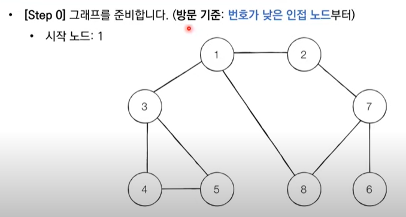
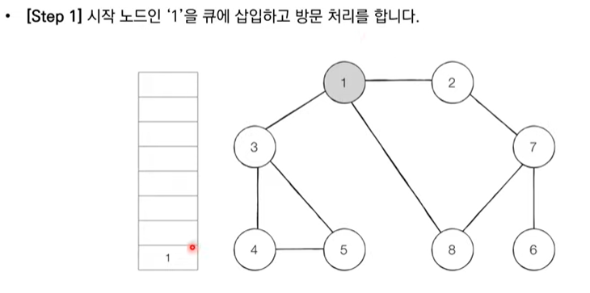
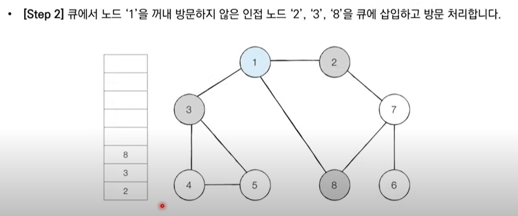
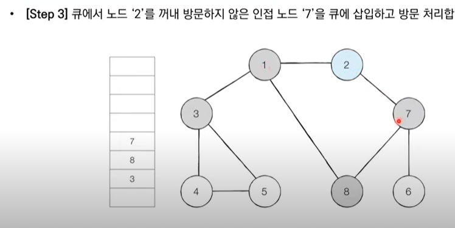
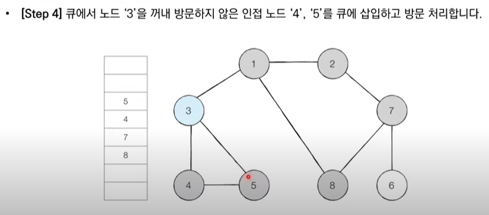
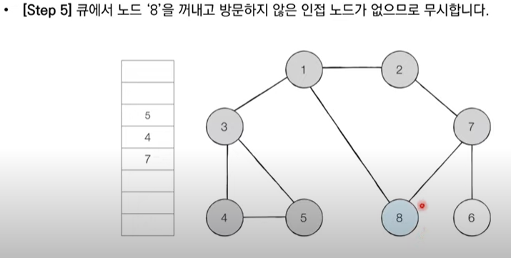


탐색 순서: 1 -> 2 -> 3 -> 8 -> 7 -> 4 -> 5 -> 6

- BFS는 너비 우선 탐색 과정으로서 시작 노드부터 가까운 노드를 우선적으로 탐색하는 것을 알 수 있습니다.
시작 노드 1을 기준으로 거리가 1인 노드 2, 3, 8이 우선 방문되었고, 1로부터 거리가 2인 7, 4, 5가 그 다음, 거리가 3인 6이 마지막으로 방문되었습니다.
BFS는 이러한 특징 때문에 각 간선의 비용이 모두 동일한 상황에서 ✔️최단 거리✔️를 해결하기 위한 목적으로 사용됩니다.


```
public static void BFS(){
Priority Queue pq = new PriorityQueue<>();
boolean[] visit= new boolean[N];
pq.add(start)// start node insert
visit[start] = true;

while(!pq.isEmpty()){
node cur = pq.poll();

for(){
if(!visit[]){
pq.add(node next);
}
}


}

}

```
 이런 느낌으로 작성할 수 있겠다.
