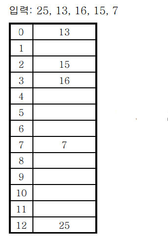
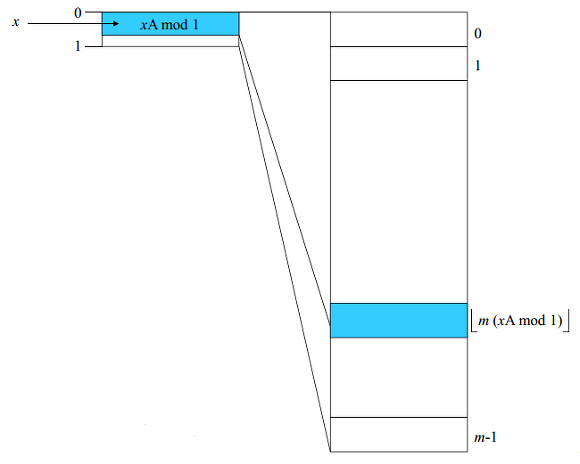

# :zap: HashTable 헤시테이블 알고리즘

## :memo: 헤시테이블이란?

	- (key,value)로 데이터를 저장하는 자료구조 중 하나이며 빠른 검색속도를 제공한다. 
		왜냐하면 내부적으로 배열을 사용하는데 이 때 배열의 고유 인덱스를 헤시함수를 사용해 임의로 생성하기 때문이다.
	
## :question: 헤시함수란?
	- 단방향을 지원하는 모종의 함수이다. 대다수의 방정식은 변수를 알면 역산이 가능하지만 
	헤시함수에서는 결과값을 알아도 헤시함수의 식을 역산할 수 없다. (역산 가능하다면 이는 헤시함수가 역할을 다 하지 못한 것)
	- Function 종류 
		- Division method : 나눗셈을 활용해 입력값을 테이블의 크기로 나눠 계산한다.( idx = input % table_size) ~ size를 소수로정하고 2의 제곱수와 먼 값을 사용하는걸 추천
		
		위의 그림에서 테이블의 크기가 13인 경우 입력값에 대해서 25%13=12 이므로 12번 인덱스에 25가 저장되는 것을 알 수 있음.
		h(x) = x mod m

		- Digit folding : 각 key의 문자열을 아스키코드로 변환 후 값을 합한 데이터를 테이블 내의 주소로 활용한다.
		- Multiplication method : 숫자로 된 key값 K 와 0~1사이의 실수 A 보통 2의 제곱수인 m을 사용해 다음과 같은 계산을 한다 H(k) = (k*AMod1)*m 
		div method 방법은 해쉬 테이블 크기보다 큰 수를 해쉬 테이블 크기 범위에 들어오도록 수축시킨다. 
		multiplication method방법은 이와 반대로 먼저 입력값을 0과 1 사이의 소수로 대응시킨 다음 해시 테이블 크기 m을 곱하여 0~m-1 사이로 팽창시킨다. 이 방법에서는 해쉬 함수의 특성을 결정짓는 0<A<1 의 범위의 상수 A를 미리 준비해야 한다. 임의의 원소 x에 대해 다음과 같은 과정을 거쳐 x의 주소를 결정한다.
		
		예를 들어, 크기 m이 65,536인 해시 테이블에서 A=0.6180339887로 정해져 있다고 하고(x=1,025,390) 해쉬값을 구하면,
		 xA = 1,025,390 x 0.6180339887 = 633,725.871673093이 된다. 이 값에서 소수부만 추출하면 0.871673093이 되고, 
		이 값에 해쉬 테이블의 크기인 65,536을 곱하면 57,125.967... 이 된다. 
		이 수에서 정수부만 취하면 57,125가되어 원소 1,025,390에 대한 해쉬 주소는 57,125가 된다.
		곱하기 방법은 나누기 방법과는 달리 해쉬 테이블의 크기 m을 아무렇게나 잡아도 상관 없다. 
		따라서 컴퓨터의 이진수 환경에 맞게  으로 잡는 것이 자연스럽다. 대신 A를 어떻게 잡느냐에 따라 해쉬값 분포가 많은 영향을 받는다. 

		- univeral hashing : 다수의 헤시함수에서 하나의 헤시함수를 뽑아쓰는 경우.

## :collision: hash 충돌이란? 

	- 앞써 이야기한 헤시함수들을 사용해서 최대한 중복되는 인덱스를 추출하지 않으려고 해도 중복되는 경우가 발생하고 이를 충돌이라고 한다.
	우리는 이를 해결하기 위해 2개의 수단을 사용할 것이다.

	## 1. 분리 연결법(separate chaining)
	
	Separate Chaining이란 동일한 버킷의 데이터에 대해 자료구조를 활용해 추가 메모리를 사용하여 다음 데이터의 주소를 저장하는 것이다. 
	위의 그림과 같이 동일한 버킷으로 접근을 한다면 데이터들을 연결을 해서 관리해주고 있다. 
	실제로 Java8의 Hash테이블은 Self-Balancing Binary Search Tree 자료구조를 사용해 Chaining 방식을 구현하였다.
	이러한 Chaining 방식은 해시 테이블의 확장이 필요없고 간단하게 구현이 가능하며, 손쉽게 삭제할 수 있다는 장점이 있다. 
	하지만 데이터의 수가 많아지면 동일한 버킷에 chaining되는 데이터가 많아지며 그에 따라 캐시의 효율성이 감소한다는 단점이 있다.
	(처음 부분만 key value로 시작하는 밸런스 트리 구조)
	## 2. 개방 주소법(open addressing)
	
	메모리의 확장을 사용하는 chaining과 다르게 개방 주소법은 테이블의 여분 인덱스를 사용한다.
	이를 구현한 대표적 3가지 기술을 소개한다.
	1. linear probing - 고정적인 길이만큼 이동하며 검색해서 비어있으면 저장
	2. quadratic probing - n의 2승만큼 검색 후 비어있을시 사용(1^2, 2^2, 3^2...)
	3. double hashing probing - 헤싱된 값을 또 헤시함수에 다시 입력하여 기존의 규칙성을 지우는 방식

## :book: 헤시테이블의 시간복잡도 
	- 각각 1:1매핑이므로 o(1)의 시간복잡도를 가진다. 단 체이닝이 적용된 테이블에서 검색을 시도하는 경우 
	트리의 최악 시간복잡도인 O(N)을 가진다.
	캐쉬를 사용하여 자주 사용되는 데이터를 캐시에 저장함으로써 성능을 높일 수 있으며 통계적으로 테이블의 공간설정을 넉넉하게 잡아둬야
	충돌이 발생하지 않는다고 한다(70~80% 포화시 충돌 가능성 높아짐)

## :memo: java의 헤시맵과 헤시 테이블의 차이점 
	<pre>
	<code>
// 해시테이블의 put
public synchronized V put(K key, V value) {
    // Make sure the value is not null
    if (value == null) {
        throw new NullPointerException();
    }
    // Makes sure the key is not already in the hashtable.
    Entry<?,?> tab[] = table;
    int hash = key.hashCode();
    int index = (hash & 0x7FFFFFFF) % tab.length;
    @SuppressWarnings("unchecked")
    Entry<K,V> entry = (Entry<K,V>)tab[index];
    for(; entry != null ; entry = entry.next) {
        if ((entry.hash == hash) && entry.key.equals(key)) {
            V old = entry.value;
            entry.value = value;
            return old;
        }
    }
    addEntry(hash, key, value, index);
    return null;
}

// 해시맵의 put
public V put(K key, V value) {
    return putVal(hash(key), key, value, false, true);
}
	</code>
	</pre>

- 첫번째 put은 해시테이블의 put이며, 두번째 put은 해시맵의 put이다. 
첫번째 해시테이블의 put에는 synchronized 키워드가 붙어있는 것을 확인할 수 있는데, 
이것은 병렬 프로그래밍을 할 때 동기화를 지원해준다는 것을 의미한다. 이것은 해당 함수를 처리하는 시간이 조금 지연됨을 의미힌다.
그렇기 때문에 우리는 병렬 처리를 하면서 자원의 동기화를 고려해야 하는 상황이라면 
해시테이블(HashTable)을 사용해야 하며, 병렬 처리를 하지 않거나 자원의 동기화를 고려하지 않는 상황이라면 
해시맵(HashMap)을 사용하면 된다.

